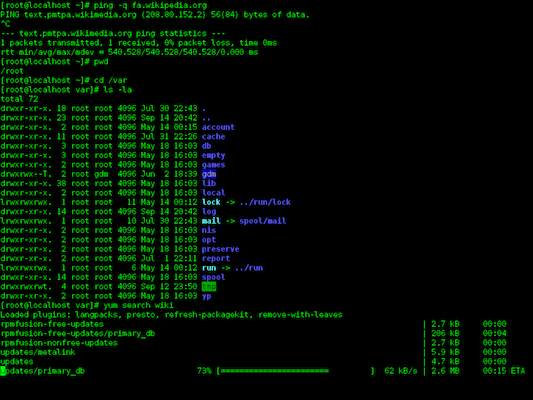
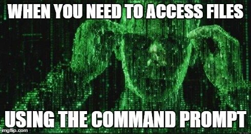

# The Command Line {#command-line}

The **command-line** is an _interface_ to a computer&mdash;a way for you (the human) to communicate with the machine. But unlike common graphical interfaces that use <a href="https://en.wikipedia.org/wiki/WIMP_(computing)">windows, icons, menus, and pointers</a>, the command-line is _text-based_: you type commands instead of clicking on icons. The command-line lets you do everything you'd normally do by clicking with a mouse, but by typing in a manner similar to programming!



The command-line is not as friendly or intuitive as a graphical interface: it's much harder to learn and figure out. However, it has the advantage of being both more powerful and more efficient in the hands of expert users. (It's faster to type than to move a mouse, and you can do _lots_ of "clicks" with a single command).  Command line is also extremely handy in situations where you work on servers that for some reason do not have GUI enabled.  Thus, command line is an essential tool for all professional developers, particularly when working with large amounts of data or files.

This chapter will give you a brief introduction to basic tasks using the command-line: enough to get you comfortable navigating the interface and able to interpret commands.


## Accessing the Command-Line
In order to use the command-line, you will need to open a **command shell** (a.k.a. a _command prompt_). This is a program that provides the interface to type commands into. You should have installed a command shell (hereafter "the terminal") as part of [setting up your machine](#setup-machine).

Once you open up the shell (Terminal or Git Bash), you should see something like this (red notes are added):


This is the textual equivalent of having opened up Finder or File Explorer and having it show you the user's "Home" folder. The text shown lets you know:

- What **machine** you're currently interfacing with (you can use the command-line to control different computers across a network or the Internet).
- What **directory** (folder) you are currently looking at (`~` is a shorthand for the "home directory").
- What **user** you are logged in as.

After that you'll see the **prompt** (typically deonated as the `$` symbol), which is where you will type in your commands.

## Navigating the Command Line
Although the command-prompt gives you the name of the folder we're in, you might like more detail about where that folder is. Time to send your first command! At the prompt, type:

```bash
pwd
```

This stands for **p**rint **w**orking **d**irectory (shell commands are highly abbreviated to make them faster to type), and will tell the computer to print the folder you are currently "in".

<p class="alert alert-info">_Fun fact:_ technically, this command usually starts a tiny program (app) that does exactly one thing: prints the working directory. When you run a command, you're actually executing a tiny program! And when you run programs (tiny or large) on the command-line, it looks like you're typing in commands.</p>

Folders on computers are stored in a hierarchy: each folder has more folders inside it, which have more folders inside them. This produces a <a href="https://en.wikipedia.org/wiki/Tree_(data_structure)">tree</a> structure which on a Mac may like like that:


We describe what folder we are in putting a slash `/` between each folder in the tree: thus `/Users/iguest` means "the `iguest` folder, which is inside the `Users` folder".

At the very top (or bottom, depending on your point of view) is the **root** `/` directory&dash;which has no name, and so is just indicated with that single slash. So `/Users/iguest` really means "the `iguest` folder, which is inside the `Users` folder, which is inside the root folder".

### Changing Directories
What if you want to change folders? In a graphical system like Finder, you would just double-click on the folder to open it. But there's no clicking on the command-line.

<p class="alert alert-warning">This includes clicking to move the cursor to an earlier part of the command you typed. You'll need to use the left and right arrow keys to move the cursor instead!</p>

<p class="alert alert-info">**Protip:** The up and down arrow keys will let you cycle though your previous commands so you don't need to re-type them!</p>

Since you can't click on a folder, you'll need to use another command:

```bash
cd folder_name
```

The first word is the **command**, or what you want the computer to do. In this case, you're issuing the command that means **c**hange **d**irectory.

The second word is an example of an **argument**, which is a programming term that means "more details about what to do". In this case, you're providing a _required_ argument of what folder you want to change to! (You'll of course need to replace `folder_name` with the name of the folder).

- Try changing to the `Desktop` folder, which should be inside the home folder you started in&mdash;you could see it in Finder or File Explorer!

- After you change folders, try printing your currently location. Can you see that it has changed?


### Listing Files
In a graphical system, once you've double-clicked on a folder, Finder will show you the contents of that folder. The command-line doesn't do this automatically; instead you need another command:

```bash
ls [folder_name]
```

This command says to **l**i**s**t the folder contents. Note that the _argument_ here is in brackets (`[]`) to indicate that it is _optional_. If you just issue the **`ls`** command without an argument, it will list the contents of the current folder. If you include the optional argument (leaving off the brackets), you can "peek" at the contents of a folder you are not currently in.

<div class="alert alert-danger">
<p>**Warning**: The command-line can be not great about giving **feedback** for your actions. For example, if there are no files in the folder, then `ls` will simply show nothing, potentially looking like it "didn't work". Or when typing a **password**, the letters you type won't show (not even as `*`) as a security measure.</p>
<p>Just because you don't see any results from your command/typing, doesn't mean it didn't work! Trust in yourself, and use basic commands like `ls` and `pwd` to confirm any changes if you're unsure. Take it slow, one step at a time.</p>
</div>

### Paths
Note that both the **`cd`** and **`ls`** commands work even for folders that are not "immediately inside" the current directory! You can refer to _any_ file or folder on the computer by specifying its **path**. A file's path is "how you get to that file": the list of folders you'd need to click through to get to the file, with each folder separated by a `/`:

```
cd /Users/iguest/Desktop/
```

This says to start at the root directory (that initial `/`), then go to `Users`, then go to `iguest`, then to `Desktop`.

Because this path starts with a specific directory (the root directory), it is referred to as an **absolute path**. No matter what folder you currently happen to be in, that path will refer to the correct file because it always starts on its journey from the root.

Contrast that with:

```
cd iguest/Desktop/
```

Because this path doesn't have the leading slash, it just says to "go to the `iguest/Desktop` folder _from the current location_". It is known as a **relative path**: it gives you directions to a file _relative to the current folder_. As such, the relative path `iguest/Desktop/` path will only refer to the correct location if you happen to be in the `/Users` folder; if you start somewhere else, who knows where you'll end up!

<p class="alert alert-warning">You should **always** use relative paths, particularly when programming! Because you'll almost always be managing multiples files in a project, you should refer to the files _relatively_ within your project. That way, you program can easily work across computers. For example, if your code refers to `/Users/your-user-name/project-name/data`, it can only run on `your-user-name`. However, if you use a _relative path_ within your code (i.e., `project-name/data`), the program will run on multiple computers (crucial for collaborative projects).</p>

You can refer to the "current folder" by using a single dot **`.`**. So the command

```bash
ls .
```

means "list the contents of the current folder" (the same thing you get if you leave off the argument).

If you want to go _up_ a directory, you use _two_ dots: **`..`** to refer to the **parent** folder (that is, the one that contains this one). So the command

```bash
ls ..
```

means "list the contents of the folder that contains the current folder".

Note that **`.`** and **`..`** act just like folder names, so you can include them anywhere in paths: `../../my_folder` says to go up two directories, and then into `my_folder`.

<p class="alert alert-info">**Protip:** Most command shells like Terminal and Git Bash support **tab-completion**. If you type out just the first few letters of a file or folder name and then hit the `tab` key, it will automatically fill in the rest of the name! If the name is ambiguous (e.g., you type `Do` and there is both a `Documents` and a `Downloads` folder), you can hit `tab` _twice_ to see the list of matching folders. Then add enough letters to distinguish them and tab to complete! This will make your life better.</p>

Also remember that you can use a tilde **`~`** as shorthand for the home directory of the current user. Just like `.` refers to "current folder", `~` refers to the user's home directory (usually  `/Users/USERNAME`). And of course, you can use the tilde as part of a path as well.


## File Commands
```{r results='asis', echo=FALSE, include=identical(knitr:::pandoc_to(), 'html')}
#to include only in html
cat('')
```

Once you're comfortable navigating folders in the command-line, you can start to use it to do all the same things you would do with Finder or File Explorer, simply by using the correct command. Here is an short list of commands to get you started using the command prompt, though there are [many more](http://www.lagmonster.org/docs/unix/intro-137.html).

| Command | Behavior |
| :------ | :------- |
| **`mkdir`** | **m**a**k**e a **dir**ectory |
| **`rm`** | **r**e**m**ove a file or folder |
| **`cp`** | **c**o**p**y a file from one location to another |
| **`open`** | opens a file or folder (Mac only) |
| **`start`** | opens a file or folder (Windows only) |
| **`cat`** | con**cat**enate (combine) file contents and display the results |
| **`history`** | show previous commands executed |

<div class="alert alert-danger">
<p>**Warning**: The command-line makes it **dangerously easy** to _permanently delete_ multiple files or folders and _will not_ ask you to confirm that you want to delete them. Be very careful when using the terminal to manage your files, as it is very powerful.</p>
</div>

Be aware that many of these commands **won't print anything** when you run them. This often means that they worked; they just did so quietly. If it _doesn't_ work, you'll know because you'll see a message telling you so (and why, if you read the message). So just because you didn't get any output doesn't mean you did something wrong&mdash;you can use another command (such as **`ls`**) to confirm that the files or folders changed the way you wanted!

### Learning New Commands
How can you figure out what kind of arguments these commands take? You can look it up! This information is available online, but many command shells (but _not_ Git Bash, unfortunately) also include their own manual you can use to look up commands!

```bash
man mkdir
```

Will show the **man**ual for the **`mkdir`** program/command.

<p class="alert alert-info">Because manuals are often long, they are opened up in a command-line viewer called <a href="https://en.wikipedia.org/wiki/Less_(Unix)">`less`</a>. You can "scroll" up and down by using the arrow keys. Hit the `q` key to **q**uit and return to the command-prompt.</p>


If you look under "Synopsis" you can see a summary of all the different arguments this command understands. A few notes about reading this syntax:

- Recall that anything in brackets `[]` is optional. Arguments that are not in brackets (e.g., `directory_name`) are required.

- **"Options"** (or "flags") for command-line programs are often marked with a leading dash **`-`** to make them distinct from file or folder names. Options may change the way a command-line program behaves&mdash;like how you might set "easy" or "hard" mode in a game. You can either write out each option individually, or combine them: **`mkdir -p -v`** and **`mkdir -pv`** are equivalent.

    - Some options may require an additional argument beyond just indicating a particular operation style. In this case, you can see that the `-m` option requires you to specify an additional `mode` parameter; see the details below for what this looks like.

- Underlined arguments are ones you choose: you don't actually type the word `directory_name`, but instead your own directory name! Contrast this with the options: if you want to use the `-p` option, you need to type `-p` exactly.

Command-line manuals ("man pages") are often very difficult to read and understand: start by looking at just the required arguments (which are usually straightforward), and then search for and use a particular option if you're looking to change a command's behavior.

For practice, try to read the man page for `rm` and figure out how to delete a folder and not just a single file. Note that you'll want to be careful, as this is a good way to [break things](http://www.pcworld.com/article/3057235/data-center-cloud/that-man-who-deleted-his-entire-company-with-a-line-of-code-it-was-a-hoax.html).

## Dealing With Errors
Note that the syntax of these commands (how you write them out) is very important. Computers aren't good at figuring out what you meant if you aren't really specific; forgetting a space may result in an entirely different action.

Try another command: **`echo`** lets you "echo" (print out) some text. Try echoing `"Hello World"` (which is the traditional first computer program):

```bash
echo "Hello world"
```

What happens if you forget the closing quote? You keep hitting "enter" but you just get that `>` over and over again! What's going on?

- Because you didn't "close" the quote, the shell thinks you are still typing the message you want to echo! When you hit "enter" it adds a _line break_ instead of ending the command, and the `>` marks that you're still going. If you finally close the quote, you'll see your multi-line message printed!

<div class="alert alert-info">
<p>**IMPORTANT TIP** If you ever get stuck in the command-line, hit **`ctrl-c`** (The `control` and `c` keys together). This almost always means "cancel", and will "stop" whatever program or command is currently running in the shell so that you can try again. Just remember: "**`ctrl-c`** to flee".</p>
<p>(If that doesn't work, try hitting the `esc` key, or typing `exit`, `q`, or `quit`. Those commands will cover _most_ command-line programs).</p>
</div>

Throughout this book, we'll discuss a variety of approaches to handling errors in computer programs. While it's tempting to disregard dense error messages, many programs do provide **error messages** that explain what went wrong. If you enter an unrecognized command, the terminal will inform you of your mistake:

```bash
lx
> -bash: lx: command not found
```

However, forgetting arguments yields different results. In some cases, there will be a default behavior (see what happens if you enter `cd` without any arguments). If more information is _required_ to run a command, your terminal will provide you with a brief summay of the command's usage:

```bash
mkdir
> usage: mkdir [-pv] [-m mode] directory ...
```

## Resources{-}
- [Learn Enough Command Line to be Dangerous](https://www.learnenough.com/command-line-tutorial#sec-basics)
- [Video series: Bash commands](https://www.youtube.com/watch?v=sqYUYHn-HKg&list=PLCAF7D691FFA25555)
- [List of Common Commands](http://www.lagmonster.org/docs/unix/intro-137.html) (also [here](http://www.math.utah.edu/lab/unix/unix-commands.html))

<!---
Local Variables:
eval: (visual-line-mode t)
eval: (auto-fill-mode -1)
End:
-->
