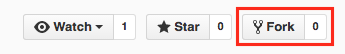

# Git and GitHub {#git-basics}

A frightening number of people still email their code to each other, have dozens of versions of the same file, and lack any structured way of backing up their work for inevitable computer failures. This is both time consuming and error prone.

And that is why they should be using **git**.

This chapter will introduce you to `git` command-line program and the GitHub cloud storage service, two wonderful tools that track changes to your code (`git`) and facilitate collaboration (GitHub). Git and GitHub are the industry standards for the family of tasks known as **version control**. Being able to manage changes to your code and share it with others is one of the most important technical skills a programmer can learn, and is the focus of this (lengthy) chapter.

## What is this _git_ thing anyway?
[](https://xkcd.com/1597/)

Git is an example of a **version control system**. [Eric Raymond](https://en.wikipedia.org/wiki/Eric_S._Raymond) defines version control as

> A version control system (VCS) is a tool for managing a collection of program code that provides you with three important capabilities: **reversibility**, **concurrency**, and **annotation**.

Version control systems work a lot like Dropbox or Google Docs: they allow multiple people to work on the same files at the same time, to view and "roll back" to previous versions. However, systems like git different from Dropbox in a couple of key ways:

1. New versions of your files must be explicitly "committed" when they are ready. Git doesn't save a new version every time you save a file to disk. That approach works fine for word-processing documents, but not for programming files. You typically need to write some code, save it, test it, debug, make some fixes, and test again before you're ready to save a new version.

2. For text files (which most all programming files are), git tracks changes _line-by-line_. This means it can easily and automatically combine changes from multiple people, and gives you very precise information what what lines of code changes.

Like Dropbox and Google Docs, git can show you all previous versions of a file and can quickly rollback to one of those previous versions. This is often helpful in programming, especially if you embark on making a massive set of changes, only to discover part way through that those changes were a bad idea (we speak from experience here 😱 ).

But where git really comes in handy is in team development. Almost all professional development work is done in teams, which involves multiple people working on the same set of files at the same time. Git helps the team coordinate all these changes, and provides a record so that anyone can see how a given file ended up the way it did.

There are a number of different version control systems in the world, but [git](http://git-scm.com/) is the de facto standard&mdash;particularly when used in combination with the cloud-based service [GitHub](https://github.com/).

### Git Core Concepts
To understand how git works, you need to understand its core concepts. Read this section carefully, and come back to it if you forget what these terms mean.

- **repository (repo):**
A database containing all the committed versions of all your files, along with some additional metadata, stored in a hidden subdirectory named `.git` within your project directory. If you want to sound cool and in-the-know, call a project folder a "repo."

- **commit:**
A set of file versions that have been added to the repository (saved in the database), along with the name of the person who did the commit, a message describing the commit, and a timestamp. This extra tracking information allows you to see when, why, and by whom changes were made to a given file. Committing a set of changes creates a "snapshot" of what that work looks like at the time&mdash;it's like saving the files, but more so.

- **remote:**
A link to a copy of this same repository on a different machine. Typically this will be a central version of the repository that all local copies on your various development machines point to. You can push (upload) commits to, and pull (download) commits from, a remote repository to keep everything in sync.

- **merging:**
Git supports having multiple different versions of your work that all live side by side (in what are called **branches**), whether those versions are created by one person or many collaborators. Git allows the commits saved in different versions of the code to be easily _merged_ (combined) back together without you needing to manually copy and paste different pieces of the code. This makes it easy to separate and then recombine work from different developers.


### Wait, but what is GitHub then?
Git was made to support completely decentralized development, where developers pull commits (sets of changes) from each other's machines directly. But most professional teams take the approach of creating one central repository on a server that all developers push to and pull from. This repository contains the authoritative version the source code, and all deployments to the "rest of the world" are done by downloading from this centralized repository.

Teams can setup their own servers to host these centralized repositories, but many choose to use a server maintained by someone else. The most popular of these in the open-source world is [GitHub](https://github.com/). In addition to hosting centralized repositories, GitHub also offers other team development features, such as issue tracking, wiki pages, and notifications. Public repositories on GitHub are free, but you have to pay for private ones.

In short: GitHub is a site that provides as a central authority (or clearing-house) for multiple people collaborating with git. Git is what you use to do version control; Github is one possible place where repositories of code can be stored.

## Installation & Setup
This chapter will walk you through all the commands you'll need to do version control with git. It is written as a "tutorial" to help you practice what you're reading!

If you haven't yet, the first thing you'll need to do is [install git](http://git-scm.com/downloads). You should already have done this as part of [setting up your machine](#setup-machine).

The first time you use `git` on your machine, you'll need [configure](https://help.github.com/articles/set-up-git/) the installation, telling git who you are so you can commit changes to a repository. You can do this by using the `git` command with the `config` option (e.g., running the `git config` command):

```bash
# enter your full name (without the dashes)
git config --global user.name "your-full-name"

# enter your email address (the one associated with your GitHub account)
git config --global user.email "your-email-address"
```

Setting up an [SSH key](https://help.github.com/articles/generating-a-new-ssh-key-and-adding-it-to-the-ssh-agent) for GitHub on your own machine is also a huge time saver. If you don't set up the key, you'll need to enter your GitHub password each time you want to push changes up to GitHub (which may be multiple times a day). Simply follow the instructions on [this page](https://help.github.com/articles/generating-a-new-ssh-key-and-adding-it-to-the-ssh-agent) to set up a key, and make sure to only do this on _your machine_.


### Creating a Repo
The first thing you'll need in order to work with git is to create a **repository**. A repository acts as a "database" of changes that you make to files in a directory.

In order to have a repository, you'll need to have a directory of files. Create a new folder `git_practice` on your computer's Desktop. Since you'll be using the command-line for this course, you might as well practice creating a new directory programmatically:


You can turn this directory _into_ a repository by telling the `git` program to run the `init` action:

```bash
# run IN the directory of project
# you can easily check this with the "pwd" command
git init
```

This creates a new _hidden_ folder called `.git` inside of the current directory (it's hidden so you won't see it in Finder, but if you use `ls -a` (list with the **a**ll option) you can see it there). This folder is the "database" of changes that you will make&mdash;git will store all changes you commit in this folder. The presence of the `.git` folder causes that directory to become a repository; we refer to the whole directory as the "repo" (an example of [synechdoche](https://en.wikipedia.org/wiki/Synecdoche)).

- Note that because a repo is a single folder, you can have lots of different repos on your machine. Just make sure that they are in separate folders; folders that are _inside_ a repo are considered part of that repo, and trying to treat them as a separate repository causes unpleasantness. **Do not put one repo inside of another!**

    ```{r results='asis', echo=FALSE, include=identical(knitr:::pandoc_to(), 'html')}
    #to include only in html
    cat('')
    ```

    ```{r fig.align='left', echo=FALSE, include=identical(knitr:::pandoc_to(), 'html'), fig.cap="Multiple folders, multiple repositories."}
    #to include only in html
    #knitr::include_graphics('img/git-basics/repo-folders.gif', dpi = NA)
    ```

### Checking Status
Now that you have a repo, the next thing you should do is check its **status**:

```bash
git status
```

The `git status` command will give you information about the current "state" of the repo. For example, running this command tells us a few things:

- That you're actually in a repo (otherwise you'll get an error)
- That you're on the `master` branch (think: line of development)
- That you're at the initial commit (you haven't committed anything yet)
- That currently there are no changes to files that you need to commit (save) to the database
- _What to do next!_

That last point is important. Git status messages are verbose and somewhat awkward to read (this is the command-line after all), but if you look at them carefully they will almost always tell you what command to use next.

<p class="alert alert-warning">**If you are ever stuck, use `git status` to figure out what to do next!**</p>

This makes `git status` the most useful command in the entire process. Learn it, use it, love it.


## Making Changes
Since `git status` told you to create a file, go ahead and do that. Using your [favorite editor](https://atom.io/), create a new file `books.md` inside the repo directory. This [Markdown](#markdown) file should contain a _list_ of 3 of your favorite books. Make sure you save the changes to your file to disk (to your computer's harddrive)!

### Adding Files
Run `git status` again. You should see that git now gives a list of changed and "untracked" files, as well as instructions about what to do next in order to save those changes to the repo's database.

The first thing you need to do is to save those changes to the **staging area**. This is like a shopping cart in an online store: you put changes in temporary storage before you commit to recording them in the database (e.g., before hitting "purchase").

We add files to the staging area using the `git add` command:

```bash
git add filename
```

(Replacing `filename` with the name/path of the file/folder you want to add). This will add a single file _in its current saved state_ to the staging area. If you change the file later, you will need to re-add the updated version.

You can also add all the contents of the directory (tracked or untracked) to the staging area with:

```bash
git add .
```

(This is what I tend to use, unless I explicitly don't want to save changes to some files.)

Add the `books.md` file to the staging area. And of course, now that you've changed the repo (you put something in the staging area), you should run `git status` to see what it says to do. Notice that it tells you what files are in the staging area, as well as the command to _unstage_ those files (remove them from the "cart").

### Committing
When you're happy with the contents of your staging area (e.g., you're ready to purchase), it's time to **commit** those changes, saving that snapshot of the files in the repository database. We do this with the `git commit` command:

```bash
git commit -m "your message here"
```

The `"your message here"` should be replaced with a short message saying what changes that commit makes to the repo (see below for details).

<p class="alert alert-danger">**WARNING**: If you forget the `-m` option, git will put you into a command-line _text editor_ so that you can compose a message (then save and exit to finish the commit). If you haven't done any other configuration, you might be dropped into the ___vim___ editor. Type **`:q`** (**colon** then **q**) and hit enter to flee from this horrid place and try again, remembering the `-m` option! Don't panic: getting stuck in _vim_ [happens to everyone](https://stackoverflow.blog/2017/05/23/stack-overflow-helping-one-million-developers-exit-vim/).</p>

#### Commit Message Etiquette
Your commit messages should [be informative](https://xkcd.com/1296/) about what changes the commit is making to the repo. `"stuff"` is not a good commit message. `"Fix critical authorization error"` is a good commit message.

Commit messages should use the **imperative mood** (`"Add feature"` not `"added feature"`). They should complete the sentence:

> If applied, this commit will **{your message}**

Other advice suggests that you limit your message to 50 characters (like an email subject line), at least for the first line&mdash;this helps for going back and looking at previous commits. If you want to include more detail, do so after a blank line.

A specific commit message format may also be required by your company or project team. See [this post](http://chris.beams.io/posts/git-commit/) for further consideration of good commit messages.

Finally, be sure to be professional in your commit messages. They will be read by your professors, bosses, coworkers, and other developers on the internet. Don't join [this group](https://twitter.com/gitlost).

After you've committed your changes, be sure and check `git status`, which should now say that there is nothing to commit!

### Commit History
You can also view the history of commits you've made:

```bash
git log [--oneline]
```

This will give you a list of the _sequence_ of commits you've made: you can see who made what changes and when. (The term **HEAD** refers to the most recent commit). The optional `--oneline` option gives you a nice compact version. Note that each commit is listed with its [SHA-1](https://en.wikipedia.org/wiki/SHA-1) hash (the random numbers and letters), which you can use to identify each commit.

### Reviewing the Process
This cycle of "edit files", "add files", "commit changes" is the standard "development loop" when working with git.

```{r results='asis', echo=FALSE, include=identical(knitr:::pandoc_to(), 'html')}
cat('')
```

In general, you'll make lots of changes to your code (editing lots of files, running and testing your code, etc). Then once you're at a good "break point"&mdash;you've got a feature working, you're stuck and need some coffee, you're about to embark on some radical changes&mdash;you will add and commit your changes to make sure you don't lose any work and you can always get back to that point.

#### Practice
For further practice using git, perform the following steps:

1. **Edit** your list of books to include two more books (top 5 list!)
2. **Add** the changes to the staging area
3. **Commit** the changes to the repository

Be sure and check the status at each step to make sure everything works!

### The `.gitignore` File
Sometimes you want git to always ignore particular directories or files in your project. For example, if you use a Mac and you tend to organize your files in the Finder, the operating system will create a hidden file in that folder named `.DS_Store` (the leading dot makes it "hidden") to track the positions of icons, which folders have been "expanded", etc. This file will likely be different from machine to machine. If it is added to your repository and you work from multiple machines (or as part of a team), it could lead to a lot of merge conflicts (not to mention cluttering up the folders for Windows users).

You can tell git to ignore files like these by creating a special _hidden_ file in your project directory called `.gitignore` (note the leading dot). This file contains a _list_ of files or folders that git should "ignore" and pretend don't exist. The file uses a very simple format: each line contains the path to a directory or file to ignore; multiple files are placed on multiple lines. For example:

```bash
# This is an example .gitignore file

# Mac system file; the leading # marks a comment
.DS_Store

# example: don't check in passwords or ssl keys!
secret/my_password.txt

# example: don't include large files or libraries
movies/my_four_hour_epic.mov
```

Note that the easiest way to create the `.gitignore` file is to use your preferred text editor (e.g., Atom); select `File > New` from the menu and choose to make the `.gitignore` file _directly inside_ your repo.

## GitHub and Remotes
Now that you've gotten the hang of git, let's talk about GitHub. [GitHub](https://github.com/) is an online service that stores copies of repositories in the cloud. These repositories can be _linked_ to your **local** repositories (the one on your machine, like you've been working with so far) so that you can synchronize changes between them.

- The relationship between git and GitHub is the same as that between your camera and Imgur: **git** is the program we use to create and manage repositories; GitHub is simply a website that stores these repositories. So we use git, but upload to/download from GitHub.

Repositories stored on GitHub are examples of **remotes**: other repos that are linked to your local one. Each repo can have multiple remotes, and you can synchronize commits between them.

Each remote has a URL associated with it (where on the internet the remote copy of the repo can be found), but they are given "alias" names (like browser bookmarks). By convention, the remote repo stored on GitHub's servers is named **`origin`**, since it tends to be the "origin" of any code you've started working on.

Remotes don't need to be stored on GitHub's computers, but it's one of the most popular places to put repos.

### Forking and Cloning
In order to use GitHub, you'll need to [**create a free GitHub account**](https://github.com/join), which you should have done as part of setting up your machine.

Next, you'll need to download a copy of a repo from GitHub onto your own machine. **Never make changes or commit directly to GitHub**: all development work is done locally, and changes you make are then uploaded and _merged_ into the remote.

Start by visiting **https://github.com/info201/github_practice**. This is the web portal for an existing repository. You can see that it contains one file (`README.md`, a Markdown file with a description of the repo) and a folder containing a second file. You can click on the files and folder to view their source online, but again you won't change them there!

Just like with Imgur or Flickr or other image-hosting sites, each GitHub user has their own account under which repos are stored. The repo linked above is under the course book account (`info201`). And because it's under our user account, you won't be able to modify it&mdash;just like you can't change someone else's picture on Imgur. So the first thing you'll need to do is copy the repo over to _your **own** account on GitHub's servers_. This process is called **forking** the repo (you're creating a "fork" in the development, splitting off to your own version).

- To fork a repo, click the **"Fork"** button in the upper-right of the screen:

    

    This will copy the repo over to your own account, so that you can upload and download changes to it!

    <p class="alert alert-info">Students in the INFO 201 course will be forking repos for class and lab execises, but _not_ for homework assignments (see below)</p>

Now that you have a copy of the repo under your own account, you need to download it to your machine. We do this by using the `clone` command:

```bash
git clone [url]
```

This command will create a new repo (directory) _in the current folder_, and download a copy of the code and all the commits from the URL you specify.

- You can get the URL from the address bar of your browser, or you can click the green "Clone or Download" button to get a popup with the URL. The little icon will copy the URL to your clipboard. **Do not** click "Open in Desktop" or "Download Zip".

- Make sure you clone from the _forked_ version (the one under your account!)

    <p class="alert alert-warning">**Warning** also be sure to `cd` out of the `git_practice` directory; you don't want to `clone` into a folder that is already a repo; you're effectively creating a _new_ repository on your machine here!</p>

Note that you'll only need to `clone` once per machine; `clone` is like `init` for repos that are on GitHub&mdash;in fact, the `clone` command _includes_ the `init` command (so you do not need to init a cloned repo).

### Pushing and Pulling
Now that you have a copy of the repo code, make some changes to it! Edit the `README.md` file to include your name, then `add` the change to the staging area and `commit` the changes to the repo (don't forget the `-m` message!).

Although you've made the changes locally, you have not uploaded them to GitHub yet&mdash;if you refresh the web portal page (make sure you're looking at the one under your account), you shouldn't see your changes yet.

In order to get the changes to GitHub, you'll need to `push` (upload) them to GitHub's computers. You can do this with the following command:

```bash
git push origin master
```

This will push the current code to the `origin` remote (specifically to its `master` branch of development).

- When you cloned the repo, it came with an `origin` "bookmark" to the original repo's location on GitHub!

Once you've **pushed** your code, you should be able to refresh the GitHub webpage and see your changes to the README!

If you want to download the changes (commits) that someone else made, you can do that using the `pull` command, which will download the changes from GitHub and _merge_ them into the code on your local machine:

```bash
git pull
```

Because you're merging as part of a `pull`, you'll need to keep an eye out for **merge conflicts**! These will be discussed in more detail in [chapter 14](#git-branches).

<p class="alert alert-warning">**Pro Tip**: always `pull` before you `push`. Technically using `git push` causes a merge to occur on GitHub's servers, but GitHub won't let you push if that merge might potentially cause a conflict. If you `pull` first, you can make sure your local version is up to date so that no conflicts will occur when you upload.</p>

### Reviewing The Process
Overall, the process of using git and GitHub together looks as follows:

```{r results='asis', echo=FALSE, include=identical(knitr:::pandoc_to(), 'html')}
#to include only in html
cat('')
```

## Course Assignments on GitHub
For students in INFO 201: While class and lab work will use the "fork and clone" workflow described above, homework assignments will work slightly differently. Assignments in this course are configured using GitHub Classroom, which provides each student _private_ repo (under the class account) for the assignment.

Each assignment description in Canvas contains a link to create an assignment repo: click the link and then **accept the assignment** in order to create your own code repo. Once the repository is created, you should **`clone`** it to your local machine to work. **Do not fork your asssignment repo**.

<p class="alert alert-danger">**DO NOT FORK YOUR ASSIGNMENT REPO.**</p>

After `cloning` the assignment repo, you can begin working following the workflow described above:

1. Make changes to your files
2. **Add** files with changes to the staging area (`git add .`)
3. **Commit** these changes to take a repo (`git commit -m "commit message"`)
4. **Push** changes back to GitHub (`git push origin master`) to turn in your work.

Repeat these steps each time you reach a "checkpoint" in your work to save it both locally and in the cloud (in case of computer problems).

## Command Summary
Whew! You made it through! This chapter has a lot to take in, but really you just need to understand and use the following half-dozen commands:

- `git status` Check the status of a repo
- `git add` Add file to the staging area
- `git commit -m "message"` Commit changes
- `git clone` Copy repo to local machine
- `git push origin master` Upload commits to GitHub
- `git pull` Download commits from GitHub

Using git and GitHub can be challenging, and you'll inevitably run into issues. While it's tempting to ignore version control systems, **they will save you time** in the long-run. For now, do your best to follow these processes, and read any error messages carefully. If you run into trouble, try to understand the issue (Google/StackOverflow), and don't hesitate to ask for help.

## Resources {-}
- [Git and GitHub in Plain English](https://red-badger.com/blog/2016/11/29/gitgithub-in-plain-english)
- [Atlassian Git Tutorial](https://www.atlassian.com/git/tutorials/what-is-version-control)
- [Try Git](https://try.github.io/levels/1/challenges/1) (interactive tutorial)
- [GitHub Setup and Instructions](https://help.github.com/articles/set-up-git/)
- [Official Git Documentation](https://git-scm.com/doc)
- [Git Cheat Sheet](https://education.github.com/git-cheat-sheet-education.pdf)
