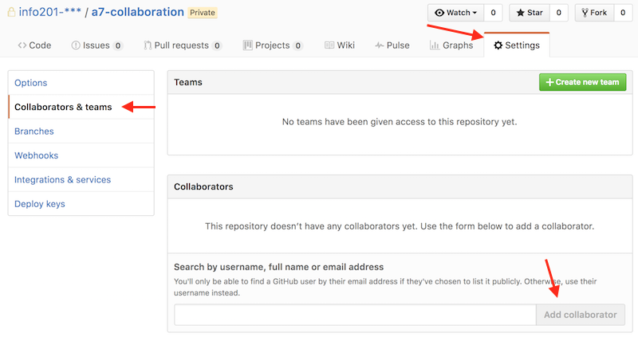

# Git Collaboration {#git-collaboration}

Being able to merge between branches allows you to work **collaboratively**, with multiple people making changes to the same repo and sharing those changes through GitHub. There are a variety of approaches (or **workflows**) that can be used to facilitate collaboration and make sure that people are effectively able to share code. This section describes a variety of different workflows, however we suggest the branch-based workflow called the [**Feature Branch Workflow**](https://www.atlassian.com/git/tutorials/comparing-workflows#feature-branch-workflow) for this course.

## Centralized Workflow
In order to understand the Feature Branch Workflow, it's important to first understand how to collaborate on a centralized repository. The Feature Branch Workflow uses a **centralized repository** stored on GitHub&mdash;that is, every single member of the team will `push` and `pull` to a single GitHub repo. However, since each repository needs to be created under a particular account, this means that a ___single member___ of the team will need to create the repo (such as by accepting a GitHub Classroom assignment, or by clicking the _"New"_ button on their "Repositories" tab on the GitHub web portal).

In order to make sure everyone is able to `push` to the repository, whoever creates the repo will need to [**add the other team members as collaborators**](https://help.github.com/articles/inviting-collaborators-to-a-personal-repository/). You can do this under the **Settings** tab:



Once you've added everyone to the GitHub repository, **each team member** will need to **`clone`** the repository to their local machines to work on the code individually. Collaborators can then `push` any changes they make to the central repository, and `pull` and changes made by others. Because multiple members will be contributing to the _same repositiory_, it's important to ensure that you are working on the most up-to-date version of the code. This means that you will regularly have to **pull in changes** from GitHub that your team members may have committed. As a result, we suggest that you have a workflow that looks like this:

```bash
# Begin your work session by pulling in changes from GitHub
git pull origin master

# If necessary, resolve any merge conflicts and commit them
git add .
git commit -m "Merge in changes from GitHub"

# Do your work, then add, commit and push
git add .
git commit -m "Make progress on feature X"
git push origin master
```

Note, if someone pushes a commit to GitHub _before you push your changes_, you'll need to integrate those into your code (and test them!) before pushing up to GitHub. While working on a single `master` branch in this fashion is possible, you'll encounter fewer conflicts if you use a dedicated **feature branch** for each developer or feature you're working on.

## Feature Branch Workflow
The Feature Branch Workflow is a natural extension of the Centralized Workflow that enhances the model by defining specific _branches_ for different pieces of development (still with one centralized repository). The core idea behind the Feature Branch Workflow is that all development should take place on a dedicated **feature branch**, rather than on the `master` branch. This allows for different people to work on different branches without disturbing the main codebase. For example, you might have one branch `visualization` that focuses on adding a complex visualization, or another `experimental-analysis` that tries a bold new approach to processing the data. Each branch is based on a _feature_ (capability or part) of the project, not a particular person: a single developer could be working on multiple feature branches.

The idea is that the `master` branch _always_ contains "production-level" code: valid, completely working code that you could deploy or publish (read: give to your boss or teacher) at a whim. All feature branches branch off of `master`, and are allowed to contain temporary or even broken code (since they are still in development). This way there is always a "working" (if incomplete) copy of the code (`master`), and development can be kept isolated and considered independent of the whole. This is similar to the example with the `experiment` branch above.

The workflow thus works like this:

1. Ada decides to add a new feature or part to the code. She creates a new feature branch off of `master`:

    ```bash
    git checkout master
    git checkout -b adas-feature
    ```

2. Ada does some work on this feature

    ```bash
    # work is done outside of terminal

    git add .
    git commit -m "Add progress on feature"
    ```

3. Ada takes a break, pushing her changes to GitHub

    ```bash
    git push -u origin adas-feature
    ```

4. After talking to Ada, Bebe decides to help finish up the feature. She checks out the branch and makes some changes, then pushes them back to GitHub

    ```bash
    # fetch will "download" commits from GitHub, without merging them
    git fetch origin
    git checkout adas-feature

    # work is on adas-feature done outside of terminal

    git add .
    git commit -m "Add more progress on feature"
    git push origin adas-feature
    ```

5. Ada downloads Bebe's changes

    ```bash
    git pull origin adas-feature
    ```

6. Ada decides the feature is finished, and _merges_ it back into `master`. But first, she makes sure she has the latest version of the `master` code to integrate her changes with

    ```bash
    git checkout master  # switch to master
    git pull origin master  # download any changes

    git merge adas-feature  # merge the feature into the master branch
    # fix any merge conflicts!!

    git push origin master  # upload the updated code to master
    ```

7. And now that the feature has been successfully added to the project, Ada can delete the feature branch (using `git branch -d branch_name`). See also [here](http://stackoverflow.com/questions/2003505/how-to-delete-a-git-branch-both-locally-and-remotely).

This kind of workflow is very common and effective for supporting collaboration. Note that as projects get large, you may need to start being more organized about how and when you create feature branches. For example, the [**Git Flow**](http://nvie.com/posts/a-successful-git-branching-model/) model organizes feature branches around product releases, and is often a starting point for large collaborative projects.

## Forking Workflow
The Forking Workflow takes a **fundamentally different approach** to collaboration than the Centralized and Feature Branch workflows. Rather than having a single remote, each developer will have **their own repository** on GitHub that is _forked_ from the original repository. As discussed in the [introductory GitHub Chapter](#git-basics), a developer can create their own remote repository from an existing project by _forking_ it on GitHub. This allows the individual to make changes (and contribute to) the project. However, we have not yet discussed how those changes can be integrated into the original code base. GitHub offers a feature called [**pull requests**](https://help.github.com/articles/creating-a-pull-request/) by which you can merge two remote branches (that is: `merge` two branches that are on GitHub). A **pull request** is a request for the changes from one branch to be pulled (merged) into another.

### Pull Requests
Pull requests are primarily used to let teams of developers _collaborate_&mdash;one developer can send a request "hey, can you integrate my changes?" to another. The second developer can perform a **code review**: reviewing the proposed changes and making comments or asking for corrections to anything they find problematic. Once the changes are improved, the pull request can be **accepted** and the changes merged into the target branch. This process is how programmers collaborate on _open-source software_ (such as R libraries like `dplyr`): a developer can _fork_ an existing professional project, make changes to that fork, and then send a pull request back to the original developer asking them to merge in changes ("will you include my changes in your branch/version of the code?").

<p class="alert alert-warning">Pull requests should only be used when doing collaboration using remote branches! Local branches should be `merge`'d locally using the command-line, not GitHub's pull request feature.</p>

In order to issue a pull request, both branches you wish to merge will need to be `pushed` to GitHub (whether they are in the same repo or in forks). To issue the pull request, navigate to your repository on GitHub's web portal and choose the **New Pull Request** button (it is next to the drop-down that lets you view different branches).

In the next page, you will need to specify which branches you wish to merge. The **base** branch is the one you want to merge _into_ (often `master`), and the **head** branch (labeled "compare") is the branch with the new changes you want to merge (often a feature branch; see below).

Add a title and description for your pull request. These should follow the format for git commit messages. Finally, click the **Create pull request** button to finish creating the pull request.

<p class="alert alert-info">Important! The pull request is a request to merge two branches, not to merge a specific set of commits. This means that you can _push more commits_ to the head/merge-from branch, and they will automatically be included in the pull request&mdash;the request is always "up-to-date" with whatever commits are on the (remote) branch.</p>

You can view all pull requests (including those that have been accepted) through the **Pull Requests** tab at the top of the repo's web portal. This is where you can go to see comments that have been left by the reviewer.

If someone sends you a pull request (e.g., another developer on your team), you can [accept that pull request](https://help.github.com/articles/merging-a-pull-request/) through GitHub's web portal. If the branches can be merged without a conflict, you can do this simply by hitting the **Merge pull request** button. However, if GitHub detects that a conflict may occur, you will need to [pull down the branches and merge them locally](https://help.github.com/articles/checking-out-pull-requests-locally).

<p class="alert alert-warning">It is best practice to _never_ accept your own pull requests! If you don't need any collaboration, just merge the branches locally.</p>

Note that when you merge a pull request via the GitHub web site, the merge is done entirely on the server. Your local repo will not yet have those changes, and so you will need to use `git pull` to download the updates to an appropriate branch.

## Resources {-}
- [Atlassian Git Workflows Tutorial](https://www.atlassian.com/git/tutorials/comparing-workflows)
