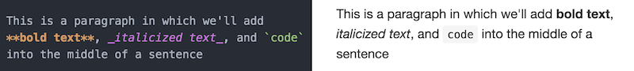
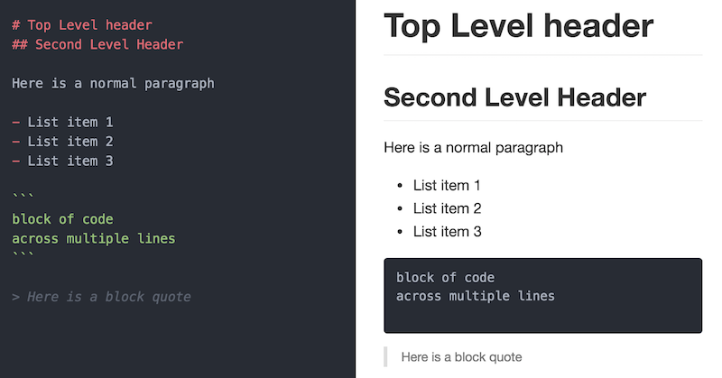

# Markdown {#markdown}

Markdown syntax provides a simple way to describe the desired formatting of text documents. In fact, this book was written using Markdown! With only a small handful of options, Markdown allows you to format to your text (like making text **bold**, or _italics_), as well as provide structure to a document (such as headers or bullet-points). There are a number of programs and services that support the _rendering_ of Markdown, including GitHub, Slack, and StackOverflow (though note the syntax may vary slightly across programs). In this chapter, you'll learn the basics of Markdown syntax, and how to leverage it to produce readable code documents.

## Writing Markdown
Markdown is a lightweight [markup language](https://en.wikipedia.org/wiki/Markup_language) that is used to format and structure text. It is a kind of "code" that you write in order to _annotate_ plain text: it lets the computer know that "this text is bold", "this text is a heading", etc. Compared to other markup languages, Markdown is easy to write and easy to read without getting in the way of the text itself. And because it's so simple to include, it's often used for formatting in web forums and services (like Wikipedia or StackOverflow). As a programmer, you'll use Markdown to create documentation and other supplementary materials that help explain your projects.

### Text Formatting
At its most basic, Markdown is used to declare text formatting options. You do this by adding special symbols (punctuation) _around_ the text you wish to "mark". For example, if you want text to be rendered as _italiccs_, you would surround that text with underscores (**`_`**): you would type `_italics_`, and a program would know to render that text as _italics_. You can see how this looks in the below example (code on the left, rendered version on the right):



There are a few different ways you can format text:

| Syntax | Formatting	|
| :--- | :--- |
| `_text_`	| _italicized_ using underscores (`_`)	|
| `**text**`	| **bolded** using two asterisks (`*`)	|
| ``` `text` ``` | inline `code` with backticks	(` ` `) |
| `~~text~~` | ~~strike-through~~ using tildes (`~`) |


### Text Blocks
But Markdown isn't just about adding **bold** and _italics_ in the middle of text&mdash;it also enables you to create distinct blocks of formatted content (such as a header or a chunk of code). You do this by adding a single symbol in front of the text. Consider the below example:



As you can see, the document (right) is produced using the following Markdown shorthand:

| Syntax | Formatting	|
| :--- | :--- |
| `# ` | Header (use `##` for 2nd-level, `###` for 3rd, etc.) |
| ```` ``` ````	| Code section (3 back ticks) that encapsulate the code	|
| `- ` | Bulleted/unordered lists (hyphens) |
| `> ` | Block quote |

And as you might have guessed from this document, Markdown can even make [tables](https://help.github.com/articles/organizing-information-with-tables/), create [hyperlinks](https://daringfireball.net/projects/markdown/syntax#link), and include [images](https://daringfireball.net/projects/markdown/syntax#img)!

For more thorough lists of Markdown options, see the [resources](#resources) linked below.

Note that Slack will allow you to use Markdown as well, though it has slightly different syntax. Luckily, the client gives you hints about what it supports:


## Rendering Markdown
In order to view the _rendered_ version of your Markdown-formatted syntax, you need to use a program that converts from Markdown into a formatted document. Luckily, GitHub will automatically render your Markdown files (which end with the **`.md`** extension), and Slack or StackOverflow will automatically format your messages.

However, it can be helpful to preview your rendered Markdown before posting code. The best way to do this is to write your marked code in a text-editor that supports preview rendering, such as **Atom**.

- To preview what your rendered content will look like, simply open a Markdown file (`.md`) in Atom. Then use the [command palette](http://flight-manual.atom.io/getting-started/sections/atom-basics/#command-palette) (or the shortcut `ctrl-shift-m`) to toggle the **Markdown Preview**. And once this preview is open, it will automatically update to reflect any changes to the text!

- Note that you can also use the command palette to **Toggle Github Style** for the Markdown preview; this will make the rendered preview look the same as it will when uploaded to GitHub!

Other options for rendering Markdown include:

- Many editors (such as [Visual Studio Code](https://code.visualstudio.com/)) include automatic Markdown rendering, or have extensions to provide that functionality.

- Stand-alone programs such as [Macdown](http://macdown.uranusjr.com/) (Mac only) will also do the same work, often providing nicer looking editor windows.

- There are a variety of online Markdown editors that you can use for practice or quick tests. [Dillinger](http://dillinger.io/) is one of the nicer ones, but there are plenty of others if you're looking for something more specific.

- There are also a number of Google Chrome Extensions that will render Markdown files for you. For example, [Markdown Reader](https://chrome.google.com/webstore/detail/markdown-reader/gpoigdifkoadgajcincpilkjmejcaanc?hl=en), provides a simple rendering of a Markdown file (note it may differ slightly from the way GitHub would render the document). Once you've installed the Extension, you can drag-and-drop a `.md` file into a blank Chrome tab to view the formatted document. Double-click to view the raw code.

## Resources {-}
- [Original Markdown Source](https://daringfireball.net/projects/markdown/)
- [GitHub Markdown Basics](https://help.github.com/articles/basic-writing-and-formatting-syntax/)
- [Slack Markdown](https://get.slack.help/hc/en-us/articles/202288908-Formatting-your-messages)
- [StackOverflow Markdown](http://stackoverflow.com/editing-help)
