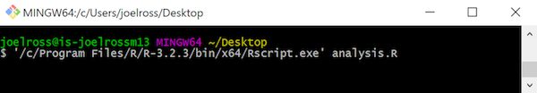
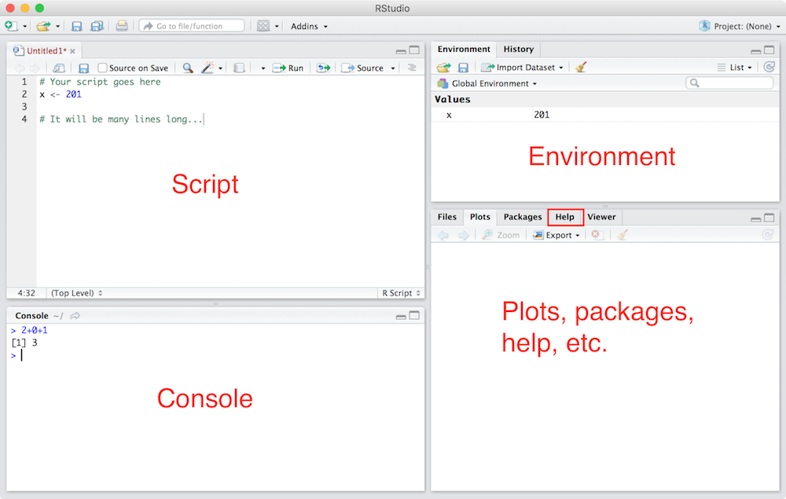

# Introduction to R {#r-intro}

R is an extraordinarily powerful open-source software program built for working with data. It is one of the most popular data science tools because of its ability to efficiently perform statistical analysis, implement machine learning algorithms, and create data visualizations. R is the primary programming language used throughout this book, and understanding its foundational operations is key to being able to perform more complex tasks.

## Programming with R
R is a **statistical programming language** that allows you to write code to work with data. It is an **open-source** programming language, which means that it is free and continually improved upon by the R community. The R language has a number of functionalities that allow you to read, analyze, and visualize datasets.

- _Fun Fact:_ R is called "R" because it was inspired by and comes after the language "S", a language for **S**tatistics developed by AT&amp;T.

So far you've leveraged formal language to give instructions to your computers, such as by writing syntactically-precise instructions at the command-line. Programming in R will work in a similar manner: you will write instructions using R's special language and syntax, which the computer will **interpret** as instructions for how to work with data.

However, as projects grow in complexity, it will become useful if you can write down all the instructions in a single place, and then order the computer to _execute_ all of those instructions at once. This list of instructions is called a **script**. Executing or "running" a script will cause each instruction (line of code) to be run _in order, one after the other_, just as if you had typed them in one by one. Writing scripts allows you to save, share, and re-use your work. By saving instructions in a file (or set of files), you can easily check, change, and re-execute the list of instructions as you figure out how to use data to answer questions. And, because R is an _interpreted_ language rather than a _compiled_ language like Java, R programming environments will also give you the ability to execute each individual line of code in your script if you desire (though this will become cumbersome as projects become large).

As you begin working with data in R, you will be writing multiple instructions (lines of code) and saving them in files with the **`.R`** extension, representing R scripts. You can write this R code in any text editor (such as Atom), but we recommend you usually use a program called **RStudio** which is specialized for writing and running R scripts.

## Running R Scripts
R scripts (programs) are just a sequence of instructions, and there are a couple of different ways in which we can tell the computer to execute these instructions.

### Command-Line {#running-r-cmd}
It is possible to issue R instructions (run lines of code) one-by-one at the command-line by starting an **interactive R session** within your terminal. This will allow you to type R code directly into the terminal, and your computer will interpret and execute each line of code (if you just typed R syntax directly into the terminal, your computer wouldn't understand it).

With R installed, you can start an interactive R session on a Mac by typing `R` into the terminal (to run the `R` program), or on Windows by running the "R" desktop app program. This will start the session and provide you with lots of information about the R language:


Notice that this description also include _instructions on what to do next_&mdash;most importantly `"Type 'q()' to quit R."`.

<p class="alert alert-warning">Always read the output when working on the command-line!</p>

Once you've started running an interactive R session, you can begin entering one line of code at a time at the prompt (`>`). This is a nice way to experiment with the R language or to quickly run some code. For example, try doing some math at the command prompt (i.e., enter `1 + 1` and see the output).

- Note that RStudio also provides an interactive console that provides the exact same functionality.

It is also possible to run entire scripts from the command-line by using the `RScript` program, specifying the `.R` file you wish to execute:


Entering this command in the terminal would execute each line of R code written in the `analysis.R` file, performing all of the instructions that you had save there. This is helpful if your data has changed, and you want to reproduce the results of your analysis using the same instructions.

#### Windows Command-Line
On Windows, you need to tell the computer where to find the `R.exe` and `RScript.exe` programs to execute&mdash;that is, what is the **path** to these programs. You can do this by specifying the _absolute path_ to the R program when you execute it, for example:



If you plan to run R from the command-line regularly (_not_ a requirement for this course), a better solution is to add the folder containing these programs to your computer's [**`PATH` variable**](https://en.wikipedia.org/wiki/PATH_(variable)). This is a _system-level_ variable that contains a list of folders that the computer searches when finding programs to execute execute. The reason the computer knows where to find the `git.exe` program when you type `git` in the command-line is because that program is "on the `PATH`".

In Windows, You can add the `R.exe` and `RScript.exe` programs to your computer's `PATH` by editing your machine's **Environment Variables** through the _Control Panel_:

- Open up the "Advanced" tab of the "System Properties". In Windows 10, you can find this by searching for "environment". Click on the "Environment Variables..." button to open the settings for the Environment Variables.

- In the window that pops up, select the "PATH" variable (either per user or for the whole system) and click the "Edit" button below it.

- In the next window that pops up, click the "Browse" button to select the _folder that contains_ the `R.exe` and `RScript.exe` files. See the above screenshot for one possible path.

- You will need to close and re-open your command-line (Git Bash) for the `PATH` changes to take effect.

Overall, using R from the command-line can be tricky; we recommend you just use RStudio instead.

### RStudio {#running-r-rstudio}
RStudio is an open-source **integrated development environment (IDE)** that provides an informative user interface for interacting with the R interpreter. IDEs provide a platform for writing _and_ executing code, including viewing the results of the code you have run. If you haven't already, make sure to download and install [the free version of RStudio](https://www.rstudio.com/products/rstudio/download3/#download).

When you open the RStudio program (either by searching for it, or double-clicking on a desktop icon), you'll see the following interface:



An RStudio session usually involves 4 sections ("panes"), though you can customize this layout if you wish:

- **Script**: The top-left pane is a simple text editor for writing your R code. While it is not as robust as a text editing program like Atom, it will colorize code, "auto-complete" text, and allows you to easily execute your code. Note that this pane is hidden if there are no open scripts; select `File > New File > R Script` from the menu to create a new script file.

    In order to execute (run) the code you write, you have two options:

    1. You can execute a section of your script by selecting (highlighting) the desired code and pressing the "Run" button (keyboard shortcut: `ctrl` and `enter`). If no lines are selected, this will run the line currently containing the cursor. This is the most common way to execute code in R.

        - _Protip:_ use `cmd + a` to select the entire script!

    2. You can execute an entire script by using the `Source` command to treat the current file as the "source" of code. Press the "Source" button (hover the mouse over it for keyboard shortcuts) to do so. If you check the "Source on save" option, your entire script will be executed every time you save the file (this may or may not be appropriate, depending on the complexity of your script and its output).

- **Console**: The bottom-left pane is a console for entering R commands. This is identical to an inetractive session you'd run on the command-line, in which you can type and execute one line of code at a time. The console will also show the printed results from executing the code you execute from the Script pane.

    - _Protip:_ just like with the command-line, you can **use the up arrow** to easily access previously executed lines of code.

- **Environment**: The top-right pane displays information about the current R environment&mdash;specifically, information that you have stored inside of _variables_ (see below). In the above example, the value `201` is stored in a variable called `x`. You'll often create dozens of variables within a script, and the Environment pane helps you keep track of which values you have stored in what variables. _This is incredibly useful for debugging!_

- **Plots, packages, help, etc.**: The bottom right pane contains multiple tabs for accessing various information about your program. When you create visualizations, those plots will render in this quadrant. You can also see what packages you've loaded or look up information about files. _Most importantly_, this is also where you can access the official documentation for the R language. If you ever have a question about how something in R works, this is a good place to start!

Note, you can use the small spaces between the quadrants to adjust the size of each area to your liking. You can also use menu options to reorganize the panes if you wish.


## Comments
Before discussing how to program with R, we need to talk about a piece of syntax that lets you comment your code. In programming, **comments** are bits of text that are _not interpreted as computer instructions_&mdash;they aren't code, they're just notes about the code! Since computer code can be opaque and difficult to understand, we use comments to help write down the meaning and _purpose_ of our code. While a computer is able to understand the code, comments are there to help _people_ understand it. This is particularly imporant when someone else will be looking at your work&mdash;whether that person is a collaborator, or is simply a future version of you (e.g., when you need to come back and fix something and so need to remember what you were even thinking).

Comments should be clear, concise, and helpful&mdash;they should provide information that is not otherwise present or "obvious" in the code itself.

In R, we mark text as a comment by putting it after the pound/hashtag symbol (**`#`**). Everything from the `#` until the end of the line is a comment. We put descriptive comments _immediately above_ the code it describes, but you can also put very short notes at the end of the line of code (preferably following two spaces):

```r
# Set how many bottles of beer are on the wall
bottles <- 99 - 1  # 98 bottles
```

(You may recognize this `#` syntax and commenting behavior from the commmand-line and git chapters. That's because the same syntax is used in a Bash shell!)


## Variables
Since computer programs involve working with lots of _information_, we need a way to store and refer to this information. We do this with **variables**. Variables are labels for information; in R, you can think of them as "boxes" or "nametags" for data. After putting data in a variable box, you can then refer to that data by the name on the box.

Variable names can contain any combination of letters, numbers, periods (`.`), or underscores (`_`). Variables names must begin with a letter. Note that like everything in programming, variable names are case sensitive. It is best practice to make variable names descriptive and information about what data they contain. `a` is not a good variable name. `cups_of_coffee` is a good variable name. In this course, we will use the [Tidyverse Style Guide](http://style.tidyverse.org/) as a foundation of _how we should style our code_. To comply with this style guide, variables should be **all lower-case letters, separated by underscore (`_`)**. This is also known as **snake_case**.

<p class="alert alert-info">**Note:** There is an important distinction between _syntax_ and _style_. You need to use the proper _syntax_ such that your _machine_ understands your code. This requires that you follow a set of rigid rules for what code can be procesed. _Style_ is what helps make your code understandable for other _humans_. Good style is not required to get your code to run, but it's imperative for writing clear, (human) readable code.</p>

We call putting information in a variable **assigning** that value to the variable. We do this using the _assignment operator_ **`<-`**. For example:

```r
# Stores the number 7 into a variable called `shoe_size`
shoe_size <- 7
```

- _Notice:_ variable name goes on the left, value goes on the right!

You can see what value (data) is inside a variable by either typing that variable name as a line of code, or by using R's built-in `print()` function (more on functions later):

```r
print(shoe_size)
# [1] 7
```

- We'll talk about the `[1]` in that output later.

You can also use **mathematical operators** (e.g., `+`, `-`, `/`, `*`) when assigning values to variables. For example, you could create a variable that is the sum of two numbers as follows:

```r
x <- 3 + 4
```

Once a value (like a number) is _in_ a variable, you can use that variable in place of any other value. So all of the following are valid:

```r
x <- 2  # store 2 in x
y <- 9  # store 9 in y
z <- x + y  # store sum of x and y in z
print(z)  # 11
z <- z + 1  # take z, add 1, and store result back in z
print(z)  # 12
```

### Basic Data Types
In the example above, we stored **numeric** values in variables. R is a **dynamically typed language**, which means that we _do not_ need to explicitly state what type of information will be stored in each variable we create. R is intelligent enough to understand that if we have code `x <- 7`, then `x` will contain a numeric value (and so we can do math upon it!)

There are a few "basic types" (or _modes_) for data in R:

- **Numeric**: The default computational data type in R is numeric data, which consists of the set of real numbers (including decimals). We use use **mathematical operators** on numeric data (such as `+`, `-`, `*`, `-`, etc.). There are also numerous functions that work on numeric data (such as calculating sums or averages).

- **Character**: Character data stores _strings_ of characters (things you type with a keyboard) in a variable. You specify that some information is character data by surrounding it in either single quotes (**`'`**) or double quotes (**`"`**).

    ```r
    # Create character variable `famous.poet` with the value "Bill Shakespeare"
    famous.poet <- "Bill Shakespeare"
    ```

    Note that character data _is still data_, so it can be assigned to a variable just like numeric data!

    There are no special operators for character data, though there are a many built-in functions for working with strings.

- **Logical**: Logical (a.k.a Boolean) data types store "yes-or-no" data. A logical value can be one of two values: `TRUE` or `FALSE`. Importantly, these **are not** the strings `"TRUE"` or `"FALSE"`; logical values are a different type! If you prefer, you can use the shorthand `T` or `F` in lieu of `TRUE` and `FALSE` in variable assignment.

    - _Fun fact:_ logical values are called "booleans" after mathematician and logician [George Boole](https://en.wikipedia.org/wiki/George_Boole).

    Logical values are most commonly the result of applying a **relational operator** (also called a **comparison operator**) to some other data. Comparison operators are used to compare values and include: `<` (less than), `>` (greater than), `<=` (less-than-or-equal), `>=` (greater-than-or-equal), `==` (equal), and `!=` (not-equal).

    ```r
    # Store values in variables
    x <- 3
    y <- 3.15

    # Compare values in x and y
    x > y  # returns logical value FALSE (x IS NOT bigger than y)
    y != x  # returns logical value TRUE (y IS not-equal to x)

    # compare x to pi (built-in variable)
    y == pi  # returns logical value FALSE

    # compare strings (based on alphabetical ordering)
    "cat" > "dog"  # returns FALSE
    ```

    Logical values have their own operators as well (called **logical operators** or **boolean operators**). These _apply to_ logical values and _produce_ logical values, allowing you to make more complex logical expressions. These include `&` (and), `|` (or), and `!` (not).

    ```r
    # Store values in variables
    x <- 3.1
    y <- 3.2
    pet <- "dog"
    weather <- "rain"

    # Check if x is less than pi AND y is greater than pi
    x < pi & y > pi  # TRUE

    # Check if pet is "cat" OR "dog"
    pet == "cat" | pet == "dog"  # TRUE

    # Check if pet is "dog" AND NOT weather is "rain"
    pet == "dog" & !(weather == "rain")  # FALSE
    ```

    Note that it's easy to write complex expressions with logical operators. If you find yourself getting lost, I recommend rethinking your question to see if there is a simpler way to express it!


- **Complex**: Complex (imaginary) numbers have their own data storage type in R, are are created using the `i` syntax: `complex.variable <- 2i`. We will not be using complex numbers in this course.

- **Integer**: Integer values are technically a different data type than numeric values because of how they are stored and manipulated by the R interpreter. This is something that you will rarely encounter, but it's good to know that you can specify a number is of integer type rather than general numeric type by placing a capital `L` (for "long integer") after an value in variable assignment (`my.integer <- 10L`).


## Getting Help {#gettinghelp}
As with any programming language, when working in R you will inevitably run into problems, confusing situations, or just general questions. Here are a few ways to start getting help.

1. **Read the error messages**: If there is an issue with the way you have written or executed your code, R will often print out a red error message in your console. Do you best to decipher the message (read it carefully, and think about what is meant by each word in the message), or you can put it directly into Google to get more information. You'll soon get the hang of interpreting these messages if you put the time into trying to understand them.

2. **Google**: When you're trying to figure out how to do something, it should be no surprise that Google is often the best resource. Try searching for queries like `"how to <DO THING> in R"`. More frequently than not, your question will lead you to a Q/A forum called StackOverflow (see below), which is a great place to find potential answers.

3. **StackOverflow**: StackOverflow is an amazing Q/A forum for asking/answering programming questions. Indeed, most basic questions have already been asked/answered here. However, don't hesitate to post your own questions to StackOverflow. Be sure to hone in on the specific question you're trying to answer, and provide error messages and sample code. I often find that, by the time I can articulate the question clearly enough to post it, I've figured out my problem anyway.

    - There is a classical method of debugging called [rubber duck debugging](https://en.wikipedia.org/wiki/Rubber_duck_debugging), which involves simply trying to explain your code/problem to an inanimate object (talking to pets works too). You'll usually be able to fix the problem if you just step back and think about how you would explain it to someone else!

4. **Documentation**: R's documentation is actually quite good. Functions and behaviors are all described in the same format, and often contain helpful examples. To search the documentation within R (or in RStudio), simply type `?` followed by the function name you're using (more on functions coming soon). You can also search the documentation by typing two questions marks (`??SEARCH`).

    - You can also look up help by using the `help()` function (e.g., `help(print)` will look up information on the `print()` function, just like `?print` does). There is also an `example()` function you can call to see examples of a function in action (e.g., `example(print)`). This will be more important in the next module!

    - [rdocumentation.org](https://www.rdocumentation.org/) has a lovely searchable and readable interface to the R documentation.


## Resources {-}
- [Tidyverse Style Guide](http://style.tidyverse.org/)
- [DataCamp](https://www.datacamp.com/home) (awesome resource for interactive tutorials in R)
- [R Tutorial: Introduction](http://www.r-tutor.com/r-introduction)
- [R Tutorial: Basic Data Types](http://www.r-tutor.com/r-introduction/basic-data-types)
- [R Tutorial: Operators](https://www.tutorialspoint.com/r/r_operators.htm)
- [RStudio Keyboard Shortcuts](https://support.rstudio.com/hc/en-us/articles/200711853-Keyboard-Shortcuts)
- [R Documentation](https://www.rdocumentation.org/) searchable online documentation
- [R for Data Science](http://r4ds.had.co.nz/) online textbook
- [aRrgh: a newcomer's (angry) guide to R](http://arrgh.tim-smith.us/) opinionated but clear introduction
- [The Art of R Programming](https://www.nostarch.com/artofr.htm) print textbook
