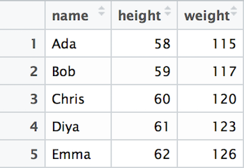
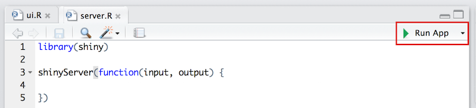
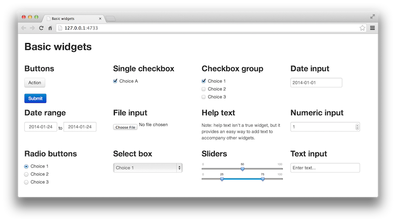

# About this Book {-}

```{r fig.align='center', echo=FALSE, include=identical(knitr:::pandoc_to(), 'html')}
#to include only in html (centered)
#knitr::include_graphics('img/cover-img.png', dpi = NA)
```

<!--  -->

This book covers the foundation skills necessary to start ___writing computer programs to work with data___ using modern and reproducable techniques. It requires no technical background. These materials were developed for the **INFO 201: Technical Foundations of Informatics** course taught at the [University of Washington Information School](https://ischool.uw.edu/); however they have been structured to be an online resource for anyone hoping to learn to work with information using programmatic approaches.

<!-- TODO: Include previous course offerings? -->

<!-- TODO: Include author contact info? -->

<p class="alert alert-warning">This book is currently in **beta** status. Visit us on [GitHub](https://github.com/info201/book) to contribute improvements.</p>


This book is licensed under a [Creative Commons Attribution-NonCommercial-ShareAlike 4.0 International License](http://creativecommons.org/licenses/by-nc-sa/4.0/).

<!--chapter:end:index.Rmd-->

# Setting up your Machine {#setup-machine}

We'll be using a variety of different software programs to write, manage, and execute the code that we write. Unfortunately, one of the most frustrating and confusing barriers to working with code is simply getting your machine properly set up. This chapter aims to provide sufficient information for setting up your machine, and troubleshooting the process.

<p class="alert alert-info">Note that iSchool lab machines should have all appropriate software already installed and ready to use.</p>

In short, you'll need to install the following programs: see below for more information / options.

- **Git**: A set of tools for tracking changes to computer code (especially when collaborating with others). This program is already installed on Macs.

    - **GitHub**: A web service for hosting code online. You don't actually need to _install_ anything GitHub (it uses `git`), but you'll need to sign up for the service.

- **Bash**: A _command-line interface_ for controlling your computer. `git` is a command-line program so you'll need a command shell to use it. Macs already have a Bash program called _Terminal_. On Windows, installing `git` will also install a Bash shell called _Git Bash_, or you can try the (experimental) Linux subsystem for Windows 10.

- **Atom**: A lightweight text editor that supports programming in lots of different languages.

    - You are welcome to use another text editor if you wish; some further suggestions are included.

- **R**: a programming language commonly used for working with data. This is the primary programming language used throught this book. "Installing R" actually means installing tools that will let your computer understand and run R code.

- **RStudio**: An graphical editor for writing and running R code. This will soon become our primary development application.

The following sections have additional information about the purpose of each component, how to install it, and alternative configurations.


## Git
**`git`** is a version control system that provides a set of commands that allow you to manage changes to written code, particularly when collaborating with other programmers (much more on this in [chapter 4](#git-basics)). To start, you'll need to [download](https://git-scm.com/downloads) and install the software. If you are on a Mac, `git` should already be installed.

If you are using a Windows machine, this will also install a program called Git Bash, which provides a text-based interface for executing commands on your computer. For alternative/additional Windows command-line tools, see below.

### GitHub
GitHub is a website that is used to store copies of computer code that are being managed with `git` (think "Imgur for code"). Students in the INFO 201 course will use GitHub to turn in programming assignments.

In order to use GitHub, you'll need to [create a free GitHub account](https://github.com/join), if you don't already have one. You should register a username that is identifiable as you (e.g., based on your name or your UW NetID). This will make it easier for others to determine out who contributed what code, rather than needing to figure out who 'LeetDesigner2099' is. This can be the start of a professional account you may use for the rest of your career!

## Command-line Tools (Bash)
The command-line provides a text-based interface for giving instructions to your computer (much more on this in [chapter 2](#command-line)). With this book, you'll largely use the command-line for navigating your computer's file structure, and executing commands that allows you to keep track of changes to the code you write (i.e., version control with `git`).

In order to use the command-line, you will need to use a **command shell** (a.k.a. a _command prompt_). This is a program that provides the interface to type commands into. In particular, we'll be working with the <a href="https://en.wikipedia.org/wiki/Bash_(Unix_shell)">Bash</a> shell, which provides a particular common set of commands common to Mac and Linux machines.

### Command-line on a Mac
On a Mac you'll want to use the built-in app called *Terminal*. You can open it by searching via Spotlight (hit Cmd (`⌘`) and Spacebar together, type in "terminal", then select the app to open it), or by finding it in the Applications/Utilities folder.

### Command-line on Windows
On Windows, we recommend using [**Git Bash**](https://git-scm.com/downloads), which you should have installed along with `git` (above). Open this program to open the command-shell. This works great, since you'll primarily be using the command-line for performing version control.

- Note that Windows does come with its own command-prompt, called the _DOS Prompt_, but it has a different set of commands and features. _Powershell_ is a more powerful version of the DOS prompt if you really want to get into the Windows Management Framework. But Bash is more common in open-source programming like we'll be doing, and so we will be focusing on that set of commands.

Alternatively, the 64-bit Windows 10 Anniversary update (August 2016) _does_ include a beta version of an integrated Bash shell. You can access this by [enabling the subsystem for Linux](https://msdn.microsoft.com/en-us/commandline/wsl/install_guide) and then running `bash` in the command prompt. This is currently (May 2017) "beta" technology, but will suffice for our purposes if you can get it running.


## Text Editors
In order to produce computer code, you need somewhere to write it (and we don't want to write it in MS Word!). There are a variety of available programs that provide an interface for editing code. A major advantage of these programs is that they provide automatic formatting/coloring for easier interpretation of the code, along with cool features like auto-completion and integration with version control.

RStudio has a great built-in text editor, but you'll sometimes want to use another text editor which is lighter weight (e.g., runs faster), more robust, or supports a different programming language. There are lots of different text editors out there, all of which have slightly different appearances and features. You only need to download and use one of the following programs (we recommend **Atom** as a default), but feel free to try out different ones to find something you like (and then evangelize about it to your friends!)

### Atom
[**Atom**](https://atom.io/) is a text editor built by the folks at GitHub and has been gaining in popularity. As an open source project, people are continually building (and making available) interesting/useful extensions. Its built-in spell-check is a great feature, especially for documents that require lots of written text. It also has excellent support for Markdown, a markup language you'll be using regularly in this course.

To Download Atom, visit their [**webpage**](https://atom.io/) and click the "Download" button to download the installer `.exe` file, then double-click on that icon to install the application.

Once you've installed Atom, you can open the program and create a new text file. When you save a document that is a particular file-type (i.e., `file-name.R`, or `file-name.md`), Atom (or any other modern text-editor) will apply a language specific color scheme to your text, making it easier to read.

The trick to using Atom more efficiently is to get comfortable with the [Command Palette](http://flight-manual.atom.io/getting-started/sections/atom-basics/#command-palette). If you hit `Cmd+Shift+P`, Atom will open a small window where you can search for whatever you want the editor to do. For example, if you type in `markdown` you can get list of commands related to Markdown files (including the ability to open up a preview).

For more information about using Atom, see [the manual](http://flight-manual.atom.io/).

### Visual Studio Code
[**Visual Studio Code**](https://code.visualstudio.com/) (or VS Code; not to be confused with Visual Studio) is a free, open-source editor developed by Microsoft&mdash;yes, really. While it focuses on web programming and JavaScript, it readily supports lots of languages including Markdown and R and provides a number of extensions for adding even more features. It has a similar _command palette_ to Atom, but isn't quite as nice for editing Markdown specifically. Although fairly new, it is updated regularly and has become one of our main editors for programming.

### Sublime Text
[**Sublime Text**](https://www.sublimetext.com/3) is a very popular text editor with excellent defaults and a variety of available extensions (though you'll need to manage and install extensions to achieve the functionality offered by other editors out of the box). While the software can be used for free, every 20 or so saves it will prompt you to purchase the full version.

## R Language
The primary programming language you will use throughout this book is called [**R**](https://www.r-project.org/). It's a very powerful statistical programming language that is built to work well with large and diverse datasets. See the _[Introduction to R]_ chapter for a more in-depth introduciton to the language.

In order to program with R, you will need to install the ___R Interpreter___ on your machine. This is a piece of software that is able to "read" code written in R and use that code to control your computer, thereby "programming" it.

The easiest way to install R is to download it from the Comprehensive R Archive Network (CRAN) at **<https://cran.rstudio.com/>**. Click on the appropriate link for your operating system in order to find a link to the installer.

- On a Mac, you're looking for the `.pkg` file&mdash;get the latest version supported by your computer.
- On Windows, following the link to the `base` subdirectory (or following the link to "_install R for the first time_"), then click the link to download the latest version of R for Windows. You will need to double-click on the `.exe` file to install the software.

## RStudio
While you are able to execute R scripts without an interface, the **RStudio** application provides a wonderful way to engage with the R language. RStudio is described in more detail in _[Introduction to R]_

To install the RStudio program, select the **installer** for your operating system from the [downloads page](https://www.rstudio.com/products/rstudio/download/). Make sure to download the ___free___ version:


Once the download completes, double-click on the `.exe` or `.dmg` file to run the installer. Simply follow the steps of the installer, and you should be prepared to use RStudio.


## Resources {-}
Links to the recommended software are collected here for easy access:

- [git (and Git Bash)](https://git-scm.com/downloads)
    - [GitHub](https://github.com/join) (sign up)
    - optional: [Bash on Windows](https://msdn.microsoft.com/en-us/commandline/wsl/install_guide)
- [Atom](https://atom.io/)
- [R](https://cran.rstudio.com/)
- [RStudio](https://www.rstudio.com/products/rstudio/download3/)

<!--chapter:end:setup.Rmd-->

# The Command Line {#command-line}

The **command-line** is an _interface_ to a computer&mdash;a way for you (the human) to communicate with the machine. But unlike common graphical interfaces that use <a href="https://en.wikipedia.org/wiki/WIMP_(computing)">windows, icons, menus, and pointers</a>, the command-line is _text-based_: you type commands instead of clicking on icons. The command-line lets you do everything you'd normally do by clicking with a mouse, but by typing in a manner similar to programming!


The command-line is not as friendly or intuitive as a graphical interface: it's much harder to learn and figure out. However, it has the advantage of being both more powerful and more efficient in the hands of expert users. (It's faster to type than to move a mouse, and you can do _lots_ of "clicks" with a single command). Thus, all professional developers interact with the command-line, particularly when working with large amounts of data or files.

This chapter will give you a brief introduction to basic tasks using the command-line: enough to get you comfortable navigating the interface and able to interpret commands.


## Accessing the Command-Line
In order to use the command-line, you will need to open a **command shell** (a.k.a. a _command prompt_). This is a program that provides the interface to type commands into. You should have installed a command shell (hereafter "the terminal") as part of [setting up your machine](#setup-machine).

Once you open up the shell (Terminal or Git Bash), you should see something like this (red notes are added):


This is the textual equivalent of having opened up Finder or File Explorer and having it show you the user's "Home" folder. The text shown lets you know:

- What **machine** you're currently interfacing with (you can use the command-line to control different computers across a network or the Internet).
- What **directory** (folder) you are currently looking at (`~` is a shorthand for the "home directory").
- What **user** you are logged in as.

After that you'll see the **prompt** (typically deonated as the `$` symbol), which is where you will type in your commands.

## Navigating the Command Line
Although the command-prompt gives you the name of the folder we're in, you might like more detail about where that folder is. Time to send your first command! At the prompt, type:

```bash
pwd
```

This stands for **p**rint **w**orking **d**irectory (shell commands are highly abbreviated to make them faster to type), and will tell the computer to print the folder you are currently "in".

<p class="alert alert-info">_Fun fact:_ technically, this command starts a tiny program (app) that does exactly one thing: prints the working directory. When you run a command, you're actually executing a tiny program! And when you run programs (tiny or large) on the command-line, it looks like you're typing in commands.</p>

Folders on computers are stored in a hierarchy: each folder has more folders inside it, which have more folders inside them. This produces a <a href="https://en.wikipedia.org/wiki/Tree_(data_structure)">tree</a> structure:


We describe what folder we are in putting a slash `/` between each folder in the tree: thus `/Users/iguest` means "the `iguest` folder, which is inside the `Users` folder".

At the very top (or bottom, depending on your point of view) is the **root** `/` directory&dash;which has no name, and so is just indicated with that single slash. So `/Users/iguest` really means "the `iguest` folder, which is inside the `Users` folder, which is inside the root folder".

### Changing Directories
What if you want to change folders? In a graphical system like Finder, you would just double-click on the folder to open it. But there's no clicking on the command-line.

<p class="alert alert-warning">This includes clicking to move the cursor to an earlier part of the command you typed. You'll need to use the left and right arrow keys to move the cursor instead!</p>

<p class="alert alert-info">**Protip:** The up and down arrow keys will let you cycle though your previous commands so you don't need to re-type them!</p>

Since you can't click on a folder, you'll need to use another command:

```bash
cd folder_name
```

The first word is the **command**, or what you want the computer to do. In this case, you're issuing the command that means **c**hange **d**irectory.

The second word is an example of an **argument**, which is a programming term that means "more details about what to do". In this case, you're providing a _required_ argument of what folder you want to change to! (You'll of course need to replace `folder_name` with the name of the folder).

- Try changing to the `Desktop` folder, which should be inside the home folder you started in&mdash;you could see it in Finder or File Explorer!

- After you change folders, try printing your currently location. Can you see that it has changed?


### Listing Files
In a graphical system, once you've double-clicked on a folder, Finder will show you the contents of that folder. The command-line doesn't do this automatically; instead you need another command:

```bash
ls [folder_name]
```

This command says to **l**i**s**t the folder contents. Note that the _argument_ here is in brackets (`[]`) to indicate that it is _optional_. If you just issue the **`ls`** command without an argument, it will list the contents of the current folder. If you include the optional argument (leaving off the brackets), you can "peek" at the contents of a folder you are not currently in.

<div class="alert alert-danger">
<p>**Warning**: The command-line can be not great about giving **feedback** for your actions. For example, if there are no files in the folder, then `ls` will simply show nothing, potentially looking like it "didn't work". Or when typing a **password**, the letters you type won't show (not even as `*`) as a security measure.</p>
<p>Just because you don't see any results from your command/typing, doesn't mean it didn't work! Trust in yourself, and use basic commands like `ls` and `pwd` to confirm any changes if you're unsure. Take it slow, one step at a time.</p>
</div>

### Paths
Note that both the **`cd`** and **`ls`** commands work even for folders that are not "immediately inside" the current directory! You can refer to _any_ file or folder on the computer by specifying its **path**. A file's path is "how you get to that file": the list of folders you'd need to click through to get to the file, with each folder separated by a `/`:

```
cd /Users/iguest/Desktop/
```

This says to start at the root directory (that initial `/`), then go to `Users`, then go to `iguest`, then to `Desktop`.

Because this path starts with a specific directory (the root directory), it is referred to as an **absolute path**. No matter what folder you currently happen to be in, that path will refer to the correct file because it always starts on its journey from the root.

Contrast that with:

```
cd iguest/Desktop/
```

Because this path doesn't have the leading slash, it just says to "go to the `iguest/Desktop` folder _from the current location_". It is known as a **relative path**: it gives you directions to a file _relative to the current folder_. As such, the relative path `iguest/Desktop/` path will only refer to the correct location if you happen to be in the `/Users` folder; if you start somewhere else, who knows where you'll end up!

<p class="alert alert-warning">You should **always** use relative paths, particularly when programming! Because you'll almost always be managing multiples files in a project, you should refer to the files _relatively_ within your project. That way, you program can easily work across computers. For example, if your code refers to `/Users/your-user-name/project-name/data`, it can only run on `your-user-name`. However, if you use a _relative path_ within your code (i.e., `project-name/data`), the program will run on multiple computers (crucial for collaborative projects).</p>

You can refer to the "current folder" by using a single dot **`.`**. So the command

```bash
ls .
```

means "list the contents of the current folder" (the same thing you get if you leave off the argument).

If you want to go _up_ a directory, you use _two_ dots: **`..`** to refer to the **parent** folder (that is, the one that contains this one). So the command

```bash
ls ..
```

means "list the contents of the folder that contains the current folder".

Note that **`.`** and **`..`** act just like folder names, so you can include them anywhere in paths: `../../my_folder` says to go up two directories, and then into `my_folder`.

<p class="alert alert-info">**Protip:** Most command shells like Terminal and Git Bash support **tab-completion**. If you type out just the first few letters of a file or folder name and then hit the `tab` key, it will automatically fill in the rest of the name! If the name is ambiguous (e.g., you type `Do` and there is both a `Documents` and a `Downloads` folder), you can hit `tab` _twice_ to see the list of matching folders. Then add enough letters to distinguish them and tab to complete! This will make your life better.</p>

Also remember that you can use a tilde **`~`** as shorthand for the home directory of the current user. Just like `.` refers to "current folder", `~` refers to the user's home directory (usually  `/Users/USERNAME`). And of course, you can use the tilde as part of a path as well.


## File Commands
```{r results='asis', echo=FALSE, include=identical(knitr:::pandoc_to(), 'html')}
#to include only in html
cat('')
```

Once you're comfortable navigating folders in the command-line, you can start to use it to do all the same things you would do with Finder or File Explorer, simply by using the correct command. Here is an short list of commands to get you started using the command prompt, though there are [many more](http://www.lagmonster.org/docs/unix/intro-137.html).

| Command | Behavior |
| :------ | :------- |
| **`mkdir`** | **m**a**k**e a **dir**ectory |
| **`rm`** | **r**e**m**ove a file or folder |
| **`cp`** | **c**o**p**y a file from one location to another |
| **`open`** | Mac: opens a file or folder |
| **`start`** | Windows: opens a file or folder |
| **`cat`** | con**cat**enate (combine) file contents and display the results |
| **`history`** | show previous commands executed |

<div class="alert alert-danger">
<p>**Warning**: The command-line makes it **dangerously easy** to _permanently delete_ multiple files or folders and _will not_ ask you to confirm that you want to delete them. Be very careful when using the terminal to manage your files, as it is very powerful.</p>
</div>

Be aware that many of these commands **won't print anything** when you run them. This often means that they worked; they just did so quietly. If it _doesn't_ work, you'll know because you'll see a message telling you so (and why, if you read the message). So just because you didn't get any output doesn't mean you did something wrong&mdash;you can use another command (such as **`ls`**) to confirm that the files or folders changed the way you wanted!

### Learning New Commands
How can you figure out what kind of arguments these commands take? You can look it up! This information is available online, but many command shells (but _not_ Git Bash, unfortunately) also include their own manual you can use to look up commands!

```bash
man mkdir
```

Will show the **man**ual for the **`mkdir`** program/command.

<p class="alert alert-info">Because manuals are often long, they are opened up in a command-line viewer called <a href="https://en.wikipedia.org/wiki/Less_(Unix)">`less`</a>. You can "scroll" up and down by using the arrow keys. Hit the `q` key to **q**uit and return to the command-prompt.</p>


If you look under "Synopsis" you can see a summary of all the different arguments this command understands. A few notes about reading this syntax:

- Recall that anything in brackets `[]` is optional. Arguments that are not in brackets (e.g., `directory_name`) are required.

- **"Options"** (or "flags") for command-line programs are often marked with a leading dash **`-`** to make them distinct from file or folder names. Options may change the way a command-line program behaves&mdash;like how you might set "easy" or "hard" mode in a game. You can either write out each option individually, or combine them: **`mkdir -p -v`** and **`mkdir -pv`** are equivalent.

    - Some options may require an additional argument beyond just indicating a particular operation style. In this case, you can see that the `-m` option requires you to specify an additional `mode` parameter; see the details below for what this looks like.

- Underlined arguments are ones you choose: you don't actually type the word `directory_name`, but instead your own directory name! Contrast this with the options: if you want to use the `-p` option, you need to type `-p` exactly.

Command-line manuals ("man pages") are often very difficult to read and understand: start by looking at just the required arguments (which are usually straightforward), and then search for and use a particular option if you're looking to change a command's behavior.

For practice, try to read the man page for `rm` and figure out how to delete a folder and not just a single file. Note that you'll want to be careful, as this is a good way to [break things](http://www.pcworld.com/article/3057235/data-center-cloud/that-man-who-deleted-his-entire-company-with-a-line-of-code-it-was-a-hoax.html).

## Dealing With Errors
Note that the syntax of these commands (how you write them out) is very important. Computers aren't good at figuring out what you meant if you aren't really specific; forgetting a space may result in an entirely different action.

Try another command: **`echo`** lets you "echo" (print out) some text. Try echoing `"Hello World"` (which is the traditional first computer program):

```bash
echo "Hello world"
```

What happens if you forget the closing quote? You keep hitting "enter" but you just get that `>` over and over again! What's going on?

- Because you didn't "close" the quote, the shell thinks you are still typing the message you want to echo! When you hit "enter" it adds a _line break_ instead of ending the command, and the `>` marks that you're still going. If you finally close the quote, you'll see your multi-line message printed!

<div class="alert alert-info">
<p>**IMPORTANT TIP** If you ever get stuck in the command-line, hit **`ctrl-c`** (The `control` and `c` keys together). This almost always means "cancel", and will "stop" whatever program or command is currently running in the shell so that you can try again. Just remember: "**`ctrl-c`** to flee".</p>
<p>(If that doesn't work, try hitting the `esc` key, or typing `exit`, `q`, or `quit`. Those commands will cover _most_ command-line programs).</p>
</div>

Throughout this book, we'll discuss a variety of approaches to handling errors in computer programs. While it's tempting to disregard dense error messages, many programs do provide **error messages** that explain what went wrong. If you enter an unrecognized command, the terminal will inform you of your mistake:

```bash
lx
> -bash: lx: command not found
```

However, forgetting arguments yields different results. In some cases, there will be a default behavior (see what happens if you enter `cd` without any arguments). If more information is _required_ to run a command, your terminal will provide you with a brief summay of the command's usage:

```bash
mkdir
> usage: mkdir [-pv] [-m mode] directory ...
```

## Resources{-}
- [Learn Enough Command Line to be Dangerous](https://www.learnenough.com/command-line-tutorial#sec-basics)
- [Video series: Bash commands](https://www.youtube.com/watch?v=sqYUYHn-HKg&list=PLCAF7D691FFA25555)
- [List of Common Commands](http://www.lagmonster.org/docs/unix/intro-137.html) (also [here](http://www.math.utah.edu/lab/unix/unix-commands.html))

<!--chapter:end:command-line.Rmd-->

# Markdown {#markdown}

Markdown syntax provides a simple way to describe the desired formatting of text documents. In fact, this book was written using Markdown! With only a small handful of options, Markdown allows you to format to your text (like making text **bold**, or _italics_), as well as provide structure to a document (such as headers or bullet-points). There are a number of programs and services that support the _rendering_ of Markdown, including GitHub, Slack, and StackOverflow (though note the syntax may vary slightly across programs). In this chapter, you'll learn the basics of Markdown syntax, and how to leverage it to produce readable code documents.

## Writing Markdown
Markdown is a lightweight [markup language](https://en.wikipedia.org/wiki/Markup_language) that is used to format and structure text. It is a kind of "code" that you write in order to _annotate_ plain text: it lets the computer know that "this text is bold", "this text is a heading", etc. Compared to other markup languages, Markdown is easy to write and easy to read without getting in the way of the text itself. And because it's so simple to include, it's often used for formatting in web forums and services (like Wikipedia or StackOverflow). As a programmer, you'll use Markdown to create documentation and other supplementary materials that help explain your projects.

### Text Formatting
At its most basic, Markdown is used to declare text formatting options. You do this by adding special symbols (punctuation) _around_ the text you wish to "mark". For example, if you want text to be rendered as _italiccs_, you would surround that text with underscores (**`_`**): you would type `_italics_`, and a program would know to render that text as _italics_. You can see how this looks in the below example (code on the left, rendered version on the right):


There are a few different ways you can format text:

| Syntax | Formatting	|
| :--- | :--- |
| `_text_`	| _italicized_ using underscores (`_`)	|
| `**text**`	| **bolded** using two asterisks (`*`)	|
| ``` `text` ``` | inline `code` with backticks	(` ` `) |
| `~~text~~` | ~~strike-through~~ using tildes (`~`) |


### Text Blocks
But Markdown isn't just about adding **bold** and _italics_ in the middle of text&mdash;it also enables you to create distinct blocks of formatted content (such as a header or a chunk of code). You do this by adding a single symbol in front of the text. Consider the below example:


As you can see, the document (right) is produced using the following Markdown shorthand:

| Syntax | Formatting	|
| :--- | :--- |
| `# ` | Header (use `##` for 2nd-level, `###` for 3rd, etc.) |
| ```` ``` ````	| Code section (3 back ticks) that encapsulate the code	|
| `- ` | Bulleted/unordered lists (hyphens) |
| `> ` | Block quote |

And as you might have guessed from this document, Markdown can even make [tables](https://help.github.com/articles/organizing-information-with-tables/), create [hyperlinks](https://daringfireball.net/projects/markdown/syntax#link), and include [images](https://daringfireball.net/projects/markdown/syntax#img)!

For more thorough lists of Markdown options, see the [resources](#resources) linked below.

Note that Slack will allow you to use Markdown as well, though it has slightly different syntax. Luckily, the client gives you hints about what it supports:


## Rendering Markdown
In order to view the _rendered_ version of your Markdown-formatted syntax, you need to use a program that converts from Markdown into a formatted document. Luckily, GitHub will automatically render your Markdown files (which end with the **`.md`** extension), and Slack or StackOverflow will automatically format your messages.

However, it can be helpful to preview your rendered Markdown before posting code. The best way to do this is to write your marked code in a text-editor that supports preview rendering, such as **Atom**.

- To preview what your rendered content will look like, simply open a Markdown file (`.md`) in Atom. Then use the [command palette](http://flight-manual.atom.io/getting-started/sections/atom-basics/#command-palette) (or the shortcut `ctrl-shift-m`) to toggle the **Markdown Preview**. And once this preview is open, it will automatically update to reflect any changes to the text!

- Note that you can also use the command palette to **Toggle Github Style** for the Markdown preview; this will make the rendered preview look the same as it will when uploaded to GitHub!

Other options for rendering Markdown include:

- Many editors (such as [Visual Studio Code](https://code.visualstudio.com/)) include automatic Markdown rendering, or have extensions to provide that functionality.

- Stand-alone programs such as [Macdown](http://macdown.uranusjr.com/) (Mac only) will also do the same work, often providing nicer looking editor windows.

- There are a variety of online Markdown editors that you can use for practice or quick tests. [Dillinger](http://dillinger.io/) is one of the nicer ones, but there are plenty of others if you're looking for something more specific.

- There are also a number of Google Chrome Extensions that will render Markdown files for you. For example, [Markdown Reader](https://chrome.google.com/webstore/detail/markdown-reader/gpoigdifkoadgajcincpilkjmejcaanc?hl=en), provides a simple rendering of a Markdown file (note it may differ slightly from the way GitHub would render the document). Once you've installed the Extension, you can drag-and-drop a `.md` file into a blank Chrome tab to view the formatted document. Double-click to view the raw code.

## Resources {-}
- [Original Markdown Source](https://daringfireball.net/projects/markdown/)
- [GitHub Markdown Basics](https://help.github.com/articles/basic-writing-and-formatting-syntax/)
- [Slack Markdown](https://get.slack.help/hc/en-us/articles/202288908-Formatting-your-messages)
- [StackOverflow Markdown](http://stackoverflow.com/editing-help)

<!--chapter:end:markdown.Rmd-->

# Git and GitHub {#git-basics}

A frightening number of people still email their code to each other, have dozens of versions of the same file, and lack any structured way of backing up their work for inevitable computer failures. This is both time consuming and error prone.

And that is why they should be using **git**.

This chapter will introduce you to `git` command-line program and the GitHub cloud storage service, two wonderful tools that track changes to your code (`git`) and facilitate collaboration (GitHub). Git and GitHub are the industry standards for the family of tasks known as **version control**. Being able to manage changes to your code and share it with others is one of the most important technical skills a programmer can learn, and is the focus of this (lengthy) chapter.

## What is this _git_ thing anyway?
[](https://xkcd.com/1597/)

Git is an example of a **version control system**. [Eric Raymond](https://en.wikipedia.org/wiki/Eric_S._Raymond) defines version control as

> A version control system (VCS) is a tool for managing a collection of program code that provides you with three important capabilities: **reversibility**, **concurrency**, and **annotation**.

Version control systems work a lot like Dropbox or Google Docs: they allow multiple people to work on the same files at the same time, to view and "roll back" to previous versions. However, systems like git different from Dropbox in a couple of key ways:

1. New versions of your files must be explicitly "committed" when they are ready. Git doesn't save a new version every time you save a file to disk. That approach works fine for word-processing documents, but not for programming files. You typically need to write some code, save it, test it, debug, make some fixes, and test again before you're ready to save a new version.

2. For text files (which most all programming files are), git tracks changes _line-by-line_. This means it can easily and automatically combine changes from multiple people, and gives you very precise information what what lines of code changes.

Like Dropbox and Google Docs, git can show you all previous versions of a file and can quickly rollback to one of those previous versions. This is often helpful in programming, especially if you embark on making a massive set of changes, only to discover part way through that those changes were a bad idea (we speak from experience here 😱 ).

But where git really comes in handy is in team development. Almost all professional development work is done in teams, which involves multiple people working on the same set of files at the same time. Git helps the team coordinate all these changes, and provides a record so that anyone can see how a given file ended up the way it did.

There are a number of different version control systems in the world, but [git](http://git-scm.com/) is the de facto standard&mdash;particularly when used in combination with the cloud-based service [GitHub](https://github.com/).

### Git Core Concepts
To understand how git works, you need to understand its core concepts. Read this section carefully, and come back to it if you forget what these terms mean.

- **repository (repo):**
A database containing all the committed versions of all your files, along with some additional metadata, stored in a hidden subdirectory named `.git` within your project directory. If you want to sound cool and in-the-know, call a project folder a "repo."

- **commit:**
A set of file versions that have been added to the repository (saved in the database), along with the name of the person who did the commit, a message describing the commit, and a timestamp. This extra tracking information allows you to see when, why, and by whom changes were made to a given file. Committing a set of changes creates a "snapshot" of what that work looks like at the time&mdash;it's like saving the files, but more so.

- **remote:**
A link to a copy of this same repository on a different machine. Typically this will be a central version of the repository that all local copies on your various development machines point to. You can push (upload) commits to, and pull (download) commits from, a remote repository to keep everything in sync.

- **merging:**
Git supports having multiple different versions of your work that all live side by side (in what are called **branches**), whether those versions are created by one person or many collaborators. Git allows the commits saved in different versions of the code to be easily _merged_ (combined) back together without you needing to manually copy and paste different pieces of the code. This makes it easy to separate and then recombine work from different developers.


### Wait, but what is GitHub then?
Git was made to support completely decentralized development, where developers pull commits (sets of changes) from each other's machines directly. But most professional teams take the approach of creating one central repository on a server that all developers push to and pull from. This repository contains the authoritative version the source code, and all deployments to the "rest of the world" are done by downloading from this centralized repository.

Teams can setup their own servers to host these centralized repositories, but many choose to use a server maintained by someone else. The most popular of these in the open-source world is [GitHub](https://github.com/). In addition to hosting centralized repositories, GitHub also offers other team development features, such as issue tracking, wiki pages, and notifications. Public repositories on GitHub are free, but you have to pay for private ones.

In short: GitHub is a site that provides as a central authority (or clearing-house) for multiple people collaborating with git. Git is what you use to do version control; Github is one possible place where repositories of code can be stored.

## Installation & Setup
This chapter will walk you through all the commands you'll need to do version control with git. It is written as a "tutorial" to help you practice what you're reading!

If you haven't yet, the first thing you'll need to do is [install git](http://git-scm.com/downloads). You should already have done this as part of [setting up your machine](#setup-machine).

The first time you use `git` on your machine, you'll need [configure](https://help.github.com/articles/set-up-git/) the installation, telling git who you are so you can commit changes to a repository. You can do this by using the `git` command with the `config` option (e.g., running the `git config` command):

```bash
# enter your full name (without the dashes)
git config --global user.name "your-full-name"

# enter your email address (the one associated with your GitHub account)
git config --global user.email "your-email-address"
```

Setting up an [SSH key](https://help.github.com/articles/generating-a-new-ssh-key-and-adding-it-to-the-ssh-agent) for GitHub on your own machine is also a huge time saver. If you don't set up the key, you'll need to enter your GitHub password each time you want to push changes up to GitHub (which may be multiple times a day). Simply follow the instructions on [this page](https://help.github.com/articles/generating-a-new-ssh-key-and-adding-it-to-the-ssh-agent) to set up a key, and make sure to only do this on _your machine_.


### Creating a Repo
The first thing you'll need in order to work with git is to create a **repository**. A repository acts as a "database" of changes that you make to files in a directory.

In order to have a repository, you'll need to have a directory of files. Create a new folder `git_practice` on your computer's Desktop. Since you'll be using the command-line for this course, you might as well practice creating a new directory programmatically:


You can turn this directory _into_ a repository by telling the `git` program to run the `init` action:

```bash
# run IN the directory of project
# you can easily check this with the "pwd" command
git init
```

This creates a new _hidden_ folder called `.git` inside of the current directory (it's hidden so you won't see it in Finder, but if you use `ls -a` (list with the **a**ll option) you can see it there). This folder is the "database" of changes that you will make&mdash;git will store all changes you commit in this folder. The presence of the `.git` folder causes that directory to become a repository; we refer to the whole directory as the "repo" (an example of [synechdoche](https://en.wikipedia.org/wiki/Synecdoche)).

- Note that because a repo is a single folder, you can have lots of different repos on your machine. Just make sure that they are in separate folders; folders that are _inside_ a repo are considered part of that repo, and trying to treat them as a separate repository causes unpleasantness. **Do not put one repo inside of another!**

    ```{r results='asis', echo=FALSE, include=identical(knitr:::pandoc_to(), 'html')}
    #to include only in html
    cat('')
    ```

    ```{r fig.align='left', echo=FALSE, include=identical(knitr:::pandoc_to(), 'html'), fig.cap="Multiple folders, multiple repositories."}
    #to include only in html
    #knitr::include_graphics('img/git-basics/repo-folders.gif', dpi = NA)
    ```

### Checking Status
Now that you have a repo, the next thing you should do is check its **status**:

```bash
git status
```

The `git status` command will give you information about the current "state" of the repo. For example, running this command tells us a few things:

- That you're actually in a repo (otherwise you'll get an error)
- That you're on the `master` branch (think: line of development)
- That you're at the initial commit (you haven't committed anything yet)
- That currently there are no changes to files that you need to commit (save) to the database
- _What to do next!_

That last point is important. Git status messages are verbose and somewhat awkward to read (this is the command-line after all), but if you look at them carefully they will almost always tell you what command to use next.

<p class="alert alert-warning">**If you are ever stuck, use `git status` to figure out what to do next!**</p>

This makes `git status` the most useful command in the entire process. Learn it, use it, love it.


## Making Changes
Since `git status` told you to create a file, go ahead and do that. Using your [favorite editor](https://atom.io/), create a new file `books.md` inside the repo directory. This [Markdown](#markdown) file should contain a _list_ of 3 of your favorite books. Make sure you save the changes to your file to disk (to your computer's harddrive)!

### Adding Files
Run `git status` again. You should see that git now gives a list of changed and "untracked" files, as well as instructions about what to do next in order to save those changes to the repo's database.

The first thing you need to do is to save those changes to the **staging area**. This is like a shopping cart in an online store: you put changes in temporary storage before you commit to recording them in the database (e.g., before hitting "purchase").

We add files to the staging area using the `git add` command:

```bash
git add filename
```

(Replacing `filename` with the name/path of the file/folder you want to add). This will add a single file _in its current saved state_ to the staging area. If you change the file later, you will need to re-add the updated version.

You can also add all the contents of the directory (tracked or untracked) to the staging area with:

```bash
git add .
```

(This is what I tend to use, unless I explicitly don't want to save changes to some files.)

Add the `books.md` file to the staging area. And of course, now that you've changed the repo (you put something in the staging area), you should run `git status` to see what it says to do. Notice that it tells you what files are in the staging area, as well as the command to _unstage_ those files (remove them from the "cart").

### Committing
When you're happy with the contents of your staging area (e.g., you're ready to purchase), it's time to **commit** those changes, saving that snapshot of the files in the repository database. We do this with the `git commit` command:

```bash
git commit -m "your message here"
```

The `"your message here"` should be replaced with a short message saying what changes that commit makes to the repo (see below for details).

<p class="alert alert-danger">**WARNING**: If you forget the `-m` option, git will put you into a command-line _text editor_ so that you can compose a message (then save and exit to finish the commit). If you haven't done any other configuration, you might be dropped into the ___vim___ editor. Type **`:q`** (**colon** then **q**) and hit enter to flee from this horrid place and try again, remembering the `-m` option! Don't panic: getting stuck in _vim_ [happens to everyone](https://stackoverflow.blog/2017/05/23/stack-overflow-helping-one-million-developers-exit-vim/).</p>

#### Commit Message Etiquette
Your commit messages should [be informative](https://xkcd.com/1296/) about what changes the commit is making to the repo. `"stuff"` is not a good commit message. `"Fix critical authorization error"` is a good commit message.

Commit messages should use the **imperative mood** (`"Add feature"` not `"added feature"`). They should complete the sentence:

> If applied, this commit will **{your message}**

Other advice suggests that you limit your message to 50 characters (like an email subject line), at least for the first line&mdash;this helps for going back and looking at previous commits. If you want to include more detail, do so after a blank line.

A specific commit message format may also be required by your company or project team. See [this post](http://chris.beams.io/posts/git-commit/) for further consideration of good commit messages.

Finally, be sure to be professional in your commit messages. They will be read by your professors, bosses, coworkers, and other developers on the internet. Don't join [this group](https://twitter.com/gitlost).

After you've committed your changes, be sure and check `git status`, which should now say that there is nothing to commit!

### Commit History
You can also view the history of commits you've made:

```bash
git log [--oneline]
```

This will give you a list of the _sequence_ of commits you've made: you can see who made what changes and when. (The term **HEAD** refers to the most recent commit). The optional `--oneline` option gives you a nice compact version. Note that each commit is listed with its [SHA-1](https://en.wikipedia.org/wiki/SHA-1) hash (the random numbers and letters), which you can use to identify each commit.

### Reviewing the Process
This cycle of "edit files", "add files", "commit changes" is the standard "development loop" when working with git.

```{r results='asis', echo=FALSE, include=identical(knitr:::pandoc_to(), 'html')}
cat('')
```

In general, you'll make lots of changes to your code (editing lots of files, running and testing your code, etc). Then once you're at a good "break point"&mdash;you've got a feature working, you're stuck and need some coffee, you're about to embark on some radical changes&mdash;you will add and commit your changes to make sure you don't lose any work and you can always get back to that point.

#### Practice
For further practice using git, perform the following steps:

1. **Edit** your list of books to include two more books (top 5 list!)
2. **Add** the changes to the staging area
3. **Commit** the changes to the repository

Be sure and check the status at each step to make sure everything works!

### The `.gitignore` File
Sometimes you want git to always ignore particular directories or files in your project. For example, if you use a Mac and you tend to organize your files in the Finder, the operating system will create a hidden file in that folder named `.DS_Store` (the leading dot makes it "hidden") to track the positions of icons, which folders have been "expanded", etc. This file will likely be different from machine to machine. If it is added to your repository and you work from multiple machines (or as part of a team), it could lead to a lot of merge conflicts (not to mention cluttering up the folders for Windows users).

You can tell git to ignore files like these by creating a special _hidden_ file in your project directory called `.gitignore` (note the leading dot). This file contains a _list_ of files or folders that git should "ignore" and pretend don't exist. The file uses a very simple format: each line contains the path to a directory or file to ignore; multiple files are placed on multiple lines. For example:

```bash
# This is an example .gitignore file

# Mac system file; the leading # marks a comment
.DS_Store

# example: don't check in passwords or ssl keys!
secret/my_password.txt

# example: don't include large files or libraries
movies/my_four_hour_epic.mov
```

Note that the easiest way to create the `.gitignore` file is to use your preferred text editor (e.g., Atom); select `File > New` from the menu and choose to make the `.gitignore` file _directly inside_ your repo.

## GitHub and Remotes
Now that you've gotten the hang of git, let's talk about GitHub. [GitHub](https://github.com/) is an online service that stores copies of repositories in the cloud. These repositories can be _linked_ to your **local** repositories (the one on your machine, like you've been working with so far) so that you can synchronize changes between them.

- The relationship between git and GitHub is the same as that between your camera and Imgur: **git** is the program we use to create and manage repositories; GitHub is simply a website that stores these repositories. So we use git, but upload to/download from GitHub.

Repositories stored on GitHub are examples of **remotes**: other repos that are linked to your local one. Each repo can have multiple remotes, and you can synchronize commits between them.

Each remote has a URL associated with it (where on the internet the remote copy of the repo can be found), but they are given "alias" names (like browser bookmarks). By convention, the remote repo stored on GitHub's servers is named **`origin`**, since it tends to be the "origin" of any code you've started working on.

Remotes don't need to be stored on GitHub's computers, but it's one of the most popular places to put repos.

### Forking and Cloning
In order to use GitHub, you'll need to [**create a free GitHub account**](https://github.com/join), which you should have done as part of setting up your machine.

Next, you'll need to download a copy of a repo from GitHub onto your own machine. **Never make changes or commit directly to GitHub**: all development work is done locally, and changes you make are then uploaded and _merged_ into the remote.

Start by visiting **https://github.com/info201/github_practice**. This is the web portal for an existing repository. You can see that it contains one file (`README.md`, a Markdown file with a description of the repo) and a folder containing a second file. You can click on the files and folder to view their source online, but again you won't change them there!

Just like with Imgur or Flickr or other image-hosting sites, each GitHub user has their own account under which repos are stored. The repo linked above is under the course book account (`info201`). And because it's under our user account, you won't be able to modify it&mdash;just like you can't change someone else's picture on Imgur. So the first thing you'll need to do is copy the repo over to _your **own** account on GitHub's servers_. This process is called **forking** the repo (you're creating a "fork" in the development, splitting off to your own version).

- To fork a repo, click the **"Fork"** button in the upper-right of the screen:

    

    This will copy the repo over to your own account, so that you can upload and download changes to it!

    <p class="alert alert-info">Students in the INFO 201 course will be forking repos for class and lab execises, but _not_ for homework assignments (see below)</p>

Now that you have a copy of the repo under your own account, you need to download it to your machine. We do this by using the `clone` command:

```bash
git clone [url]
```

This command will create a new repo (directory) _in the current folder_, and download a copy of the code and all the commits from the URL you specify.

- You can get the URL from the address bar of your browser, or you can click the green "Clone or Download" button to get a popup with the URL. The little icon will copy the URL to your clipboard. **Do not** click "Open in Desktop" or "Download Zip".

- Make sure you clone from the _forked_ version (the one under your account!)

    <p class="alert alert-warning">**Warning** also be sure to `cd` out of the `git_practice` directory; you don't want to `clone` into a folder that is already a repo; you're effectively creating a _new_ repository on your machine here!</p>

Note that you'll only need to `clone` once per machine; `clone` is like `init` for repos that are on GitHub&mdash;in fact, the `clone` command _includes_ the `init` command (so you do not need to init a cloned repo).

### Pushing and Pulling
Now that you have a copy of the repo code, make some changes to it! Edit the `README.md` file to include your name, then `add` the change to the staging area and `commit` the changes to the repo (don't forget the `-m` message!).

Although you've made the changes locally, you have not uploaded them to GitHub yet&mdash;if you refresh the web portal page (make sure you're looking at the one under your account), you shouldn't see your changes yet.

In order to get the changes to GitHub, you'll need to `push` (upload) them to GitHub's computers. You can do this with the following command:

```bash
git push origin master
```

This will push the current code to the `origin` remote (specifically to its `master` branch of development).

- When you cloned the repo, it came with an `origin` "bookmark" to the original repo's location on GitHub!

Once you've **pushed** your code, you should be able to refresh the GitHub webpage and see your changes to the README!

If you want to download the changes (commits) that someone else made, you can do that using the `pull` command, which will download the changes from GitHub and _merge_ them into the code on your local machine:

```bash
git pull
```

Because you're merging as part of a `pull`, you'll need to keep an eye out for **merge conflicts**! These will be discussed in more detail in [chapter 14](#git-branches).

<p class="alert alert-warning">**Pro Tip**: always `pull` before you `push`. Technically using `git push` causes a merge to occur on GitHub's servers, but GitHub won't let you push if that merge might potentially cause a conflict. If you `pull` first, you can make sure your local version is up to date so that no conflicts will occur when you upload.</p>

### Reviewing The Process
Overall, the process of using git and GitHub together looks as follows:

```{r results='asis', echo=FALSE, include=identical(knitr:::pandoc_to(), 'html')}
#to include only in html
cat('')
```

## Course Assignments on GitHub
For students in INFO 201: While class and lab work will use the "fork and clone" workflow described above, homework assignments will work slightly differently. Assignments in this course are configured using GitHub Classroom, which provides each student _private_ repo (under the class account) for the assignment.

Each assignment description in Canvas contains a link to create an assignment repo: click the link and then **accept the assignment** in order to create your own code repo. Once the repository is created, you should **`clone`** it to your local machine to work. **Do not fork your asssignment repo**.

<p class="alert alert-danger">**DO NOT FORK YOUR ASSIGNMENT REPO.**</p>

After `cloning` the assignment repo, you can begin working following the workflow described above:

1. Make changes to your files
2. **Add** files with changes to the staging area (`git add .`)
3. **Commit** these changes to take a repo (`git commit -m "commit message"`)
4. **Push** changes back to GitHub (`git push origin master`) to turn in your work.

Repeat these steps each time you reach a "checkpoint" in your work to save it both locally and in the cloud (in case of computer problems).

## Command Summary
Whew! You made it through! This chapter has a lot to take in, but really you just need to understand and use the following half-dozen commands:

- `git status` Check the status of a repo
- `git add` Add file to the staging area
- `git commit -m "message"` Commit changes
- `git clone` Copy repo to local machine
- `git push origin master` Upload commits to GitHub
- `git pull` Download commits from GitHub

Using git and GitHub can be challenging, and you'll inevitably run into issues. While it's tempting to ignore version control systems, **they will save you time** in the long-run. For now, do your best to follow these processes, and read any error messages carefully. If you run into trouble, try to understand the issue (Google/StackOverflow), and don't hesitate to ask for help.

## Resources {-}
- [Git and GitHub in Plain English](https://red-badger.com/blog/2016/11/29/gitgithub-in-plain-english)
- [Atlassian Git Tutorial](https://www.atlassian.com/git/tutorials/what-is-version-control)
- [Try Git](https://try.github.io/levels/1/challenges/1) (interactive tutorial)
- [GitHub Setup and Instructions](https://help.github.com/articles/set-up-git/)
- [Official Git Documentation](https://git-scm.com/doc)
- [Git Cheat Sheet](https://education.github.com/git-cheat-sheet-education.pdf)

<!--chapter:end:git-basics.Rmd-->

# Introduction to R {#r-intro}

R is an extraordinarily powerful open-source software program built for working with data. It is one of the most popular data science tools because of its ability to efficiently perform statistical analysis, implement machine learning algorithms, and create data visualizations. R is the primary programming language used throughout this book, and understanding its foundational operations is key to being able to perform more complex tasks.

## Programming with R
R is a **statistical programming language** that allows you to write code to work with data. It is an **open-source** programming language, which means that it is free and continually improved upon by the R community. The R language has a number of functionalities that allow you to read, analyze, and visualize datasets.

- _Fun Fact:_ R is called "R" because it was inspired by and comes after the language "S", a language for **S**tatistics developed by AT&amp;T.

So far you've leveraged formal language to give instructions to your computers, such as by writing syntactically-precise instructions at the command-line. Programming in R will work in a similar manner: you will write instructions using R's special language and syntax, which the computer will **interpret** as instructions for how to work with data.

However, as projects grow in complexity, it will become useful if you can write down all the instructions in a single place, and then order the computer to _execute_ all of those instructions at once. This list of instructions is called a **script**. Executing or "running" a script will cause each instruction (line of code) to be run _in order, one after the other_, just as if you had typed them in one by one. Writing scripts allows you to save, share, and re-use your work. By saving instructions in a file (or set of files), you can easily check, change, and re-execute the list of instructions as you figure out how to use data to answer questions. And, because R is an _interpreted_ language rather than a _compiled_ language like Java, R programming environments will also give you the ability to execute each individual line of code in your script if you desire (though this will become cumbersome as projects become large).

As you begin working with data in R, you will be writing multiple instructions (lines of code) and saving them in files with the **`.R`** extension, representing R scripts. You can write this R code in any text editor (such as Atom), but we recommend you usually use a program called **RStudio** which is specialized for writing and running R scripts.

## Running R Scripts
R scripts (programs) are just a sequence of instructions, and there are a couple of different ways in which we can tell the computer to execute these instructions.

### Command-Line {#rscript-cmd}
It is possible to issue R instructions (run lines of code) one-by-one at the command-line by starting an **interactive R session** within your terminal. This will allow you to type R code directly into the terminal, and your computer will interpret and execute each line of code (if you just typed R syntax directly into the terminal, your computer wouldn't understand it).

With R installed, you can start an interactive R session on a Mac by typing `R` into the terminal (to run the `R` program), or on Windows by running the "R" desktop app program. This will start the session and provide you with lots of information about the R language:


Notice that this description also include _instructions on what to do next_&mdash;most importantly `"Type 'q()' to quit R."`.

<p class="alert alert-warning">Always read the output when working on the command-line!</p>

Once you've started running an interactive R session, you can begin entering one line of code at a time at the prompt (`>`). This is a nice way to experiment with the R language or to quickly run some code. For example, try doing some math at the command prompt (i.e., enter `1 + 1` and see the output).

- Note that RStudio also provides an interactive console that provides the exact same functionality.

It is also possible to run entire scripts from the command-line by using the `RScript` program, specifying the `.R` file you wish to execute:


Entering this command in the terminal would execute each line of R code written in the `analysis.R` file, performing all of the instructions that you had save there. This is helpful if your data has changed, and you want to reproduce the results of your analysis using the same instructions.

#### Windows Command-Line
On Windows, you need to tell the computer where to find the `R.exe` and `RScript.exe` programs to execute&mdash;that is, what is the **path** to these programs. You can do this by specifying the _absolute path_ to the R program when you execute it, for example:


If you plan to run R from the command-line regularly (_not_ a requirement for this course), a better solution is to add the folder containing these programs to your computer's [**`PATH` variable**](https://en.wikipedia.org/wiki/PATH_(variable)). This is a _system-level_ variable that contains a list of folders that the computer searches when finding programs to execute execute. The reason the computer knows where to find the `git.exe` program when you type `git` in the command-line is because that program is "on the `PATH`".

In Windows, You can add the `R.exe` and `RScript.exe` programs to your computer's `PATH` by editing your machine's **Environment Variables** through the _Control Panel_:

- Open up the "Advanced" tab of the "System Properties". In Windows 10, you can find this by searching for "environment". Click on the "Environment Variables..." button to open the settings for the Environment Variables.

- In the window that pops up, select the "PATH" variable (either per user or for the whole system) and click the "Edit" button below it.

- In the next window that pops up, click the "Browse" button to select the _folder that contains_ the `R.exe` and `RScript.exe` files. See the above screenshot for one possible path.

- You will need to close and re-open your command-line (Git Bash) for the `PATH` changes to take effect.

Overall, using R from the command-line can be tricky; we recommend you just use RStudio instead.

### RStudio
RStudio is an open-source **integrated development environment (IDE)** that provides an informative user interface for interacting with the R interpreter. IDEs provide a platform for writing _and_ executing code, including viewing the results of the code you have run. If you haven't already, make sure to download and install [the free version of RStudio](https://www.rstudio.com/products/rstudio/download3/#download).

When you open the RStudio program (either by searching for it, or double-clicking on a desktop icon), you'll see the following interface:


An RStudio session usually involves 4 sections ("panes"), though you can customize this layout if you wish:

- **Script**: The top-left pane is a simple text editor for writing your R code. While it is not as robust as a text editing program like Atom, it will colorize code, "auto-complete" text, and allows you to easily execute your code. Note that this pane is hidden if there are no open scripts; select `File > New File > R Script` from the menu to create a new script file.

    In order to execute (run) the code you write, you have two options:

    1. You can execute a section of your script by selecting (highlighting) the desired code and pressing the "Run" button (keyboard shortcut: `ctrl` and `enter`). If no lines are selected, this will run the line currently containing the cursor. This is the most common way to execute code in R.

        - _Protip:_ use `cmd + a` to select the entire script!

    2. You can execute an entire script by using the `Source` command to treat the current file as the "source" of code. Press the "Source" button (hover the mouse over it for keyboard shortcuts) to do so. If you check the "Source on save" option, your entire script will be executed every time you save the file (this may or may not be appropriate, depending on the complexity of your script and its output).

- **Console**: The bottom-left pane is a console for entering R commands. This is identical to an inetractive session you'd run on the command-line, in which you can type and execute one line of code at a time. The console will also show the printed results from executing the code you execute from the Script pane.

    - _Protip:_ just like with the command-line, you can **use the up arrow** to easily access previously executed lines of code.

- **Environment**: The top-right pane displays information about the current R environment&mdash;specifically, information that you have stored inside of _variables_ (see below). In the above example, the value `201` is stored in a variable called `x`. You'll often create dozens of variables within a script, and the Environment pane helps you keep track of which values you have stored in what variables. _This is incredibly useful for debugging!_

- **Plots, packages, help, etc.**: The bottom right pane contains multiple tabs for accessing various information about your program. When you create visualizations, those plots will render in this quadrant. You can also see what packages you've loaded or look up information about files. _Most importantly_, this is also where you can access the official documentation for the R language. If you ever have a question about how something in R works, this is a good place to start!

Note, you can use the small spaces between the quadrants to adjust the size of each area to your liking. You can also use menu options to reorganize the panes if you wish.


## Comments
Before discussing how to program with R, we need to talk about a piece of syntax that lets you comment your code. In programming, **comments** are bits of text that are _not interpreted as computer instructions_&mdash;they aren't code, they're just notes about the code! Since computer code can be opaque and difficult to understand, we use comments to help write down the meaning and _purpose_ of our code. While a computer is able to understand the code, comments are there to help _people_ understand it. This is particularly imporant when someone else will be looking at your work&mdash;whether that person is a collaborator, or is simply a future version of you (e.g., when you need to come back and fix something and so need to remember what you were even thinking).

Comments should be clear, concise, and helpful&mdash;they should provide information that is not otherwise present or "obvious" in the code itself.

In R, we mark text as a comment by putting it after the pound/hashtag symbol (**`#`**). Everything from the `#` until the end of the line is a comment. We put descriptive comments _immediately above_ the code it describes, but you can also put very short notes at the end of the line of code (preferably following two spaces):

```r
# Set how many bottles of beer are on the wall
bottles <- 99 - 1  # 98 bottles
```

(You may recognize this `#` syntax and commenting behavior from the commmand-line and git chapters. That's because the same syntax is used in a Bash shell!)


## Variables
Since computer programs involve working with lots of _information_, we need a way to store and refer to this information. We do this with **variables**. Variables are labels for information; in R, you can think of them as "boxes" or "nametags" for data. After putting data in a variable box, you can then refer to that data by the name on the box.

Variable names can contain any combination of letters, numbers, periods (`.`), or underscores (`_`). Variables names must begin with a letter. Note that like everything in programming, variable names are case sensitive. It is best practice to make variable names descriptive and information about what data they contain. `a` is not a good variable name. `cups.of.coffee` is a good variable name. To comply with [Google's Style Guidelines](https://google.github.io/styleguide/Rguide.xml#identifiers) variables should be **all lower-case letters, separated by periods (`.`)**.

We call putting information in a variable **assigning** that value to the variable. We do this using the _assignment operator_ **`<-`**. For example:

```r
# Stores the number 7 into a variable called shoe.size
shoe.size <- 7
```

- _Notice:_ variable name goes on the left, value goes on the right!

You can see what value (data) is inside a variable by either typing that variable name as a line of code, or by using R's built-in `print()` function (more on functions later):

```r
print(shoe.size)
# [1] 7
```

- We'll talk about the `[1]` in that output later.

You can also use **mathematical operators** (e.g., `+`, `-`, `/`, `*`) when assigning values to variables. For example, you could create a variable that is the sum of two numbers as follows:

```r
x <- 3 + 4
```

Once a value (like a number) is _in_ a variable, you can use that variable in place of any other value. So all of the following are valid:

```r
x <- 2  # store 2 in x
y <- 9  # store 9 in y
z <- x + y  # store sum of x and y in z
print(z)  # 11
z <- z + 1  # take z, add 1, and store result back in z
print(z)  # 12
```

### Basic Data Types
In the example above, we stored **numeric** values in variables. R is a **dynamically typed language**, which means that we _do not_ need to explicitly state what type of information will be stored in each variable we create. R is intelligent enough to understand that if we have code `x <- 7`, then `x` will contain a numeric value (and so we can do math upon it!)

There are a few "basic types" (or _modes_) for data in R:

- **Numeric**: The default computational data type in R is numeric data, which consists of the set of real numbers (including decimals). We use use **mathematical operators** on numeric data (such as `+`, `-`, `*`, `-`, etc.). There are also numerous functions that work on numeric data (such as calculating sums or averages).

- **Character**: Character data stores _strings_ of characters (things you type with a keyboard) in a variable. You specify that some information is character data by surrounding it in either single quotes (**`'`**) or double quotes (**`"`**).

    ```r
    # Create character variable `famous.poet` with the value "Bill Shakespeare"
    famous.poet <- "Bill Shakespeare"
    ```

    Note that character data _is still data_, so it can be assigned to a variable just like numeric data!

    There are no special operators for character data, though there are a many built-in functions for working with strings.

- **Logical**: Logical (a.k.a Boolean) data types store "yes-or-no" data. A logical value can be one of two values: `TRUE` or `FALSE`. Importantly, these **are not** the strings `"TRUE"` or `"FALSE"`; logical values are a different type! If you prefer, you can use the shorthand `T` or `F` in lieu of `TRUE` and `FALSE` in variable assignment.

    - _Fun fact:_ logical values are called "booleans" after mathematician and logician [George Boole](https://en.wikipedia.org/wiki/George_Boole).

    Logical values are most commonly the result of applying a **relational operator** (also called a **comparison operator**) to some other data. Comparison operators are used to compare values and include: `<` (less than), `>` (greater than), `<=` (less-than-or-equal), `>=` (greater-than-or-equal), `==` (equal), and `!=` (not-equal).

    ```r
    # Store values in variables
    x <- 3
    y <- 3.15

    # Compare values in x and y
    x > y  # returns logical value FALSE (x IS NOT bigger than y)
    y != x  # returns logical value TRUE (y IS not-equal to x)

    # compare x to pi (built-in variable)
    y == pi  # returns logical value FALSE

    # compare strings (based on alphabetical ordering)
    "cat" > "dog"  # returns FALSE
    ```

    Logical values have their own operators as well (called **logical operators** or **boolean operators**). These _apply to_ logical values and _produce_ logical values, allowing you to make more complex logical expressions. These include `&` (and), `|` (or), and `!` (not).

    ```r
    # Store values in variables
    x <- 3.1
    y <- 3.2
    pet <- "dog"
    weather <- "rain"

    # Check if x is less than pi AND y is greater than pi
    x < pi & y > pi  # TRUE

    # Check if pet is "cat" OR "dog"
    pet == "cat" | pet == "dog"  # TRUE

    # Check if pet is "dog" AND NOT weather is "rain"
    pet == "dog" & !(weather == "rain")  # FALSE
    ```

    Note that it's easy to write complex expressions with logical operators. If you find yourself getting lost, I recommend rethinking your question to see if there is a simpler way to express it!


- **Complex**: Complex (imaginary) numbers have their own data storage type in R, are are created using the `i` syntax: `complex.variable <- 2i`. We will not be using complex numbers in this course.

- **Integer**: Integer values are technically a different data type than numeric values because of how they are stored and manipulated by the R interpreter. This is something that you will rarely encounter, but it's good to know that you can specify a number is of integer type rather than general numeric type by placing a capital `L` (for "long integer") after an value in variable assignment (`my.integer <- 10L`).


## Getting Help {#gettinghelp}
As with any programming language, when working in R you will inevitably run into problems, confusing situations, or just general questions. Here are a few ways to start getting help.

1. **Read the error messages**: If there is an issue with the way you have written or executed your code, R will often print out a red error message in your console. Do you best to decipher the message (read it carefully, and think about what is meant by each word in the message), or you can put it directly into Google to get more information. You'll soon get the hang of interpreting these messages if you put the time into trying to understand them.

2. **Google**: When you're trying to figure out how to do something, it should be no surprise that Google is often the best resource. Try searching for queries like `"how to <DO THING> in R"`. More frequently than not, your question will lead you to a Q/A forum called StackOverflow (see below), which is a great place to find potential answers.

3. **StackOverflow**: StackOverflow is an amazing Q/A forum for asking/answering programming questions. Indeed, most basic questions have already been asked/answered here. However, don't hesitate to post your own questions to StackOverflow. Be sure to hone in on the specific question you're trying to answer, and provide error messages and sample code. I often find that, by the time I can articulate the question clearly enough to post it, I've figured out my problem anyway.

    - There is a classical method of debugging called [rubber duck debugging](https://en.wikipedia.org/wiki/Rubber_duck_debugging), which involves simply trying to explain your code/problem to an inanimate object (talking to pets works too). You'll usually be able to fix the problem if you just step back and think about how you would explain it to someone else!

4. **Documentation**: R's documentation is actually quite good. Functions and behaviors are all described in the same format, and often contain helpful examples. To search the documentation within R (or in RStudio), simply type `?` followed by the function name you're using (more on functions coming soon). You can also search the documentation by typing two questions marks (`??SEARCH`).

    - You can also look up help by using the `help()` function (e.g., `help(print)` will look up information on the `print()` function, just like `?print` does). There is also an `example()` function you can call to see examples of a function in action (e.g., `example(print)`). This will be more important in the next module!

    - [rdocumentation.org](https://www.rdocumentation.org/) has a lovely searchable and readable interface to the R documentation.


## Resources {-}
- [Google's R Style Guide](https://google.github.io/styleguide/Rguide.xml)
- [DataCamp](https://www.datacamp.com/home) (awesome resource for interactive tutorials in R)
- [R Tutorial: Introduction](http://www.r-tutor.com/r-introduction)
- [R Tutorial: Basic Data Types](http://www.r-tutor.com/r-introduction/basic-data-types)
- [R Tutorial: Operators](https://www.tutorialspoint.com/r/r_operators.htm)
- [RStudio Keyboard Shortcuts](https://support.rstudio.com/hc/en-us/articles/200711853-Keyboard-Shortcuts)
- [R Documentation](https://www.rdocumentation.org/) searchable online documentation
- [R for Data Science](http://r4ds.had.co.nz/) online textbook
- [aRrgh: a newcomer's (angry) guide to R](http://arrgh.tim-smith.us/) opinionated but clear introduction
- [The Art of R Programming](https://www.nostarch.com/artofr.htm) print textbook

<!--chapter:end:r-intro.Rmd-->

# Functions

This chapter will explore how to use **functions** in R to perform advanced capabilities and actually ask questions about data. After considering a function in an abstract sense, it will discuss using built-in R functions, accessing additional functions by loading R packages, and writing your own functions.

## What are Functions?
In a broad sense, a **function** is a named sequence of instructions (lines of code) that you may want to perform one or more times throughout a program. They provide a way of _encapsulating_ multiple instructions into a single "unit" that can be used in a variety of different contexts. So rather than needing to repeatedly write down all the individual instructions for "make a sandwich" every time you're hungry, you can define a `MakeSandwich()` function once and then just **call** (execute) that function when you want to perform those steps.

In addition to grouping instructions, functions in programming languages like R also tend to follow the mathematical definition of functions, which is a set of operations (instructions!) that are performed on some **inputs** and lead to some **outputs**. Function inputs are called **arguments** or **parameters**, and we say that these arguments are **passed** to a function (like a football). We say that a function then **returns** an ouput to use.

### R Function Syntax
R functions are referred to by name (technically, they are values like any other variable). As in many programming languages, we **call** a function by writing the name of the function followed immediately (no space) by parentheses `()`. Inside the parentheses, we put the **arguments** (inputs) to the function separated by commas (**`,`**). Thus computer functions look just like multi-variable mathematical functions, but with names longer than `f()`.

```r
# call the print() function, pass it "Hello world" value as an argument
print("Hello world")  # "Hello world"

# call the sqrt() function, passing it 25 as an argument
sqrt(25)  # 5, square root of 25

# call the min() function, pass it 1, 6/8, AND 4/3 as arguments
# this is an example of a function that takes multiple args
min(1, 6/8, 4/3)  # 0.75, (6/8 is the smallest value)
```

- _Note:_ To keep functions and variables distinct, we try to always include empty parentheses `()` when referring to a function by name. This does not mean that the function takes no arguments, it is just a useful shorthand for indicating that something is a function.

If you call any of these functions interactively, R will display the **returned value** (the output) in the console. However, the computer is not able to "read" what is written in the console&mdash;that's for humans to view! If you want the computer to be able to _use_ a returned value, you will need to give that value a name so that the computer can refer to it. That is, you need to store the returned value in a variable:

```r
# store min value in smallest.number variable
smallest.number <- min(1, 6/8, 4/3)

# we can then use the variable as normal, such as for a comparison
min.is.big <- smallest.number > 1  # FALSE

# we can also use functions directly when storing to variables
phi <- .5 + sqrt(5)/2  # 1.618...

# we can even pass the result of a function as an argument to another!
# watch out for where the parentheses close!
print(min(1.5, sqrt(3)))  # prints 1.5
```

- In the last example, the resulting _value_ of the "inner" function (e.g., `sqrt()`) is immediately used as an argument. Because that value is used immediately, we don't have to assign it a separate variable name. It is thus known as an **anonymous variable**.

## Built-in R Functions
As you may have noticed, R comes with a large number of functions that are built into the language. In the above example, we used the `print()` function to print a value to the console, the `min()` function to find the smallest number among the arguments, and the `sqrt()` function to take the square root of a number. Here is a _very_ limited list of functions you can experiment with (or see a few more [here](http://www.statmethods.net/management/functions.html)).

<!-- TODO: Fix the formatting for this? -->

| Function Name | Description | Example |
| :------------- | :---------------------- | :------------------------------- |
| `sum(a,b,...)`  | Calculates the sum of all input values  | `sum(1, 5)` returns `6`|
| `round(x,digits)` | Rounds the first argument to the given number of digits | `round(3.1415, 3)` returns `3.142` |
| `toupper(str)`  | Returns the characters in uppercase  | `toupper("hi there")` returns `"HI THERE"` |
| `paste(a,b,...)` | _Concatenate_ (combine) characters into one value | `paste("hi", "there")` returns `"hi there"` |
| `nchar(str)` | Counts the number of characters in a string | `nchar("hi there")` returns `8` (space is a character!) |
| `c(a,b,...)` | _Concatenate_ (combine) multiple items into a _vector_ (see [chapter 7](#vectors)) | `c(1, 2)` returns `1, 2` |
| `seq(a,b)`  | Return a sequence of numbers from a to b  | `seq(1, 5)` returns `1, 2, 3, 4, 5` |


To learn more about any individual function, look them up in the R documentation by using `?FunctionName` account as described in the previous chapter.

<!-- TODO: Make this a link to the chapter?? Why won't it work? -->

<p class="alert alert-info">"Knowing" how to program in a language is to some extent simply "knowing" what provided functions are available in that language. Thus you should look around and become familiar with these functions... but **do not** feel that you need to memorize them! It's enough to simply be aware "oh yeah, there was a function that sums up numbers", and then be able to look up the name and argument for that function.</p>


## Loading Functions
Although R comes with lots of built-in functions, you can always use more functions! **Packages** (or **libraries**) are additional sets of R functions that are written and published by the R community. Because many R users encounter the same data management/analysis challenges, programmers are able to use these libraries and thus benefit from the work of others (this is the amazing thing about the open-source community&mdash;people solve problems and then make those solutions available to others). R packages **do not** ship with the R software by default, and need to be downloaded (once) and then loaded into your interpreter's environment (each time you wish to use them). While this may seem cumbersome, the R software would be huge and slow if you had to install and load _all_ available packages to use it.

Luckily, it is quite simple to install and load R packages from within R. To do so, you'll need to use the _built-in_ R functions `install.packages` and `library`. Below is an example of installing and loading the `stringr` package (which contains more handy functions for working with character strings):

```r
# Install the `stringr` package. Only needs to be done once on your machine
install.packages("stringr")

# Load the package (tell R functions are available for use)
library("stringr") # quotes optional here
```

- Note that when you load a package, you may receive a warning message about the package being built under a previous version of R. In all likelihood this shouldn't cause a problem, but you should pay attention to the details of the messages and keep them in mind (especially if you start getting unexpected errors).

After loading the package with the `library` function, you have access to functions that were written as part of that package (see [the documentation](https://cran.r-project.org/web/packages/stringr/stringr.pdf) for a list of functions included with the `stringr` library).


## Writing Functions
Even more exciting than loading other peoples' functions is writing your own. Any time that you have a task that you may repeat throughout a script&mdash;or you simply want to organize your thinking&mdash;it's good practice to write a function to perform that task. This will limit repetition and reduce the likelihood of errors... as well as make things easier to read and understand (and thus identify flaws in your analysis).

Functions are named like any other variable, so we use the _assignment operator_ (**`<-`**) to store a new `function` in a variable. It is [best practice ](https://google.github.io/styleguide/Rguide.xml#functiondefinition) to assign functions names in _CamelCase_ without any periods (`.`) in the name. This helps distinguish functions from other variables.

The best way to understand the syntax for defining a function is to look at an example:

```r
# A function named `MakeFullName` that takes two arguments
# and returns the "full name" made from them
MakeFullName <- function(first.name, last.name) {
  # Function body: perform tasks in here
  full.name <- paste(first.name, last.name)

  # Return: what you want the function to output
  return(full.name)
}

# Call the MakeFullName function with the values "Alice" and "Kim"
my.name <- MakeFullName("Alice", "Kim")  # "Alice Kim"
```

Functions have a couple of pieces to them:

- **Arguments**: the data assigned to the function variable uses the syntax `function(...)` to indicate that you are creating a function (as opposed to a number or character string). The values put betweeen the parentheses are variables that _will contain_ the values passed in as **arguments**. For example, when we call `MakeFullName("Alice", "Kim")`, the value of the first argument (`"Alice"`) will be assigned to the first variable (`first.name`), and the value of the second argument (`"Kim"`) will be assigned to the second variable (`last.name`).

    Importantly, we could have made the argument names anything we wanted (`name.first`, `given.name`, etc.), just as long as we then use _that variable name_ to refer to the argument while inside the function. Moreover, these argument variable names _only apply_ while inside the function. You can think of them like "nicknames" for the values. The variables `first.name`, `last.name`, and `full.name` only exist within this particular function.

- **Body**: The body of the function is a **block** of code that falls between curly braces **`{}`** (a "block" is represented by curly braces surrounding code statements). Note that cleanest style is to put the opening `{` immediately after the arguments list, and the closing `}` on its own line.

    The function body specifies all the instructions (lines of code) that your function will perform. A function can contain as many lines of code as you want&mdash;you'll usually want more than 1 to make it worth while, but if you have more than 20 you might want to break it up into separate functions. You can use the argument variables in here, create new variables, call other functions... basically any code that you would write outside of a function can be written inside of one as well!

- **Return value**: You can specify what output a function produces by calling the `return()` function and passing that the value that you wish _your function_ to return (output). The `return()` function will execute instructions that end the current function and _return_ the flow of code execution to whereever this function was called from. Note that even though we returned a variable called `full.name`, that variable was _local_ to the function and so doesn't exist outside of it; thus we have to take the returned value and assign it to a new variable (as with `name <- MakeFullName("Alice", "Kim")`).

    Because the `return()` call exits the function, it is usually the last line of code in the function.

We can call (execute) a function we defined the same way we called built-in functions. When we do so, R will take the **arguments** we passed in (e.g., `"Alice"` and `"Kim"`) and assign them to the _argument variables_. Then it executes each line of code in the **function body** one at a time. When it gets to the `return()` call, it will end the function and return the given value, which can then be assigned to a different variable outside of the functions.


## Conditional Statements
Functions are a way to organize and control the flow of execution (e.g., what lines of code get run in what order). In R, as in other languages, we have one other way of controlling program flow, and that is by specifying different instructions that can be run based on a different set of conditions. **Conditional statements** allow us to specify different chunks of code to run when given different contexts, which is often valuable within functions.

In an abstract sense, an conditional statement is saying:

```
IF something is true
  do some lines of code
OTHERWISE
  do some other lines of code
```

In R, we write these conditional statements using the keywords **`if`** and **`else`** and the following syntax:

```r
if(condition){
  # lines of code to run if condition is TRUE
} else {
  # lines of code to run if condition is FALSE
}
```

(Note that the the `else` needs to be on the same line as the closing `}` of the `if` block. It is also possible to omit the `else` and its block).

The `condition` can be any variable or expression that resolves to a logical value (`TRUE` or `FALSE`). Thus both of the below conditional statements are valid:

```r
porridge.temp <- 115  # in degrees F
if(porridge.temp > 120) {
  print("This porridge is too hot!")
}

too.cold <- porridge.temp < 70
if(too.cold) {  # a logical value
  print("This porridge is too cold!")
}
```

## Resources {-}
- [R Function Cheatsheet](https://cran.r-project.org/doc/contrib/Short-refcard.pdf)
- [User Defined R Functions](http://www.statmethods.net/management/userfunctions.html)

<!--chapter:end:functions.Rmd-->

# Vectors

This chapter covers the foundational concepts for working with vectors in R. Vectors are _the_ fundamental data type in R: in order to use R, you need to become comfortable with vectors. This chapter will discuss how R stores information in vectors, the way in which operations are executed in _vectorized_ form, and how to extract subsets of vectors. These concepts are key to effectively programming in R.

## What is a Vector?
**Vectors** are _one-dimensional collections of values_ that are all stored in a single variable. For example, you can make a vector `names` that contains the character strings "Sarah", "Amit", and "Zhang", or a vector `one.to.hundred` that stores the numbers from 1 to 100. Each value in a vector is refered to as an **element** of that vector; thus the `names` vector would have 3 elements: `"Sarah"`, `"Amit"`, and `"Zhang"`.

- Importantly, all the elements in a vector need to have the same _type_ (numeric, character, logical, etc.). You can't have a vector whose elements include both numbers and character strings.


### Creating Vectors
The easiest and most common syntax for creating vectors is to use the built in `c()` function, which is used to ***c***_ombine_ values into a vector. The `c()` function takes in any number of **arguments** of the same type (separated by commas as usual), and **returns** a vector of that contains those elements:

```r
# Use the combine (`c`) function to create a vector.
names <- c("Sarah", "Amit", "Zhang")
print(names)  # [1] "Sarah" "Amit"  "Zhang"

numbers <- c(1,2,3,4,5)
print(numbers)  # [1] 1 2 3 4 5
```

You can use the `length()` function to determine how many **elements** are in a vector:

```r
names <- c("Sarah", "Amit", "Zhang")
names.length <- length(names)
print(names.length)  # [1] 3

numbers <- c(1,2,3,4,5)
print( length(numbers) )  # [1] 5
```

Other functions can also help with creating vectors. For example, the `seq()` function mentioned in [chapter 6](#functions) takes 2 arguments and produces a vector of the integers between them. An _optional_ third argument specifies how many numbers to skip:

```r
# Make vector of numbers 1 to 100
one.to.hundred <- seq(1,100)
print(one.to.hundred)

# Make vector of numbers 1 to 10, counting by 2
odds <- seq(1, 10, 2)
print(odds)  # [1] 1 3 5 7 9
```

- When you print out `one.to.hundred`, you'll notice that in addition to the leading `[1]` that you've seen in all printed results, there are additional bracketed numbers at the start of each line. These bracketed numbers tells you from which element number (**index**, see below) that line is showing the elements of. Thus the `[1]` means that the printed line shows elements started at element number `1`, a `[20]` means that the printed line shows elements starting at element number `20`, and so on. This is to help make the output more readable, so you know where in the vector you are when looking at in a printed line of elements!

As a shorthand, you can produce a sequence with the **colon operator** (**`a:b`**), which returns a vector `a` to `b` with the element values incrementing by `1`:

```r
one.to.hundred <- 1:100
```

Once created, you are unable to change the number of elements in a vector. However, you can create a _new vector_ by **c**ombining a new element with an existing vector:

```r
# Use the combine (`c()`) function to create a vector.
names <- c("Sarah", "Amit", "Zhang")

# Use the `c()` function to combine the `people` vector and the name 'Josh'.
more.names <- c(names, 'Josh')
print(more.names)  # [1] "Sarah" "Amit"  "Zhang" "Josh"
```

## Vectorized Operations
When performing operations (such as mathematical operations `+`, `-`, etc.) on vectors, the operation is applied to vector elements **member-wise**. This means that each element from the first vector operand is modified by the element in the **same corresponding position** in the second vector operand, in order to determine the value of at _the corresponding position_ of the resulting vector. E.g., if you want to add (`+`) two vectors, then the value of the first element in the result will be the sum (`+`) of the first elements in each vector, the second element in the result will be the sum of the second elements in each vector, and so on.

```r
# Create two vectors to combine
v1 <- c(1, 1, 1, 1, 1)
v2 <- c(1, 2, 3, 4, 5)

# Create arithmetic combinations of the vectors
v1 + v2  # returns 2, 3, 4, 5, 6
v1 - v2  # returns 0, -1, -2, -3, -4
v1 * v2  # returns 1, 2, 3, 4, 5
v1 / v2  # returns 1, .5, .33, .25, .2

# Add a vector to itself (why not?)
v3 <- v2 + v2  # returns 2, 4, 6, 8, 10

# Perform more advanced arithmetic!
v4 <- (v1 + v2) / (v1 + v1)  # returns 1, 1.5, 2, 2.5, 3
```

While we can't apply mathematical operators (namely, `+`) to combine vectors of character strings, we can use functions like `paste()` to concatenate the elements of two vectors.

```r
colors <- c('Green', 'Blue')
spaces <- c('sky', 'grass')

# Note: look up the `paste0()` function if it's not familiar!
bands <- paste0(colors, spaces)  # returns "Greensky", "Bluegrass"
# http://greenskybluegrass.com/
```

Notice the same _member-wise_ combination is occuring: the `paste0()` function is applied to the first elements, then to the second elements, and so on.


### Recycling
**Recycling** refers to what R does in cases when there are an unequal number of elements in two operand vectors. If R is tasked with performing a vectorized operation with two vectors of unequal length, it will reuse (_recycle_) elements from the shorter vector. For example:

```r
# Create vectors to combine
v1 <- c(1, 3, 5)
v2 <- c(1, 2)

# Add vectors
v3 <- v1 + v2  # returns (2, 5, 6)
```

In this example, R first combined the elements in the first position of each vector (`1+1=2`). Then, it combined elements from the second position (`3+2=5`). When it got to the third element (which only was present in `v1`), it went back to the **beginning** of `v2` to select a value, yielding `5+1=6`.

- Recycling will occur no matter if the longer vector is the first or second operand.

- R may provide a warning message, notifying you that the vectors are of different length. This warning doesn't necessarily mean you did something wrong, but you should pay attention to it because it may be indicative of an error (i.e., you thought the vectors were of the same length, but made a mistake somewhere).


### Everything is a Vector!
What happens if you try to add a vector and a "regular" single value (a **scalar**)?

```r
# create vector of numbers 1 to 5
v1 <- 1:5
result <- v1 + 4  #add scalar to vector
print(result)  # [1] 5 6 7 8 9
```

As you can see (and probably expected), the operation added `4` to every element in the vector.

The reason this sensible behavior occurs is because, in truth, **everything in R is a vector**. Even when you thought you were creating a single value (a scalar), you were actually just creating a vector with a single element (length 1). When you create a variable storing the number `7` (with `x <- 7`), R creates a vector of length 1 with the number `7` as that single element.

- This is why R prints the `[1]` in front of all results: it's telling you that it's showing a vector (which happens to have 1 element) starting at element number 1.

- This is also why you can't use the `length()` function to get the length of a character string; it just returns the length of the array containing that string (`1`). Instead, use the `nchar()` function to get the number of characters in a character string.

```r
# Create a vector of length 1 in a variable x
x <- 7  # equivalent to `x <- c(7)`

# Print out x: R states the vector index (1) in the console
print(x)  # [1] 7
```

Thus when you add a "scalar" such as `4` to a vector, what you're really doing is adding a vector with a single element `4`. As such the same _recycling_ principle applies, and that single element is "recycled" and applied to each element of the first operand.


### Vectorized Functions

> _Vectors In, Vector Out_

Because _everything is a vector_, it means that pretty much every function you've used so far has actually applied to vectors, not just to single values. These are referred to as **vectorized functions**, and will run significantly faster than non-vector approaches. You'll find that functions work the same way for vectors as they do for single values, because single values are just instances of vectors!

- _Fun fact:_ The mathematical operators (e.g., `+`) are actually functions in R that take 2 arguments (the operands). The mathematical notation we're used to using is just a shortcut.

    ```r
    # these two lines of code are the same:
    x <- 2 + 3  # add 2 and 3
    x <- '+'(2, 3)  # add 2 and 3
    ```

This means that you can use any function on a vector, and it will act in the same **vectorized**, _member-wise_ manner: the function will result in a new vector where the function's transformation has been applied to each individual element in order.

For example consider the `round()` function described in the previous chapter. This function rounds the given argument to the nearest whole number (or number of decimal places if specified).

```r
# round number to 1 decimal place
round(1.67, 1)  # returns 1.6
```

But recall that the `1.6` in the above example is _actually a vector of length 1_. If we instead pass a vector as an argument, the function will perform the same rounding on each element in the vector.

```r
# Create a vector of numbers
nums <- c(3.98, 8, 10.8, 3.27, 5.21)

# Perform the vectorized operation
whole.nums <- round(nums, 1)

# Print the results (each element is rounded)
print(whole.nums)  # [1]  4.0  8.0 10.8  3.3  5.2
```

This vectorization process is ___extremely powerful___, and is a significant factor in what makes R an efficient language for working with large data sets (particularly in comparison to languages that require explicit iteration through elements in a collection). Thus to write really effective R code, you'll need to be comfortable applying functions to vectors of data, and getting vectors of data back as results.

<p class="alert">Just remember: _when you use a function on a vector, you're using that function **on each item** in the vector_!</p>


## Vector Indices
Vectors are the fundamental structure for storing collections of data. Yet you often want to only work with _some_ of the data in a vector. This section will discuss a few ways that you can get a **subset** of elements in a vector.

In particular, you can refer to individual elements in a vector by their **index**, which is the number of their position in the vector. For example, in the vector:

```r
vowels <- c('a','e','i','o','u')
```

The `'a'` (the first element) is at _index_ 1, `'e'` (the second element) is at index 2, and so on.

- Note in R vector elements are indexed starting with `1`. This is distinct from most other programming languages which are _zero-indexed_ and so reference the first element at index `0`.

You can retrieve a value from a vector using **bracket notation**: you refer to the element at a particular index of a vector by writing the name of the vector, followed by square brackets (**`[]`**) that contain the index of interest:

```r
names <- c("Sarah", "Amit", "Zhang")

# access the element at index 1
name.first <- names[1]
print(name.first)  # [1] "Sarah"

# access the elemnt at index 2
name.second <- names[2]
print(name.second)  # [1] "Amit"

# You can also use variables inside the brackets
last.index <- length(names)  # last index is the length of the vector!
name.last <- names[last.index]  # returns "Zhang"
```

- Don't get confused by the `[1]` in the printed output&mdash;it doesn't refer to which index you got from `names`, but what index in the _extracted_ result (e.g., stored in `name.first`) is being printed!


If you specify an index that is **out-of-bounds** (e.g., greater than the number of elements in the vector) in the square brackets, you will get back the value `NA`, which stands for **N**ot **A**vailable. Note that this is _not_ the _character string_ `"NA"`, but a specific logical value.

```r
vowels <- c('a','e','i','o','u')

# Attempt to access the 10th element
vowels[10]  # returns NA
```

If you specify a **negative index** in the square-brackets, R will return all elements _except_ the (negative) index specified:

```r
vowels <- c('a','e','i','o','u')

# Return all elements EXCEPT that at index 2
all.but.e <- vowels[-2]
print(all.but.e)  # [1] "a" "i" "o" "u"
```

### Multiple Indicies
Remember that in R, **everything is a vector**. This means that when you put a single number inside the square brackets, you're actually putting a _vector with a single element in it_ into the brackets So what you're really doing is specifying a **vector of indices** that you want R to extract from the vector. As such, you can put a vector of any length inside the brackets, and R will extract _all_ the elements with those indices from the vector (producing a **subset** of the vector elements):

```r
# Create a `colors` vector
colors <- c('red', 'green', 'blue', 'yellow', 'purple')

# Vector of indices to extract
indices <- c(1,3,4)

# Retrieve the colors at those indices
extracted <- colors[indices]
print(extracted)  # [1] "red"    "blue"   "yellow"


# Specify the index array anonymously
others <- colors[c(2, 5)]
print(others)  # [1] "green"  "purple"
```

It's incredibly common to use the **colon operator** to quickly specify a range of indices to extract:

```r
# Create a `colors` vector
colors <- c('red', 'green', 'blue', 'yellow', 'purple')

# Retrieve values in positions 2 through 5
colors[2:5]  # [1] "green"  "blue"   "yellow" "purple"
```

This easily reads as _"a vector of the elements in positions 2 through 5"_.

## Vector Filtering
In the above section, you used a vector of indices (_numeric_ values) to retrieve a subset of elements from a vector. Alternatively, you can put a **vector of logical (boolean) values** inside the square brackets to specify which ones you want to extract (`TRUE` in the _corresponding position_ means extract, `FALSE` means don't extract):

```r
# Create a vector of shoe sizes
shoe.sizes <- c(7, 6.5, 4, 11, 8)

# Vector of elements to extract
filter <- c(TRUE, FALSE, FALSE, TRUE, TRUE)

# Extract every element in an index that is TRUE
shoe.sizes[filter]  # [1]  7 11  8
```

R will go through the boolean vector and extract every item at the same position as a `TRUE`. In the example above, since `filter` is `TRUE` and indices 1, 4, and 5, then `shoe.sizes[filter]` returns a vector with the elements from indicies 1, 4, and 5.

This may seem a bit strange, but it is actually incredibly powerful because it lets you select elements from a vector that _meet a certain criteria_ (called **filtering**). You perform this _filtering operation_ by first creating a vector of boolean values that correspond with the indices meeting that criteria, and then put that filter vector inside the square brackets:

```r
# Create a vector of shoe sizes
shoe.sizes <- c(7, 6.5, 4, 11, 8)

# Create a boolean vector that indicates if a shoe size is greater than 6.5
shoe.is.big <- shoe.sizes > 6.5  # T, F, F, T, T

# Use the `shoe.is.big` vector to select large shoes
big.shoes <- shoe.sizes[shoe.is.big]  # returns 7, 11, 8
```

The magic here is that you are once again using _recycling_: the relational operator `>` is _vectorized_, meaning that the shorter vector (the `6.5`) is recycled and applied to each element in the `shoe.sizes` vector, thus producing the boolean vector that you want!

You can even combine the second and third lines of code into a single statement. You can think of the following statement as saying _shoe.sizes **where** shoe.sizes is greater than 6.5_:

```r
# Create a vector of shoe sizes
shoe.sizes <- c(7, 6.5, 4, 11, 8)

# Select shoe sizes that are greater than 6.5
shoe.sizes[shoe.sizes > 6.5]  # returns 7, 11, 8
```

This is a valid statement because the equality inside of the square-brackets (`shoe.sizes > 6.5`) is evaluated first, producing the boolean vector which is then used to filter the `shoe.sizes` vector.

This kind of filtering is crucial for being able to ask real world questions of datasets.


## Modifying Vectors
As a final note, while you are unable to change the number of elements within a vector, you _are_ able to change the individual values within a vector. To achieve this, put the extracted _subset_ on the **left-hand side** of the assignment operator, and then assign the element a new value:

```r
# Create a vector of school supplies
school.supplies <- c('Backpack', 'Laptop', 'Pen')

# Replace 'Pen' (element at index 3) with 'Pencil'
school.supplies[3] <- 'Pencil'
```

And of course, there's no reason that you can't select multiple elements on the left-hand side, and assign them multiple values. The assignment operator is also _vectorized_!

```r
# Create a vector of school supplies
school.supplies <- c('Backpack', 'Laptop', 'Pen')

# Replace  'Laptop' with 'Tablet', and 'Pen' with 'Pencil'
school.supplies[c(2,3)] <- c('Tablet', 'Pencil')
```

As a more useful example, imagine you had a vector of values in which you wanted to replace all numbers greater that 10 with the number 10 (to "cap" the values). Because the assignment operator is vectorized, you can leverage _recycling_ to assign a single value to each element that has been _filtered_ from the vector:

```r
# Element of values
v1 <- c(1, 5, 55, 1, 3, 11, 4, 27)

# Replace all values greater than 10 with 10
v1[v1>10] <- 10  # returns 1, 5, 10, 1, 3, 10, 4, 10
```

In this example, the number `10` get recycled for each element in which `v1` is greater than 10 (`v1[v1>10]`). Presto!


## Resources {-}
- [R Tutorial: Vectors](http://www.r-tutor.com/r-introduction/vector)

<!--chapter:end:vectors.Rmd-->

# Lists

This chapter covers an additional R data type called lists. Lists are somewhat similar to vectors, but can store more types of data and more details _about_ that data (with some cost). Lists are R's version of a **Map**, which is a common and extremely useful way of organizing data in a computer program. Moreover: lists are used to create _data frames_, which is the primary data storage type used for working with sets of real data in R. This chapter will cover how to create and access elements in a list, as well as how to apply functions to lists or vectors.

## What is a List?
A **List** is a lot like a vector, in that it is a _one-dimensional collection of data_. However, lists have two main differences from vectors:

1. Unlike a vector, you can store elements of _different types_ in a list: e.g., a list can contain numeric data _and_ character string data.

2. Elements in a list can be **tagged** with with names which you can use to easily refer to them&mdash;rather than talking about the list's "element \#1", we can talk about the list's "`first.name` element".

The second feature is the most significant, as it allows you to use lists to create a type of **map**. In computer programming, a map (or "mapping") is a way of associating one value with another. The most common real-world example is a _dictionary_ or _encyclopedia_: a dictionary associates each word with it's definition&mdash;you can "look up" a definition by using the word itself, rather than needing to look up the 3891st definition in the book. In fact, this same data structure is called a `dictionary` in the Python programming language!

Lists are extremely useful for organizing data. They allow you to group together data like a person's name (characters), job title (characters), salary (number), and whether they are in a union (logical)&mdash;and you don't have to remember whether whether the person's name or title was the first element!

### Creating Lists
You create a list by using the `list()` function and passing it any number of **arguments** (separated by commas) that you want to make up that list&mdash;similar to the `c()` functon for vectors.

However, you can specify the _tags_ for each element in the list by putting the name of the tag (which is like a variable name), followed by an equal symbol (**`=`**), followed by the value you want to go in the list and be associated with that tag. For example:

```r
person <- list(first.name = "Ada", job = "Programmer", salary = 78000, in.union = TRUE)
```

This creates a list of 4 elements: `"Ada"` which is tagged with `first.name`, `"Programmer"` which is tagged with `job`, `78000` which is tagged with `salary`, and `TRUE` which is tagged with `in.union`.

- Note that you can have _vectors_ as elements of a list. In fact, each of these scalar values are really vectors (of length 1)!

- The use of the `=` symbol here is an example of assigning a value to a specific named argument. You can actually use this syntax for _any_ function (e.g., rather than listing arguments in order, you can explicit "assign" a value to each argument), but it is more common to just use the normal order of the arguments if there aren't very many.

It is possible to create a list without tagging the elements:

```r
person.alt <- list("Ada", "Programmer", 78000, TRUE)
```

But it will make code harder to read and more error-prone, so isn't as common.


### Accessing Lists
If you printed out the above `person` list, you would see the following:

```
> print(person)
$first.name
[1] "Ada"

$job
[1] "Programmer"

$salary
[1] 78000

$in.union
[1] TRUE
```

Notice that the output lists each tag name prepended with a dollar sign (**`$`**) symbol, and then on the following line the vector that is the element itself. The `$` symbol is one of the easiest ways of accessing list elements.

Because list elements are (usually) tagged, you can access them by their tag name rather than by the index number you used with vectors. You do this by using **dollar notation**: you refer to the element with a particular tag in a list by writing the name of the list, followed by a `$`, following by the element's tag:

```r
person <- list(first.name = "Ada", job = "Programmer", salary = 78000, in.union = TRUE)

person$first.name  # [1] "Ada"
person$salary  # [1] 78000
```

(See below for other options for accessing list elements).

You can almost read the dollar sign as like an "apostrophe s" (possessive) in English: so `person$salary` would mean "the `person` list**'s** `salary` value".

Dollar notation allows list elements to almost be treated as variables in their own right&mdash;for example, you specify that you're talking about the `salary` variable in the `person` list, rather than the `salary` variable in some other list (or not in a list at all).

```r
person <- list(first.name = "Ada", job = "Programmer", salary = 78000, in.union = TRUE)

# use elements as function or operation arguments
paste(person$job, person$first.name)   # [1] "Programmer Ada"

# assign values to list element
person$job <- "Senior Programmer"  # a promotion!
print(person$job)  # [1] "Senior Programmer"

# assign value to list element from itself
person$salary <- person$salary * 1.15  # a 15% raise!
print(person$salary)  # [1] 89700
```

Note that if you need to, you can get a _vector_ of element tags using the `names()` function:

```r
person <- list(first.name = "Ada", job = "Programmer", salary = 78000, in.union = TRUE)
names(person)  # [1] "first.name" "job"  "salary"  "in.union"
```

- This is useful for understanding the structure of variables that may have come from other data sources.

### List Indicies
Whether or not a list element has a tag, you can also access it by its numeric index (i.e., if it is the 1st, 2nd, etc. item in the list). You do this by using **double-bracket notation**: you refer to the element at a particular index of a list by writing the name of the list, followed by double square brackets (**`[[]]`**) that contain the index of interest:

```r
# note: a list and not a vector, even though elements have the same types
animals <- list("Aardvark", "Baboon", "Camel")

animals[[1]]  # [1] "Aardvark"
animals[[3]]  # [1] "Camel"
animals[[4]]  # Error: subscript out of bounds!
```

You can also use double-bracket notation to access an element by its tag if you put a character string (in `""`) of the tag name inside the brackets. This is particularly useful if you want the tag itself to be a variable!

```r
person <- list(first.name = "Bob", last.name = "Wong", salary = 77000, in.union = TRUE)

person[["first.name"]]  # [1] "Bob"
person[["salary"]]  # [1] 77000

name.to.use <- "last.name"  # choose name (i.e., based on formality)
person[[name.to.use]]  # [1] "Wong"
name.to.use <- "first.name"  # change name to use
person[[name.to.use]]  # [1] "Bob"

# Can use indices for tagged elements as well!
person[[1]]  # [1] "Bob"
person[[4]]  # [1] TRUE
```

#### Single vs. Double Brackets
<p class="alert alert-warning">**Wach out!**: vectors use ___single___-bracket notation for accessing by index, but lists use ___double___-bracket notation for accessing by index!</p>

This is because the single-bracket syntax for vectors isn't actually selecting by index: rather it is **filtering** by whatever vector is inside the brackets (which may be just a single element: the index number to extract). In R, single brackets _always_ mean to filter the collection. So if you put single-brackets after a list, what you're actually doing is getting a filtered **sub-list** of the elements that have those indicies, just as single brackets on a vector return a subset of elements in that vector:

```r
my.list <- list('A', 201, TRUE, 'rhinoceros')

# SINGLE brackets returns a list
my.list[1]
            # [[1]]
            # [1] "A"

# DOUBLE brackets returns a vector
my.list[[1]]  # [1] "A"

# can use any vector as the argument to single brackets, just like with vectors
my.list[1:3]
            # [[1]]
            # [1] "A"
            #
            # [[2]]
            # [1] 201
            #
            # [[3]]
            # [1] TRUE
```

In sum, remember that **single-brackets gives a list, double-brackets gives a vector**. You almost always want to be refering to the value itself (the vector&mdash;everything is a vector!) rather than a list, so almost always want to use ___double-brackets___ when accessing lists.


### Modifying Lists
Unlike with vectors, you are also able to change the _number_ of elements that are inside a list&mdash;you can add and remove elements from a list!

You can add elements to a list simply by assigning a value to a tag (or index) in the list that doesn't yet exist:

```r
person <- list(first.name = "Ada", job = "Programmer", salary = 78000, in.union = TRUE)

# has no `age` element
person$age  # NULL

# assign a value to the `age` tag to add it
person$age <- 40
person$age  # [1] 40

# assign using index
person[[10]] <- "Tenth field"
# elements 6-9 will be NULL
```

You can also remove elements by assiging the special value `NULL` to their tag or index:

```r
a.list <- list('A', 201, True)
a.list[[2]] <- NULL  # remove element #2
print(a.list)
            # [[1]]
            # [1] "A"
            #
            # [[2]]
            # [1] TRUE
```


## The `lapply()` Function
Since everything is a vector in R, and most functions are _vectorized_, you can can pass most functions (e.g., `paste()`, `round()`, etc.) a vector as an argument and the function will be applied to each item in the vector. It "just works". But if you want to apply a function to each item in a _list_, you need to put in a bit more effort.

In particular, you need to use a function called **`lapply()`** (for _**l**ist apply_). This function takes two arguments: the first is a list or vector you want to modify, and the second is a function you want to "apply" to each item in that list. For example:

```r
# list, not a vector
names <- list("Sarah", "Amit", "Zhang")

# apply the `toupper()` function to each element in `names`
names.upper <- lapply(names, toupper)
            # [[1]]
            # [1] "SARAH"
            #
            # [[2]]
            # [1] "AMIT"
            #
            # [[3]]
            # [1] "ZHANG"

# apply the `paste()` function to each element in `names`,
# with an addition argument `"dances!"` to each call
dance.party <- lapply(names, paste, "dances!")
```

- Notice that the second argument to `lapply()` is just the name of the function: not a character string (it's not in `""`). You're also not actually _calling_ that function (there are no `()` after it). Just put the name of the function! After that, you can put any additional arguments you want the applied function to be called with: for example, how many digits to round to, or what value to paste to the end of a string.

Note that the `lapply()` function returns a _new_ list; the original one is unmodified (though if the list contains vectors or other lists as elements, it's possible for those values to be changed).

You commonly use `lapply()` with your own custom functions which define what you want to do to a single element in that list:

```r
# A function that prepends "Hello" to any item
Greet <- function(item) {
  return( paste("Hello", item) )
}

# a list of names
names <- list("Sarah", "Amit", "Zhang")

# greet each name
greetings <- lapply(names, Greet)
            # [[1]]
            # [1] "Hello Sarah"
            #
            # [[2]]
            # [1] "Hello Amit"

            # [[3]]
            # [1] "Hello Zhang"
```

Additionally, `lapply()` is a member of the "`*apply()`" family of functions: a set of functions that each start with a different letter and applies to a different data structure, but otherwise all work basically the same. For example, `lapply()` is used for lists, while `sapply()` (**s**implified apply) works well for vectors.

## Resources {-}
- [R Tutorial: Lists](http://www.r-tutor.com/r-introduction/list)
- [R Tutorial: Named List Members](http://www.r-tutor.com/r-introduction/list/named-list-members)
- [StackOverflow: Single vs. double brackets](http://stackoverflow.com/questions/1169456/in-r-what-is-the-difference-between-the-and-notations-for-accessing-the)

<!--chapter:end:lists.Rmd-->

# Data Frames {#dataframes}

This chapter will introduce data frame objects, which are the major data storage type used in R. In many ways, data frames are similar to a two-dimensional row/column layouts that you should be familiar with from spreadsheet programs like Microsoft Excel. This chapter will cover various ways of creating, describing, and accessing data frames, as well as how they are related to other data types in R.


## What is a Data Frame?
At a practical level, **Data Frames** act like _tables_, where data is organized into rows and columns. For example, consider the following table of names, weights, and heights:



In this table, each _row_ represents a **record** or **observation**: an instance of a single thing being measured (e.g., a person). Each _column_ represents a **feature**: a particular property or aspect of the thing being measured (e.g., the person's height or weight). This structure is used to organize lots of different _related_ data points for easier analysis.

In R, you can use **data frames** to represent these kinds of tables. Data frames are really just **lists** (see [Lists]) in which each element is a **vector of the same length**. Each vector represents a **column, not a row**. The elements at corresponding indices in the vectors are considered part of the same record (row).

- This makes sense because each row may have a different type of data&mdash;e.g., a person's `name` (string) and `height` (number)&mdash;and vector elements must all be of the same type.

For example, you can think of the above table as a _list_ of three _vectors_: `name`, `height` and `weight`. The name, height, and weight of the first person measured are represented by the first elements of the `name`, `height` and `weight` vectors respectively.

You can work with data frames as if they were lists, but data frames include additional properties as well that make them particularly well suited for handling tables of data.


### Creating Data Frames
Typically you will _load_ data sets from some external source (see [below](#csv-files)), rather than writing out the data by hand. However, it is important to understand that you can construct a data frame by combining multiple vectors. To accomplish this, you can use the `data.frame()` function, which accepts **vectors** as _arguments_, and creates a table with a column for each vector. For example:

```r
# vector of names
name <- c('Ada','Bob','Chris','Diya','Emma')

# Vector of heights
height <- 58:62

# Vector of weights
weight <- c(115, 117, 120, 123, 126)

# Combine the vectors into a data.frame
# Note the names of the variables become the names of the columns!
my.data <- data.frame(name, height, weight, stringsAsFactors=FALSE)
```

- (The last argument to the `data.frame()` function is included because one of the vectors contains strings; it tells R to treat that vector as a _vector_ not as a **factor**. This is usually what you'll want to do. See below for details about [factors](#factors)).

Because data frame elements are lists, you can access the values from `my.data` using the same **dollar notation** and **double-bracket notation** as lists:

```r
# Using the same weights/heights as above:
my.data <- data.frame(height, weight)

# Retrieve weights (the `weight` element of the list: a vector!)
my.weights <- my.data$weight

# Retrieve heights (the whole column: a vector!)
my.heights <- my.data[['height']]
```


### Describing Structure of Data Frames
While you can interact with data frames as lists, they also offer a number of additional capabilities and functions. For example, here are a few ways you can _inspect_ the structure of a data frame:

| Function | Description |
| :--- | :----------------------------------------------------------------- |
| `nrow(my.data.frame)` | Number of rows in the data frame |
| `ncol(my.data.frame)` | Number of columns in the data frame |
| `dim(my.data.frame)` | Dimensions (rows, columns) in the data frame |
| `colnames(my.data.frame)` | Names of the columns of the data frame |
| `rownames(my.data.frame)` | Names of the row of the data frame |
| `head(my.data.frame)` | Extracts the first few rows of the data frame (as a new data frame) |
| `tail(my.data.frame)` | Extracts the last few rows of the data frame (as a new data frame) |
| `View(my.data.frame)` | Opens the data frame in as spreadsheet-like viewer (only in RStudio)|

Note that many of these description functions can also be used to _modify_ the structure of a data frame. For example, you can use the `colnames` functions to assign a new set of column names to a data frame:

```r
# Using the same weights/heights as above:
my.data <- data.frame(name, height, weight)

# A vector of new column names
new.col.names <- c('First.Name','How.Tall','How.Heavy')

# Assign that vector to be the vector of column names
colnames(my.data) <- new.col.names
```

### Accessing Data in Data Frames
As stated above, since data frames _are_ lists, it's possible to use **dollar notation** (`my.data.frame$column.name`) or **double-bracket notation** (`my.data.frame[['column.name']]`) to access entire columns. However, R also uses a variation of **single-bracket notation** which allows you to access individual data elements (cells) in the table. In this synax, you put _two_ values separated by a comma (**`,`**) inside the brackets&mdash;the first for which row and the second for which column you wish you extract:

| Syntax | Description | Example |
| :-------------------- | :------------------- | :--------------------------- |
| `my.df[row.num, col.num]` | Element by row and column indices | `my.frame[2,3]` (element in the second row, third column) |
| `my.df[row.name, col.name]` | Element by row and column names | `my.frame['Ada','height']` (element in row _named_ `Ada` and column _named_ `height`; the `height` of `Ada`) |
| `my.df[row, col]` | Element by row and col; can mix indices and names | `my.frame[2,'height']` (second element in the `height` column) |
| `my.df[row, ]` | All elements (columns) in row index or name |  `my.frame[2,]` (all columns in the second row) |
| `my.df[, col]`| All elements (rows) in a col index or name | `my.frame[,'height']`  (all rows in the `height` column; equivalent to list notations) |

Take special note of the 4th option's syntax (for retrieving rows): you still include the comma (`,`), but because you leave _which column_ blank, you get all of the columns!

```r
# Extract the second row
my.data[2, ]  # comma

# Extract the second column AS A VECTOR
my.data[, 2]  # comma

# Extract the second column AS A DATA FRAME (filtering)
my.data[2]  # no comma
```

(Extracting from more than one column will produce a _sub-data frame_; extracting from just one column will produce a vector).

And of course, because _everything is a vector_, you're actually specifying vectors of indicies to extract. This allows you to get multiple rows or columns:

```r
# Get the second through fourth rows
my.data[2:4, ]

# Get the `height` and `weight` columns
my.data[, c('height', 'weight')]

# Perform filtering
my.data[my.data$height > 60, ] # rows for which `height` is greater than 60
```

## Working with CSV Data {#csv-files}
So far you've been constructing your own data frames by "hard-coding" the data values. But it's much more common to load that data from somewhere else, such as a separate file on your computer or by downloading it off the internet. While R is able to ingest data from a variety of sources, this chapter will focus  on reading tabular data in **comma separated value** (CSV) format, usually stored in a `.csv` file. In this format, each line of the file represents a record (_row_) of data, while each feature (_column_) of that record is separated by a comma:

```
Ada, 58, 115
Bob, 59, 117
Chris, 60, 120
Diya, 61, 123
Emma, 62, 126
```

Most spreadsheet programs like Microsoft Excel, Numbers, or Google Sheets are simply interfaces for formatting and interacting with data that is saved in this format. These programs easily import and export `.csv` files; however `.csv` files are unable to save the formatting done in those programs&mdash;the files only store the data!

You can load the data from a `.csv` file into R by using the `read.csv()` function:

```r
# Read data from the file `my_file.csv` into a data frame `my.data`
my.data <- read.csv('my_file.csv', stringsAsFactors=FALSE)
```

Again, use the `stringsAsFactors` argument to make sure string data is stored as a _vector_ rather than as a _factor_ (see [below](#factors)). This function will return a data frame, just like those described above!

<p class="alert alert-warning">**Important Note**: If for whatever reason an element is missing from a data frame (which is very common with real world data!), R will fill that cell with the logical value `NA` (distinct from the string `"NA"`), meaning "**N**ot **A**vailable". There are multiple ways to handle this in an analysis; see [this link](http://www.statmethods.net/input/missingdata.html) among others for details.</p>


### Working Directory
The biggest complication when loading `.csv` files is that the `read.csv()` function takes as an argument a **path** to the file. Because you want this script to work on any computer (to support collaboration, as well as things like assignment grading), you need to be sure to use a **relative path** to the file. The question is: _relative to what_?

Like the command-line, the R interpreter (running inside R Studio) has a **current working directory** from which all file paths are relative. The trick is that ___the working directory is not the directory of the current script file!___.

- This makes sense if you think about it: you can run R commands through the console without having a script, and you can have open multiple script files from separate folders that are all interacting with the same execution environment.

Just as you can view the current working directory when on the commandline (using `pwd`), you can use an R function to view the current working directory when in R:

```r
# get the absolute path to the current working directory
getwd()
```

You often will want to change the working directory to be your "project" directory (wherever your scripts and data files happen to be). It is possible to change the current working directory using the `setwd()` function. However, this function would also take an absolute path, so doesn't fix the problem. You would not want to include this absolute path in your script (though you could use it from the console).

A better solution is to use R Studio itself to change the working directory. This is reasonable because the working directory is a property of the _current running environment_, which is what R Studio makes accessible! The easiest way to do this is to use the **`Session > Set Working Directory`** menu options: you can either set the working directory `To Source File Location` (the folder containing whichever `.R` script you are currently editing; this is usually what you want), or you can browse for a particular directory with `Choose Directory`.


You should do this whenever you hit a "path" problem when loading external files. If you want to do this repeatedly by calling `setwd()` from your script to an absolute path, be sure and keep it commented out (`# setwd(...)`) so it doesn't cause problems for others who try to run your script.


## Factor Variables {#factors}
**Factors** are a way of _optimizing_ variables that consist of a finite set of categories (i.e., they are **categorical (nominal) variables**).

For example, imagine that you had a vector of shirt sizes which could only take on the values `small`, `medium`, or `large`. If you were working with a large dataset (thousands of shirts!), it would end up taking up a lot of memory to store the character strings (5+ letters per word at 1 or more bytes per letter) for each one of those variables.

A **factor** on the other hand would instead store a _number_ (called a **level**) for each of these character strings: for example, `1` for `small`, `2` for `medium`, or `3` for large (though the order or specific numbers will vary). R will remember the relationship between the integers and their **labels** (the strings). Since each number only takes 4 bytes (rather than 1 per letter), factors allow R to keep much more information in memory.

```r
# Start with a character vector of shirt sizes
shirt.sizes <- c('small', 'medium', 'small', 'large', 'medium', 'large')

# Convert to a vector of factor data
shirt.sizes.factor <- as.factor(shirt.sizes)

# View the factor and its levels
print(shirt.sizes.factor)

# The length of the factor is still the length of the vector, not the number of levels
length(shirt.sizes.factor)  # 6
```

When you print out the `shirt.sizes.factor` variable, R still (intelligently) prints out the **labels** that you are presumably interested in. It also indicates the **levels**, which are the _only_ possible values that elements can take on.

It is worth re-stating: **factors are not vectors**. This means that most all the operations and functions you want to use on vectors _will not work_:

```r
# Create a factor of numbers (factors need not be strings)
num.factors <- as.factor(c(10,10,20,20,30,30,40,40))

# Print the factor to see its levels
print(num.factors)

# Multiply the numbers by 2
num.factors * 2  # Error: * not meaningful
                 # returns vector of NA instead

# Changing entry to a level is fine
num.factors[1] <- 40

# Change entry to a value that ISN'T a level fails
num.factors[1] <- 50  # Error: invalid factor level
                      # num.factors[1] is now NA
```

If you create a data frame with a string vector as a column (as what happens with `read.csv()`), it will automatically be treated as a factor _unless you explicitly tell it not to_:

```r
# Vector of shirt sizes
shirt.size <- c('small', 'medium', 'small', 'large', 'medium', 'large')

# Vector of costs (in dollars)
cost <- c(15.5, 17, 17, 14, 12, 23)

# Data frame of inventory (with factors, since didn't say otherwise)
shirts.factor <- data.frame(shirt.size, cost)

# The shirt.size column is a factor
is.factor(shirts.factor$shirt.size)  # TRUE

# Can treat this as a vector; but better to fix how the data is loaded
as.vector(shirts.factor$shirt.size)  # a vector

# Data frame of orders (without factoring)
shirts <- data.frame(shirt.size, cost, stringsAsFactors=FALSE)

# The shirt.size column is NOT a factor
is.factor(shirts$shirt.size)  # FALSE
```

This is not to say that factors can't be useful (beyond just saving memory)! They offer easy ways to group and process data using specialized functions:

```r
shirt.size <- c('small', 'medium', 'small', 'large', 'medium', 'large')
cost <- c(15.5, 17, 17, 14, 12, 23)

# Data frame of inventory (with factors)
shirts.factor <- data.frame(shirt.size, cost)

# Produce a list of data frames, one for each factor level
# first argument is the data frame to split, second is the factor to split by
shirt.size.frames <- split(shirts.factor, shirts.factor$shirt.size)

# Apply a function (mean) to each factor level
#   first argument is the vector to apply the function to,
#   second argument is the factor to split by
#   third argument is the name of the function
tapply(shirts$cost, shirts$shirt.size, mean)
```

However, in general this course is more interested in working with data as vectors, thus you should always use `stringsAsFactors=FALSE` when creating data frames or loading `.csv` files that include strings.


## Resources {-}
- [R Tutorial: Data Frames](http://www.r-tutor.com/r-introduction/data-frame)
- [R Tutorial: Data Frame Indexing](http://www.r-tutor.com/r-introduction/data-frame/data-frame-row-slice)
- [Quick-R: Missing Values](http://www.statmethods.net/input/missingdata.html)
- [Factor Variables (UCLA)](http://www.ats.ucla.edu/stat/r/modules/factor_variables.htm)

<!--chapter:end:dataframes.Rmd-->

# The `dplyr` Library {#dplyr}

The **`dplyr`** ("dee-ply-er") package is the preeminent tool for data wrangling in R (and perhaps, in data science more generally). It provides programmers with an intuitive vocabulary for executing data management and analysis tasks. Learning and utilizing this package will make your data preparation and management process faster and easier to understand.

## A Grammar of Data Manipulation
[Hadley Wickham](http://hadley.nz/), the creator of the [`dplyr`](https://github.com/hadley/dplyr) package, fittingly refers to it as a ___Grammar of Data Manipulation___.

This is because the package provides a set of **verbs** (functions) to describe and perform common data preparation tasks. One of the core challenge in programming is _mapping_ from questions about a dataset to specific programming operations. The presence of a data manipulation grammar makes this process smoother, as it enables you to use the same vocabulary to both _ask_ questions and _write_ your program. Specifically, the `dplyr` grammar lets you easily talk about and perform tasks such as:

- **select** specific features (columns) of interest from the data set
- **filter** out irrelevant data and only keep observations (rows) of interest
- **mutate** a data set by adding more features (columns)
- **arrange** the observations (rows) in a particular order
- **summarize** the data in terms of aspects such as the mean, median, or maximum
- **join** multiple data sets together into a single data frame
<!-- - find **distinct** observations (rows) in the data set -->

You can use these words when describing the _algorithm_ or process for interrogating data, and then use `dplyr` to write code that will closely follow your "plain language" description because it uses functions and procedures that share the same language. Indeed, many real-world questions about a dataset come down to isolating specific rows/columns of the data set as the "elements of interest", and then performing a simple comparison or computation (mean, count, max, etc.). While it is possible to perform this computation with basic R functions&mdash;the `dplyr` library makes it much easier to write and read such code.

## Using `dplyr` Functions
The `dplyr` package provides functions that mirror the above verbs. Using this package's functions will allow you to quickly and effectively write code to ask questions of your data sets.

Since `dplyr` is an external package, you will need to install it (once per machine) and load it to make the functions available:

```r
install.packages("dplyr")  # once per machine
library("dplyr")
```

After loading the library, you can call any of the functions just as if they were the built-in functions you've come to know and love.

For each `dplyr` function discussed here, the **first argument** to the function is a data frame to manipulate, with the rest of the arguments providing more details about the manipulation.

<p class="alert alert-warning">___IMPORTANT NOTE:___ inside the function argument list (inside the parentheses), we refer to data frame columns **without quotation marks**&mdash;that is, we just give the column names as _variable names_, rather than as _character strings_. This is refered to as [non-standard evaluation](#Non-standard Evaluation), and is described in more detail below; while it makes code easier to write and read, it can occassionally create challenges.</p>

<p class="alert alert">The images in this section come from the [RStudio's STRATA NYC R-Day workshop](http://bit.ly/rday-nyc-strata15), which was presented by [Nathan Stephens](http://conferences.oreilly.com/strata/big-data-conference-ny-2015/public/schedule/speaker/217840).</p>

### Select
The **`select()`** operation allows you to choose and extract **columns** of interest from your data frame.

```r
# Select `storm` and `pressure` columns from `storms` data frame
storm.info <- select(storms, storm, pressure)
```

 function")

The `select()` function takes in the data frame to select from, followed by the names of the columns you wish to select (without quotation marks!)

This function is equivalent to simply extracting the columns:

```r
# Extract columns by name
storm.info <- storms[, c("storm", "pressure")]  # Note the comma!
```

But easier to read and write!

### Filter
The **`filter()`** operation allows you to choose and extract **rows** of interest from your data frame (contrasted with `select()` which extracts _columns_).

```r
# Select rows whose `wind` column is greater than or equal to 50
some.storms <- filter(storms, wind >= 50)
```

 function")

The `filter()` function takes in the data frame to filter, followed by a comma-separated list of conditions that each _row_ returned row must fill. Note again that columns are provided without quotation marks!

-  R will extract the rows that match **all** conditions. Thus you are specifying that you want to filter down a data frame to contain only the rows that meet Condition 1 **and** Condition 2.

This function is equivalent to simply extracting the rows:

```r
# Extract rows by condition
some.storms <- storms[storms$wind >= 50, ]  # Note the comma!
```

### Mutate
The **`mutate()`** operation allows you to create additional **columns** for your data frame.

```r
# Add `ratio` column that is ratio between pressure and wind
storms <- mutate(storms, ratio = pressure/wind)  # Replace existing frame with mutated one!
```

 function")

The `mutate()` function takes in the data frame to mutate, followed by a comma-separated list of columns to create using the same **`name = vector`** syntax you used when creating **lists** or **data frames** from scratch. As always, the names of the columns in the data frame are used without quotation marks.

- Despite the name, the `mutate()` function doesn't actually change the data frame; instead it returns a _new_ data frame that has the extra columns added. You will often want to replace the old data frame variable with this new value.

In cases where you are creating multiple columns (and therefore writing really long code instructions), you should break the single statement into multiple lines for readability. Because you haven't closed the parentheses on the function arguments, R will not treat each line as a separate statement.

```r
# Generic mutate command
more.columns <- mutate(my.data.frame,
                       new.column.1 = old.column * 2,
                       new.column.2 = old.column * 3,
                       new.column.3 = old.column * 4
                      )
```

### Arrange
The **`arrange()`** operation allows you to **sort the rows** of your data frame by some feature (column value).

```r
# Arrange storms by INCREASING order of the `wind` column
sorted.storms <- arrange(storms, wind)
```

 function")

By default, the `arrange()` function will sort rows in **increasing** order. To sort in **reverse** (decreasing) order, place a minus sign (**`-`**) in front of the column name (e.g., `-wind`). You can also use the `desc()` helper function (e.g, `desc(wind)`).

- You can pass multiple arguments into the `arrange()` function in order to sort first by `argument.1`, then by `argument.2`, and so on.

- Again, this doesn't actually modify the argument data frame&mdash;instead returning a new data frame you'll need to store.

<!-- ### Distinct
The **`distinct()`** operation allows you to extract distinct values (rows) from a particular **column** in your data frame&mdash;that is, you'll get one row for each different value in the column. If multiple columns are specified, you will get a row for each different combination.

For example (no diagram available):

```r
# Create a quick data frame
x <- c(1, 1, 2, 2, 3, 3, 4, 4)  # duplicate x values
y <- 1:8                        # unique y values
my.df <- data.frame(x, y)

# Select distinct rows, judging by the `x` column
distinct.rows <- distinct(my.df, x)
                                    #   x
                                    # 1 1
                                    # 2 2
                                    # 3 3
                                    # 4 4

# Select distinct rows, judging by the `x` and `y`columns
distinct.rows <- distinct(my.df, x, y)  # returns whole table, since no duplicate rows
```

While this is a simple way to get a unique set of rows, **be careful** not to unintentionally remove rows of your data which may be important. -->

### Summarize
The **`summarize()`** function (equivalently `summarise()` for those using the British spelling) will generate a _new_ data frame that contains a "summary" of a **column**, computing a single value from the multiple elements in that column.

```r
# Compute the median value of the `amount` column
summary <- summarize(pollution, median = median(amount))
```

 function")

The `summarize()` function takes in the data frame to mutate, followed by the values that will be included in the resulting summary table. You can use multiple arguments to include multiple summaries in the same statement:

```r
# Compute statistics for the `amount` column
summaries <- summarize(pollution,
                       median = median(amount),  # median value
                       mean = mean(amount),      # "average" value
                       sum = sum(amount),        # total value
                       count = n()               # number of values (neat trick!)
                       )
```

Note that the `summarize()` function is particularly useful for grouped operations (see below), as you can produce summaries of different groups of data.


## Multiple Operations
<!-- This discussion may be better for lecture than module, but leave in for now -->
You've likely encountered a number of instances in which you want to take the results from one function and pass them into another function. Your approach thus far has often been to create _temporary variables_ for use in your analysis. For example, if you're using the `mtcars` dataset, you may want to ask a simple question like,

> Which 4-cylinder car gets the best milage per gallon?

This simple question actually requires a few steps:

1. _Filter_ down the dataset to only 4 cylinder cars
2. Of the 4 cylinder cars, _filter_ down to the one with the highest mpg
3. _Select_ the car name of the car

You could then implement each step as follows:

```r
# Preparation: add a column that is the car name
mtcars.named <- mutate(mtcars, car.name = row.names(mtcars))

# 1. Filter down to only four cylinder cars
four.cyl <- filter(mtcars.named, cyl == 4)

# 2. Filter down to the one with the highest mpg
best.four.cyl <- filter(four.cyl, mpg == max(mpg))

# 3. Select the car name of the car
best.car.name <- select(best.four.cyl, car.name)
```

While this works fine, it clutters the work environment with variables you won't need to use again, and which can potentially step on one anothers toes. It can help with readability (the results of each step is explicit), but those extra variables make it harder to modify and change the algorithm later (you have to change them in two places).

An alternative to saving each step as a distinct, named variables would be to utilize **anonymous variables** and write the desired statements **nested** within other functions. For example, you could write the algorithm above as follows:

```r
# Preparation: add a column that is the car name
mtcars.named <- mutate(mtcars, car.name = row.names(mtcars))

# Write a nested operation to return the best car name
best.car.name <- select(  # 3. Select car name of the car
                  filter(  # 2. Filter down to the one with the highest mpg
                    filter( # 1. Filter down to only four cylinder cars
                      mtcars.named,  # arguments for the Step 1 filter
                      cyl == 4
                    ),
                    mpg == max(mpg)  # other arguments for the Step 2 filter
                  ),
                  car.name  # other arguments for the Step 3 select
                )
```

This version uses _anonymous variables_&mdash;result values which are not assigned to names (so are anonymous), but instead are immediately used as the arguments to another function. You've used these frequently with the `print()` function and with filters (those vectors of `TRUE` and `FALSE` values)&mdash;and even the `max(mpg)` in the Step 2 filter is an anonymous variable!

This _nested_ version performs the same results as the _temporary variable_ version without creating the extra variables, but even with only 3 steps it can get quite complicated to read&mdash;in a large part because you have to think about it "inside out", with the stuff in the middle evaluating first. This will obviously become undecipherable for more involved operations.

### The Pipe Operator
Luckily, `dplyr` provides a cleaner and more effective way of achieving the same task (that is, using the result of one function as an argument to the next). The **pipe operator** (**`>%>`**) indicates that the result from the first function operand should be passed in as **the first argument** to the next function operand!

As a simple example:

```r
# nested version: evaluate c(), then max(), then print()
print( max( c(2, 0, 1) ) )

# pipe version
c(1,2,3) %>%   # do first function
  max() %>%   # which becomes the _first_ argument to the next function
  print()  # which becomes the _first_ argument to the next function
```

Or as another version of the above data wrangling:

```r
# Preparation: add a column that is the car name
mtcars.named <- mutate(mtcars, car.name = row.names(mtcars))

best.car.name <- filter(mtcars.named, cyl == 4) %>%  # Step 1
  filter(mpg == max(mpg)) %>%  # Step 2
  select(car.name)  # Step 3
```

- Yes, the `%>%` operator is awkward to type and takes some getting use to (especially compared to the command-line's use of `|` to pipe). However, you can ease the typing by noticing that you hold down the `shift` key for all 3 characters, or by using the [RStudio keyboard shortcut](https://support.rstudio.com/hc/en-us/articles/200711853-Keyboard-Shortcuts) `cmd + shift + m`.

The pipe operator is part of the `dplyr` package (it is only available if you load that package), but it will work with _any_ function, not just `dplyr` ones! This syntax, while slightly odd, can completely change and simply the way you write code to ask questions about your data!


## Grouped Operations
`dplyr` functions are powerful, but they are truly awesome when you can apply them to **groups of rows** within a data set. For example, the above use of `summarize()` isn't particularly useful since it just gives a single summary for a given column (which you could have done anyway). However, a **grouped** operation would allow you to compute the same summary measure (`mean`, `median`, `sum`, etc.) automatically for multiple groups of rows, enabling you to ask more nuanced questions about your data set.

The **`group_by()`** operation allows you to break a data frame down into _groups_ of rows, which can then have the other verbs (e.g., `summarize`, `filter`, etc). applied to each one.

```r
# Get summary statistics by city
city.summary <- group_by(pollution, city) %>%
  summarize( # first argument (the data frame) is received from the pipe
    mean = mean(amount),
    sum = sum(amount),
    n = n()
  )
```

 function")

As another example, if you were using the `mtcars` dataset, you may want to answer this question:

> What are the differences in mean miles per gallon for cars with different numbers of gears (3, 4, or 5)?

This simple question requires computing the mean for different subsets of the data. Rather than explicitly breaking your data into different groups (a.k.a. _bins_ or _chunks_) and running the same operations on each, you can use the `group_by()` function to accomplish this in a single command:

```r
# Group cars by gear number, then compute the mean and median mpg
gear.summary <- group_by(mtcars, gear) %>%  # group by gear
                 summarise(mean = mean(mpg))  # calculate mean
# Computing the difference between scores is done elsewhere (or by hand!)
```

Thus grouping can allow you to quickly and easily compare different subsets of your data!

<!-- For an introduction to and practice working with grouped operations, see [exercise-5](exercise-5). -->


## Joins
When working with real-world data, you'll often find that that data is stored across _multiple_ files or data frames. This can be done for a number of reasons. For one, it can help to reduce memory usage (in the same manner as **factors**). For example, if you had a data frame containing information on students enrolled in university courses, you might store information about each course (the professor, meeting time, and classroom) in a separate data frame rather than duplicating that information for every student that takes the same course. You also may simply want to keep your information organized: e.g., have student information in one file, and course information in another.

- This separation and organization of data is a core concern in the design of [relational databases](https://en.wikipedia.org/wiki/Relational_database); check out the iSchool's Database courses for more information!

But at some point, you'll want to access information from both data sets (e.g., you need to figure out a student's schedule), and thus need a way to combine the data frames. This process is called a **join** (because you are "joining" the data frames together). When you perform a join, you identify **columns** which are present in both tables. Those column values are then used as **identifiers** to determine which rows in each table correspond to one another, and thus will be combined into a row in the resulting joined table.

The **`left_join()`** operation is one example of a join. This operation looks for matching columns between the two data frames, and then returns a new data frame that is the first ("left") operand with extra columns from the second operand added on.

```r
# Combine (join) songs and artists data frames
left_join(songs, artists)
```

 function")

To understand how this works, consider a specific example where you have a table of student ids and the students' contact information. You also have a separate table of student ids and the students' majors (your institution very well may store this information in separate tables for privacy or organizational reasons).

```r
# Table of contact information
student.contact <- data.frame(
    student.id = c(1, 2, 3, 4),  # id numbers
    email = c("id1@school.edu", "id2@school.edu", "id3@school.edu", "id4@school.ed")
)

# Table of information about majors
student.majors <- data.frame(
  student.id = c(1, 2, 3),  # id numbers
  major = c('sociology', 'math', 'biology')
)
```

Notice that both tables have a `student.id` column, allowing you to "match" the rows from the `student.contact` table to the `student.majors` table and merge them together:

```r
# Join tables by the student.id column
merged.student.info <- left_join(student.contact, student.majors)
                        #    student.id          email     major
                        # 1          1 id1@school.edu sociology
                        # 2          2 id2@school.edu      math
                        # 3          3 id3@school.edu   biology
                        # 4          4  id4@school.ed      <NA>
```

When you perform this **left join**, R goes through each row in the table on the "left" (the first argument), looking at the shared column(s) (`student.id`). For each row, it looks for a corresponding value in `student.majors$student.id`, and if it fines one then it adds any data from columns that are in `student.majors` but _not_ in `student.contact` (e.g., `major`) to new columns in the resulting table, with values from whatever the matching row was. Thus student \#1 is given a `major` of "sociology", student \#2 is given a `major` of "math", and student \#4 is given a `major` of `NA` (because that student had no corresponding row in `student.majors`!)

- In short, a **left join** returns all of the rows from the _first_ table, with all of the columns from _both_ tables.

R will join tables by any and all shared columns. However, if the names of your columns don't match specifically, you can also specify a `by` argument indicating which columns should be used for the matching:

```r
# Use the named `by` argument to specify (a vector of) columns to match on
left_join(student.contact, student.majors, by="student.id")
```

- With the `by` argument, column name _is_ a string (in quotes) because you're specifying a vector of column names (the string literal is a vector length 1).

Notice that because of how a left join is defined, **the argument order matters!** The resulting table only has rows for elements in the _left_ (first) table; any unmatched elements in the second table are lost. If you switch the order of the operands, you would only have information for students with majors:

```r
# Join tables by the student.id column
merged.student.info <- left_join(student.majors, student.contact)  # switched order!
                        #   student.id     major          email
                        # 1          1 sociology id1@school.edu
                        # 2          2      math id2@school.edu
                        # 3          3   biology id3@school.edu
```

You don't get any information for student \#4, because they didn't have a record in the left-hand table!

Because of this behavior, `dplyr` (and relational database systems in general) provide a number of different kinds of joins, each of which influences _which_ rows are included in the final table. Note that in any case, _all_ columns from _both_ tables will be included, with rows taking on any values from their matches in the second table.

- **`left_join`** All rows from the first (left) data frame are returned. That is, you get all the data from the left-hand table, with extra column values added from the right-hand table. Left-hand rows without a match will have `NA` in the right-hand columns.

- **`right_join`** All rows from the second (right) data frame are returned. That is, you get all the data from the right-hand table, with extra column values added from the left-hand table. Right-hand rows without a match will have `NA` in the left-hand columns. This is the "opposite" of a `left_join`, and the equivalent of switching the operands.

- **`inner_join`** Only rows in **both** data frames are returned. That is, you get any rows that had matching observations in both tables, with the column values from both tables. There will be no additional `NA` values created by the join. Observations from the left that had no match in the right, or observations in the right that had no match in the left, will not be returned at all.

- **`full_join`** All rows from **both** data frames are returned. That is, you get a row for any observation, whether or not it matched. If it happened to match, it will have values from both tables in that row. Observations without a match will have `NA` in the columns from the other table.

The key to deciding between these is to think about what set of data you want as your set of observations (rows), and which columns you'd be okay with being `NA` if a record is missing.

Note that these are all _mutating joins_, which add columns from one table to another. `dplyr` also provides _filtering joins_ which exclude rows based on whether they have a matching observation in another table, and _set operations_ which combine observations as if they were set elements. See [the documentation](https://cran.r-project.org/web/packages/dplyr/vignettes/two-table.html) for more detail on these options, but in this course we'll be primarily focusing on the mutating joins described above.

<!-- For an introduction to and practice working with joins, see [exercise-6](exercise-6). -->


## Non-Standard Evaluation vs. Standard Evaluation
One of the features that makes `dplyr` such a clean and attractive way to write code is that inside of each function, you've been able to write column variable names **without quotes**. This is called [**non-standard evaluation (NSE)**](https://cran.r-project.org/web/packages/dplyr/vignettes/nse.html) (it is _not_ the _standard_ way that code is _evaluated_, or interpreted), and is useful primarily because of how it reduces typing (along with some other benefits when working with databases).

However, there are times when you want to use `dplyr` with **standard evaluation (SE)**: that is, you want to be able to specify column names as normal _values_ (in quotes). Luckily, `dplyr` supplies a set of functions that support standard evaluation. These have the exact same names as the normal verb functions, except are followed by an underscore (**`_`**):

```r
# Normal, non-standard evaluation version
mpg <- select(mtcars, mpg)

# Standard-evaluation version (same result)
mpg <- select_(mtcars, 'mpg')  # with quotes! 'mpg' is a normal value!

# Normal, non-standard evaluation version of equations
mean.mpg <- summarize(mtcars, mean(mpg))

# Standard-evaluation version of equations (same result)
mean.mpg <- summarize_(mtcars, 'mean(mpg)')
```

<p class="alert alert-warning">Yes, it does feel a bit off that the "normal" way of using `dplyr` is the "non-standard" way. Remember that using SE is the "different" approach</p>

The most common use-case for this system is when you're storing the _name of a column of interest_ in a variable:

```r
# Which column you're interested in
which.column <- 'mpg'

# Use standard evaluation to execute function:
my.column <- select_(mtcars, which.column)
```

Because you are using standard evaluation, `which.column` isn't treated as the _name_ of the column (it's _not_ refering to `mtcars$which.column`, a.k.a. `mtcars[['which.column']]`), but is instead a normal variable which contains the name of the column in it (it _is_ referring to `mtcars[[which.column]]`)

-----------------------   ------------------------------    -----------------------
Non-Standard Evaluation   `select(my.df, col.name)`         `my.df[['col.name']]`
Standard Evaluation       `select_(my.df, col.name.var)`    `my.df[[col.var.name]]`
-----------------------   ------------------------------    -----------------------

<!-- TODO: Add note about using `desc()` in the string -->

<!-- TODO: Formulas probably go here -->

## Resources {-}
- [Introduction to dplyr](https://cran.r-project.org/web/packages/dplyr/vignettes/introduction.html)
- [dplyr and pipes: the basics (blog)](http://seananderson.ca/2014/09/13/dplyr-intro.html)
- [Two-table verbs](https://cran.r-project.org/web/packages/dplyr/vignettes/two-table.html)
- [DPLYR Join Cheatsheet (Jenny Bryan)](http://stat545.com/bit001_dplyr-cheatsheet.html)
- [Non-standard evaluation](https://cran.r-project.org/web/packages/dplyr/vignettes/nse.html)
- [Data Manipulation with DPLYR (R-bloggers)](https://www.r-bloggers.com/data-manipulation-with-dplyr/)
- [Data Manipulation in R (DataCamp)](https://www.datacamp.com/courses/dplyr-data-manipulation-r-tutorial)

<!--chapter:end:dplyr.Rmd-->

# Accessing Web APIs {#apis}

R is able to load data from external packages or read it from locally-saved `.csv` files, but it is also able to download data directly from web sites on the internet. This allows scripts to always work with the latest data available, performing analysis on data that may be changing rapidly (such as from social networks or other live events). Web services may make their data easily accessible to computer programs like R scripts by offering an **Application Programming Interface (API)**. A web service's API specifies _where_ and _how_ particular data may be accessed, and many web services follow a particular style known as _Representational State Transfer (REST)_. This chapter will cover how to access and work with data from these _RESTful APIs_.


## What is a Web API?
An **interface** is the point at which two different systems meet and _communicate_: exchanging informations and instructions. An **Application Programming Interface (API)** thus represents a way of communicating with a computer application by writing a computer program (a set of formal instructions understandable by a machine). APIs commonly take the form of **functions** that can be called to give instructions to programs&mdash;the set of functions provided by a library like `dplyr` make up the API for that library.

While most APIs provide an interface for utilizing _functionality_, other APIs provide an interface for accessing _data_. One of the most common sources of these data apis are **web services**: websites that offer an interface for accessing their data.

<!-- (Technically the interface is just the function **signature** which says how you _use_ the function: what name it has, what arguments it takes, and what value it returns. The actual library is an _implementation_ of this interface). -->

With web services, the interface (the set of "functions" you can call to access the data) takes the form of **HTTP Requests**&mdash;a _request_ for data sent following the _**H**yper**T**ext **T**ransfer **P**rotocol_. This is the same protocol (way of communicating) used by your browser to view a web page! An HTTP Request represents a message that your computer sends to a web server (another computer on the internet which "serves", or provides, information). That server, upon receiving the request, will determine what data to include in the **response** it sends _back_ to the requesting computer. With a web browser the response data takes the form of HTML files that the browser can _render_ as web pages; with data APIs the response data will be structured data that you can convert into R structures such as lists or data frames.

In short, loading data from a Web API involves sending an **HTTP Request** to a server for a particular piece of data, and then receiving and parsing the **response** to that request.

## RESTful Requests
There are two parts to a request sent to an API: the name of the **resource** (data) that you wish to access, and a **verb** indicating what you want to do with that resource. In many ways, the _verb_ is the function you want to call on the API, and the _resource_ is an argument to that function.

### URIs
Which **resource** you want to access is specified with a **Uniform Resource Identifier (URI)**. A URI is a generalization of a URL (Uniform Resource Locator)&mdash;what you commonly think of as "web addresses". URIs act a lot like the _address_ on a postal letter sent within a large organization such as a university: you indicate the business address as well as the department and the person, and will get a different response (and different data) from Alice in Accounting than from Sally in Sales.

- Note that the URI is the **identifier** (think: variable name) for the resource, while the **resource** is the actual _data_ value that you want to access.

Like postal letter addresses, URIs have a very specific format used to direct the request to the right resource.


Not all parts of the format are required&mdash;for example, you don't need a `port`, `query`, or `fragment`. Important parts of the format include:

- `scheme` (`protocol`): the "language" that the computer will use to communicate the request to this resource. With web services this is normally `https` (**s**ecure HTTP)
- `domain`: the address of the web server to request information from
- `path`: which resource on that web server you wish to access. This may be the name of a file with an extension if you're trying to access a particular file, but with web services it often just looks like a folder path!
- `query`: extra **parameters** (arguments) about what resource to access.

The `domain` and `path` usually specify the resource. For example, `www.domain.com/users` might be an _identifier_ for a resource which is a list of users. Note that web services can also have "subresources" by adding extra pieces to the path: `www.domain.com/users/mike` might refer to the specific "mike" user in that list.

With an API, the domain and path are often viewed as being broken up into two parts:

- The **Base URI** is the domain and part of the path that is included on _all_ resources. It acts as the "root" for any particular resource. For example, the [Spotify API](https://developer.spotify.com/web-api/endpoint-reference/) has a base URI of `https://api.spotify.com`, while the [UNHCR API](http://data.unhcr.org/wiki/index.php/API_Documentation.html) has a base URI of `http://data.unhcr.org/api/`

- An **Endpoint**, or which resource on that domain you want to access. Each API will have _many_ different endpoints.

    For example, Spotify includes endpoints such as:

    - `/v1/tracks/{id}` to refer to a track with a specific `id` (the `{}` indicate a "variable", in that you can put any id in there in place of the string `"id"`)
    - `/v1/artists/{id}/albums` to refer to a specific artist's albums
    - `/v1/browse/new-releases` to refer to a list of new releases

    The UNHCR includes enpoints such as:

    - `countries/show/:id` to refer to region information about a specific country (the `:` is another way to indicate a variable)
    - `stats/persons_of_concern` to refer to statistics about people seeking asylum

Thus you can equivalently talk about accessing a particular **resource** and sending a request to a particular **endpoint**.

#### Query Parameters
Often in order to access only partial sets of data from a resource (e.g., to only get some users) you also include a set of **query parameters**. These are like extra arguments that are given to the request function. Query parameters are listed after a question mark **`?`** in the URI, and are formed as key-value pairs similar to how you named items in _lists_. The key (_parameter name_) is listed first, followed by an equal sign **`=`**, followed by the value (_parameter value_); note that you can't include any spaces in URIs! You can include multiple query parameters by putting an ampersand **`&`** between each key-value pair:

```
?firstParam=firstValue&secondParam=secondValue&thirdParam=thirdValue
```

Exactly what parameter names you need to include (and what are legal values to assign to that name) depends on the particular web service. Common examples include having parameters named `q` or `query` for searching, with a value being whatever term you want to search for: in [`https://www.google.com/search?q=informatics`](https://www.google.com/search?q=informatics), the resource `/search` takes a query parameter `q` with the term you want to search for!

#### Access Tokens and API Keys
Many web services require you to register with them in order to send them requests. This allows them to limit access to the data, as well as to keep track of who is asking for what data (usually so that if someone starts "spamming" the service, they can be blocked).

To facilitate this tracking, many services provide **Access Tokens** (also called **API Keys**). These are unique strings of letters and numbers that identify a particular developer (like a secret password that only works for you). Web services will require you to include your _access token_ as a query parameter in the request; the exact name of the parameter varies, but it often looks like `access_token` or `api_key`. When exploring a web service, keep an eye out for whether they require such tokens.

_Access tokens_ act a lot like passwords; you will want to keep them secret and not share them with others. This means that you **should not include them in your committed files**, so that the passwords don't get pushed to GitHub and shared with the world. The best way to get around this in R is to create a separate script file in your repo (e.g., `apikeys.R`) which includes exactly one line: assigning the key to a variable:

```r
# in `apikeys.R`
api.key <- "123456789abcdefg"
```

You can then add this file to a **`.gitignore`** file in your repo; that will keep it from even possibly being committed with your code!

In order to access this variable in your "main" script, you can use the `source()` function to load and run your `apikeys.R` script. This will execute the line of code that assigns the `api.key` variable, making it available in your environment for your use:

```r
# in `myScript.R`

# (make sure working directory is set)

source('apiKeys.R')  # load the script
print(api.key)  # key is now available!
```

Anyone else who runs the script will simply need to provide an `api.key` variable to access the API using their key, keeping everyone's account separate!

<p class="alert alert-warning">Watch out for APIs that mention using [OAuth](https://en.wikipedia.org/wiki/OAuth) when explaining API keys. OAuth is a system for performing **authentification**&mdash;that is, letting someone log into a website from your application (like what a "Log in with Facebook" button does). OAuth systems require more than one access key, and these keys ___must___ be kept secret and usually require you to run a web server to utilize them correctly (which requires lots of extra setup, see [the full `httr` docs](https://cran.r-project.org/web/packages/httr/httr.pdf) for details). So for this course, we encourage you to avoid anything that needs OAuth</p>


### HTTP Verbs
When you send a request to a particular resource, you need to indicate what you want to _do_ with that resource! This is done by specifying an **HTTP Verb** in the request. The HTTP protocol supports the following verbs:

- `GET`	Return a representation of the current state of the resource
- `POST`	Add a new subresource (e.g., insert a record)
- `PUT`	Update the resource to have a new state
- `PATCH`	Update a portion of the resource's state
- `DELETE`	Remove the resource
- `OPTIONS`	Return the set of methods that can be performed on the resource

By far the most common verb is `GET`, which is used to "get" (download) data from a web service.

You combine the verb and the endpoint to indicate what we want to do to a particular resource. Thus you can say:

```
GET /v1/search?type=artist&q=bowie
```

in order to GET data from the `/v1/search` resource (of Spotify) where `type` is `artist` and `q` is `bowie`&mdash;that is, to download the results of a search for artists named "bowie".

Overall, this structure of treating each datum on the web as a **resource** which we can interact with via **HTTP Requests** is refered to as the **REST Architecture** (REST stands for _REpresentational State Transfer_). This is a standard way of structuring computer applications that allows them to be interacted with in the same way as everyday websites. Thus a web service that enabled data access through named resources and responds to HTTP requests is known as a **RESTful** service, with a _RESTful API_.


## Accessing Web APIs
So to access a Web API, you just need to send an HTTP Request to a particular URI! You can easily do this with the browser: simply navigate to a particular address (base URI + endpoint), and that will cause the browser to send a GET request and display the resulting data. For example, you can send a request to search Spotify for artists named "bowie" by visiting:

```
https://api.spotify.com/v1/search?type=artist&q=bowie
```

(Note that the data you'll get back is structued in JSON format. See [below](#json) for details).

In `R` you can send GET requests using the [`httr`](https://cran.r-project.org/web/packages/httr/vignettes/quickstart.html) library. Like `dplyr`, you will need to install and load it to use it:

```r
install.packages("httr")  # once per machine
library("httr")
```

This library provides a number of functions that reflect HTTP verbs. For example, the **`GET()`** function will send an HTTP GET Request to the URI specified as an argument:

```r
# Get search results for artist
response <- GET("https://api.spotify.com/v1/search?type=artist&q=bowie")
```

While it is possible to include _query parameters_ in the URI string, `httr` also allows you to include them as a _list_, making it easy to set and change variables (instead of needing to do a complex `paste0()` operation to produce the correct string):

```r
# Equivalent to the above, but easier to read and change
query.params <- list(type = "artist", q = "bowie")
response <- GET("https://api.spotify.com/v1/search", query = query.params)
```

If you try printing out the `response` variable, you'll see information about the response:

```
Response [https://api.spotify.com/v1/search?type=artist&q=bowie]
  Date: 2017-01-30 05:14
  Status: 200
  Content-Type: application/json; charset=utf-8
  Size: 15.3 kB
```

This is called the **response header**. Each **response** has two parts: the **header**, and the **body**. You can think of the response as a envelope: the _header_ contains meta-data like the address and postage date, while the _body_ contains the actual contents of the letter (the data).

Since you're almost always interested in working with the _body_, you will need to extract that data from the response (e.g., open up the envelope and pull out the letter). You can do this with the `content()` method:

```r
# extract content from response, as a text string (not a list!)
body <- content(response, "text")
```

Note the second argument `"text"`; this is needed to keep `httr` from doing it's own processing on the body data, since we'll be using other methods to handle that; keep reading for details!

<p class="alert alert-info">_Pro-tip_: The URI shown when you print out the `response` is a good way to check exactly what URI you were sending the request to: copy that into your browser to make sure it goes where you expected!</p>


## JSON Data {#json}
Most APIs will return data in **JavaScript Object Notation (JSON)** format. Like CSV, this is a format for writing down structured data&mdash;but while `.csv` files organize data into rows and columns (like a data frame), JSON allows you to organize elements into **key-value pairs** similar to an R _list_! This allows the data to have much more complex structure, which is useful for web services (but can be challenging for us).

In JSON, lists of key-value pairs (called _objects_) are put inside braces (**`{ }`**), with the key and value separated by a colon (**`:`**) and each pair separated by a comma (**`,`**); key-value pairs are often written on separate lines for readability, but this isn't required. Note that keys need to be character strings (so in quotes), while values can either be character strings, numbers, booleans (written in lower-case as `true` and `false`), or even other lists! For example:

```json
{
  "first_name": "Ada",
  "job": "Programmer",
  "salary": 78000,
  "in_union": true,
  "favorites": {
    "music": "jazz",
    "food": "pizza",
  }
}
```

(In JavaScript the period `.` has special meaning, so it is not used in key names; hence the underscores `_`). The above is equivalent to the `R` list:

```r
list(first_name = "Ada", job = "Programmer", salary = 78000, in_union = TRUE,
        favorites = list(music = "jazz", food = "pizza")  # nested list in the list!
    )
```

Additionally, JSON supports what are called _arrays_ of data. These are like lists without keys (and so are only accessed by index). Key-less arrays are written in square brackets (**`[ ]`**), with values separated by commas. For example:

```json
["Aardvark", "Baboon", "Camel"]
```

which is equvalent to the `R` list:

```r
list("Aardvark", "Baboon", "Camel")
```

(Like _objects_ , array elements may or may not be written on separate lines).

Just as R allows you to have nested lists of lists, and those lists may or may not have keys, JSON can have any form of nested _objects_ and _arrays_. This can be arrays (unkeyed lists) within objects (keyed lists), such as a more complex set of data about Ada:

```json
{
  "first_name": "Ada",
  "job": "Programmer",
  "pets": ["rover", "fluffy", "mittens"],
  "favorites": {
    "music": "jazz",
    "food": "pizza",
    "numbers": [12, 42]
  }
}
```

JSON can also be structured as _arrays_ of _objects_ (unkeyed lists of keyed lists), such as a list of data about Seahawks games:

```json
[
  { "opponent": "Dolphins", "sea_score": 12, "opp_score": 10 },
  { "opponent": "Rams", "sea_score": 3, "opp_score": 9 },
  { "opponent": "49ers", "sea_score": 37, "opp_score": 18 },
  { "opponent": "Jets", "sea_score": 27, "opp_score": 17 },
  { "opponent": "Falcons", "sea_score": 26, "opp_score": 24 }
]
```

The later format is incredibly common in web API data: as long as each _object_ in the _array_ has the same set of keys, then you can easily consider this as a data table where each _object_ (keyed list) represents an **observation** (row), and each key represents a **feature** (column) of that observation.

### Parsing JSON
When working with a web API, the usual goal is to take the JSON data contained in the _response_ and convert it into an `R` data structure you can use, such as _list_ or _data frame_. While the `httr` package is able to parse the JSON body of a response into a _list_, it doesn't do a very clean job of it (particularly for complex data structures).

A more effective solution is to use _another_ library called [`jsonlite`](https://cran.r-project.org/web/packages/jsonlite/jsonlite.pdf). This library provides helpful methods to convert JSON data into R data, and does a much more effective job of converting content into data frames that you can use.

As always, you will need to install and load this library:

```r
install.packages("jsonlite")  # once per machine
library("jsonlite")
```

`jsonlite` provides a function called **`fromJSON()`** that allows you to convert a JSON string into a list&mdash;or even a data frame if the columns have the right lengths!

```r
# send request for albums by David Bowie
response <- GET("https://api.spotify.com/v1/artists/0oSGxfWSnnOXhD2fKuz2Gy/albums")
body <- content(response, "text")  # extract the body JSON
parsed.data <- fromJSON(body)  # convert the JSON string to a list
```

The `parsed.data` will contain a _list_ built out of the JSON. Depending on the complexity of the JSON, this may already be a data frame you can `View()`... but more likely you'll need to _explore_ the list more to locate the "main" data you are interested in. Good strategies for this include:

- You can `print()` the data, but that is often hard to read (it requires a lot of scrolling).
- The `str()` method will produce a more organized printed list, though it can still be hard to read.
- The `names()` method will let you see a list of the what keys the list has, which is good for delving into the data.

As an example continuing the above code:

```r
is.data.frame(parsed.data)  # FALSE; not a data frame you can work with
names(parsed.data)  # "href" "items" "limit" "next" "offset" "previous" "total"
  # looking at the JSON data itself (e.g., in the browser), `items` is the
  # key that contains the value we want

items <- parsed.data$items  # extract that element from the list
is.data.frame(items)  # TRUE; you can work with that!
```

### Flattening Data
Because JSON supports&mdash;and in fact encourages&mdash;nested lists (lists within lists), parsing a JSON string is likely to produce a data frame whose columns _are themselves data frames_. As an example:

```r
# A somewhat contrived example
people <- data.frame(names = c('Spencer', 'Jessica', 'Keagan'))  # a data frame with one column

favorites <- data.frame(  # a data frame with two columns
                food = c('Pizza', 'Pasta', 'salad'),
                music = c('Bluegrass', 'Indie', 'Electronic')
            )
# Store second dataframe as column of first
people$favorites <- favorites  # the `favorites` column is a data frame!

# This prints nicely...
print(people)
  #     names favorites.food favorites.music
  # 1 Spencer          Pizza       Bluegrass
  # 2 Jessica          Pasta           Indie
  # 3  Keagan          salad      Electronic

# but doesn't actually work like you expect!
people$favorites.food  # NULL
people$favorites$food  # [1] Pizza Pasta salad
```

Nested data frames make it hard to work with the data using previously established techniques. Luckily, the `jsonlite` package provides a helpful function for addressing this called **`flatten()`**. This function takes the columns of each _nested_ data frame and converts them into appropriately named columns in the "outer" data frame:

```r
people <- flatten(people)
people$favorites.food  # this just got created! Woo!
```

Note that `flatten()` only works on values that are _already data frames_; thus you may need to find the appropriate element inside of the list (that is, the item which is the data frame you want to flatten).

In practice, you will almost always want to flatten the data returned from a web API. Thus your "algorithm" for downloading web data is as follows:

1. Use `GET()` to download the data, specifying the URI (and any query parameters).
2. Use `content()` to extract the data as a JSON string.
3. Use `fromJSON()` to convert the JSON string into a list.
4. Find which element in that list is your data frame of interest. You may need to go "multiple levels" deep.
5. Use `flatten()` to flatten that data frame.
6. ...
7. Profit!

<!-- To practice working with APIs and JSON data, see [exercise-1](exercise-1) and [exercise-2](exercise-2). -->

## Resources {-}
- [URIs (Wikipedia)](https://en.wikipedia.org/wiki/Uniform_Resource_Identifier)
- [HTTP Protocol Tutorial](https://code.tutsplus.com/tutorials/http-the-protocol-every-web-developer-must-know-part-1--net-31177)
- [Programmable Web](http://www.programmableweb.com/) (list of web APIs; may be out of date)
- [RESTful Architecture](https://www.ics.uci.edu/~fielding/pubs/dissertation/rest_arch_style.htm) (original specification; not for beginners)
- [JSON View Extension](https://chrome.google.com/webstore/detail/jsonview/chklaanhfefbnpoihckbnefhakgolnmc?hl=en)
- [`httr` documentation](https://cran.r-project.org/web/packages/httr/vignettes/quickstart.html)
- [`jsonlite` documentation](https://cran.r-project.org/web/packages/jsonlite/jsonlite.pdf)

<!--chapter:end:apis.Rmd-->

# R Markdown {#r-markdown}

R Markdown is a package that supports using `R` to dynamically creating _documents_, such as websites (`.html` files), reports (`.pdf` files), slideshows (using `ioslides` or `slidy`), and even interactive web apps (using `shiny`).

As you may have guessed, R Markdown does this by providing the ability to blend Markdown syntax and `R` code so that, when executed, scripts will automatically inject your code results into a formatted document. The ability to automatically generate reports and documents from a computer script eliminates the need to manually update the _results_ of a data analysis project, enabling you to more effectively share the _information_ that you've produced from your data.

## R Markdown and RStudio
R Markdown documents are created from a combination of two libraries: `rmarkdown` (which process the markdown and generates the output) and `knitr` (which runs R code and produces Markdown-like output). These packages are already included in RStudio, which provides built-in support for creating and viewing R Markdown documents.

### Creating `.Rmd` Files
The easiest way to begin a new R-Markdown document in RStudio is to use the **File > New File > R Markdown** menu option:


RStudio will then prompt you to provide some additional details abour what kind of R Markdown document you want. In particular, you will need to choose a default _document type_ and _output format_. You can also provide a title and author information which will be included in the document. This chapter will focus on creating HTML documents (websites; the default format)&mdash;other formats require the installation of additional software.


Once you've chosen _R Markdown_ as your desired file type, you'll be prompted to choose a default _document type_ and _output format_ that you would like to create. In this module, we'll discuss creating HTML documents (websites).

Once you've chosen your desired document type and output format, RStudio will open up a new script file for you. The file contains some example code for you.

### `.Rmd` Content
At the top of the file is some text that has the format:

```yaml
---
title: "Example"
author: "YOUR NAME HERE"
date: "1/30/2017"
output: html_document
---
```

This is the document "header" information, which tells R Markdown details about the file and how the file should be processed. For example, the `title`, `author`, and `date` will automatically be added to the top of your document. You can include additional information as well, such as [whether there should be a table of contents](http://rmarkdown.rstudio.com/html_document_format.html) or even [variable defaults](http://rmarkdown.rstudio.com/developer_parameterized_reports.html).

- The header is written in [YAML](https://en.wikipedia.org/wiki/YAML) format, which is yet another way of formatting structured data similar to `.csv` or JSON (in fact, YAML is a superset of JSON and can represent the same data structure, just using indentation and dashes instead of braces and commas).

After this header you will find two types of contents: normal Markdown text like you learned in [chapter 3](#markdown) (e.g., `## R Markdown` for a second-level heading), and blocks of `R` code called **chunks**. R chunks loos like normal code block elements (using <code>\`\`\`</code>), but with an extra `{r}` immediately after the backticks. See below for more details about this format.

<p class="alert alert-warning">**Important** This file should be saved with the extension **`.Rmd`** (for "R Markdown"), which tells the computer and RStudio that the document contains Markdown content with embedded `R` code.</p>

### Knitting Documents
RStdudio provides an easy interface to compile your `.Rmd` source code into an actual document (a process called **"knitting"**). Simply click the **Knit** button at the top of the script panel:


This will generate the document (in the same directory as your `.Rmd` file), as well as open up a preview window in RStudio.

While it is easy to generate such documents, the knitting process can make it hard to debug errors in your `R` code (whether syntax or logical), in part because the output may or may not show up in the document! We suggest that you write complex `R` code in another script and then simply copy or `source()` that script into your `.Rmd` file. Additionally, be sure and knit your document frequently, paying close atention to any errors that appear in the console.

### HTML
Assuming that you've chosen HTML as your desired output type, RStudio will knit your `.Rmd` into a `.html` file. HTML stands for _**H**yper**T**ext **M**arkup **L**anguage_ and like Markdown is a syntax for describing the structure and formatting of content (mostly the structure!), though HTML is **far** more extensive and detailed. In particular, HTML is a is a markup language that can be automatically rendered by web browsers, and thus is the language used to create web pages. As such, the `.html` files you create can be put online as web pages for others to view&mdash;you will learn how to do this in a future chapter. For now, you can open a `.html` file in any browser (such as by double-clicking on the file) to see the content outside of RStudio!

<!-- TODO: add reference to HTML chapter -->

## R Markdown Syntax
What makes R Markdown distinct from simple Markdown code is the ability to actually _execute your `R` code and include the output directly in the document_. `R` code can be executed and included in the document in blocks of code, or even inline in the document!

### R Code Chunks
Code that is to be executed (rather than simply displayed as formatted text) is called a **code chunk**. To specify a code chunk, you need to include **`{r}`** immediately after the backticks that start the code block (the <code>\`\`\`</code>). For example

```{r results='asis', echo=FALSE}
# written as string to help with formatting
cat("````markdown
Write normal *markdown* out here, then create a code block:

\`\`\`{r}
# Execute R code in here
x <- 201
\`\`\`

Back to writing _markdown_ out here.
````")
```

It is also possible to specify additional configuration **options** by including a comma-separate list of named arguments (like you've done with lists and functions) inside the curly braces following the `r`:


```{r results='asis', echo=FALSE}
# written as string to help with formatting
cat("````markdown
\`\`\`{r options_example, echo=FALSE, message=TRUE}
# Execute R code in here
\`\`\`
````")
```

- The first "argument" (`options_example`) is a "name" for the chunk, and the following are named arguments for the options.

There are [many options](https://yihui.name/knitr/options/) (see also the [reference](https://www.rstudio.com/wp-content/uploads/2015/03/rmarkdown-reference.pdf)). However the most useful ones have to do with how the code is outputted in the the document. These include:

- **`echo`** indicates whether you want the _R code itself_ to be displayed in the document (e.g., if you want readers to be able to see your work and reproduce your calculations and analysis). Value is either `TRUE` (do display) or `FALSE` (do not display).
- **`message`** indicates whether you want any messages generated by the code to be displayed. This includes print statements! Value is either `TRUE` (do display) or `FALSE` (do not display).

### Inline Code
In addition to creating distinct code blocks, you may want to execute R code _inline_ with the rest of your text, such as to include a variable result inside a paragraph of text. As with code blocks, you'll follow the Markdown convention of using single backticks (**`` ` ``**), but put the letter **`r`** imediately after the first backtick. For example:

```
If we want to calculate 3 + 4 inside some text, we can use `r 3 + 4` right in the _middle_.
```

When you knit the text above, the <code>&#96;r 3 + 4&#96;</code> would be replaced with the number `7`.

<p class="alert alert-info">Note you can also reference values computed in the code blocks preceding your inline code; it is **best practice** to do your calculations in a code block (with `echo=FALSE`), save the result in a variable, and then simply inline that variable with e.g., <code>&#96;r my.variable&#96;</code>.</p>


## Resources {-}
- [R Markdown Homepage](http://rmarkdown.rstudio.com/)
- [R Markdown Cheatsheet](https://www.rstudio.com/wp-content/uploads/2016/03/rmarkdown-cheatsheet-2.0.pdf) (really useful!)
- [R Markdown Reference](https://www.rstudio.com/wp-content/uploads/2015/03/rmarkdown-reference.pdf) (really useful!)
- [`knitr`](https://yihui.name/knitr/)

<!--chapter:end:r-markdown.Rmd-->

# The `gglot2` Library {#ggplot2}

Being able to create **visualizations** (graphical representations) of data is a key step in being able to _communicate_ information and findings to others. In this chapter you will learn to use the **`ggplot2`** library to declaratively make beautiful plots or charts of your data.
Although R does provide built-in plotting functions, the `ggplot2` library implements the **Grammar of Graphics** (similar to how `dplyr` implements a _Grammar of Data Manipulation_; indeed, both packages were developed by the same person). This makes the library particularly effective for describing how visualizations should represent data, and has turned it into the preeminent plotting library in R.
Learning this library will allow you to easily make nearly any kind of (static) data visualization, customized to your exact specifications.

<p class="alert">Examples in this chapter adapted from [_R for Data Science_](http://r4ds.had.co.nz/) by Garrett Grolemund and Hadley Wickham.</p>

```{r setup, include=FALSE}
knitr::opts_chunk$set(echo = TRUE, message = FALSE)
knitr::opts_chunk$set(fig.path='img/ggplot2/', fig.width=6, fig.asp=0.618)
library("ggplot2")
library("dplyr")
```

## A Grammar of Graphics
Just as the grammar of language helps us construct meaningful sentences out of words, the ___Grammar of Graphics___ helps us to construct graphical figures out of different visual elements. This grammar gives us a way to talk about parts of a plot: all the circles, lines, arrows, and words that are combined into a diagram for visualizing data. Originally developed by Leland Wilkinson, the Grammar of Graphics was [adapted by Hadley Wickham](http://vita.had.co.nz/papers/layered-grammar.pdf) to describe the _components_ of a plot, including

- the **data** being plotted
- the **geometric objects** (circles, lines, etc.) that appear on the plot
- the **aesthetics** (appearance) of the geometric objects, and the _mappings_ from variables in the data to those aesthetics
- a **statistical transformation** used to calculate the data values used in the plot
- a **position adjustment** for locating each geometric object on the plot
- a **scale** (e.g., range of values) for each aesthetic mapping used
- a **coordinate system** used to organize the geometric objects
- the **facets** or groups of data shown in different plots

<!--http://r4ds.had.co.nz/data-visualisation.html#the-layered-grammar-of-graphics << good diagrams (for slides?)-->

Wickham further organizes these components into **layers**, where each layer has a single _geometric object_, _statistical transformation_, and _position adjustment_. Following this grammar, you can think of each plot as a set of layers of images, where each image's appearance is based on some aspect of the data set.

All together, this grammar enables you to discuss what plots look like using a standard set of vocabulary. And like with `dplyr` and the _Grammar of Data Manipulation_, `ggplot2` uses this grammar directly to declare plots, allowing you to more easily create specific visual images.


## Basic Plotting with `ggplot2`
The [**`ggplot2`**](http://ggplot2.tidyverse.org/) library provides a set of _declarative functions_ that mirror the above grammar, enabling you to efficaciously specify what you want a plot to look like (e.g., what data, geometric objects, aesthetics, scales, etc. you want it to have).

`ggplot2` is yet another external package (like `dplyr` and `httr` and `jsonlite`), so you will need to install and load it in order to use it:

```r
install.packages("ggplot2")  # once per machine
library("ggplot2")
```

This will make all of the plotting functions you'll need available.

- Note that the library also comes with a number of built-in data sets. This chapter will use the provided `mpg` data set as an example, which is a data frame containing information about fuel economy for different cars.

In order to create a plot, you call the `ggplot()` function, specifying the **data** that you wish to plot. You then add new _layers_ that are **geometric objects** which will show up on the plot:

```{r basic_mpg}
# plot the `mpg` data set, with highway milage on the x axis and
# engine displacement (power) on the y axis:
ggplot(data = mpg) +
  geom_point(mapping = aes(x = displ, y = hwy))
```

To walk through the above code:

- The `ggplot()` function is passed the data frame to plot as the `data` argument.

- You specify a geometric object (`geom`) by calling one of the many`geom` [functions](http://ggplot2.tidyverse.org/reference/index.html#section-layer-geoms), which are all named `geom_` followed by the name of the kind of geometry you wish to create. For example, `geom_point()` will create a layer with "point" (dot) elements as the geometry. There are large number of these functions; see below for more details.

- For each `geom` you must specify the **aesthetic mappings**, which is how data from the data frame will be mapped to the visual aspects of the geometry. These mappings are defined using the `aes()` function. The `aes()` function takes a set of arguments (like a list), where the argument name is the visual property to map _to_, and the argument value is the data property to map _from_.

- Finally, you add `geom` layers to the plot by using the addition (**`+`**) operator.

Thus basic simple plots can be created simply by specifying a data set, a `geom`, and a set of aesthetic mappings.

- Note that `ggplot2` library does include a `qlot()` function for creating "quick plots", which acts as a convenient shortcut for making simple, "default"-like plots. However, for this course you should focus on thinking about plots in terms of the _Grammar of Graphics_ and use the `ggplot()` function instead.


### Aesthetic Mappings
The **aesthetic mappings** take properties of the data and use them to influence **visual channels**, such as _position_, _color_, _size_, or _shape_. Each visual channel can thus encode an aspect of the data and be used to convey information.

All aesthetics for a plot are specified in the [`aes()`](http://ggplot2.tidyverse.org/reference/index.html#section-aesthetics) function call for that `geom` layer. For example, you can add a mapping from the `class` of the cars to the _color_ channel:

```{r aes_color}
# color the data by car type
ggplot(data = mpg) +
  geom_point(mapping = aes(x = displ, y = hwy, color = class))
```

(`ggplot2` will even create a legend for you!)

Note that using the `aes()` function will cause the visual channel to be based on the data specified in the argument. For example, using `aes(color = "blue")` won't cause the geometry's color to be "blue", but will instead cause the visual channel to be mapped from the _vector_ `c("blue")`&mdash;as if you only had a single type of engine that happened to be called "blue". If you wish to apply an aesthetic property to an entire geometry, you can ___set___ that property as an argument to the `geom` method, outside of the `aes()` call:

```{r color_blue}
ggplot(data = mpg) +                         # note where parentheses are closed
  geom_point(mapping = aes(x = displ, y = hwy), color = "blue")  # blue points!
```


## Complex Plots
Building on these basics, `ggplot2` can be used to build almost any kind of plot you may want. These plots are declared using functions that follow from the _Grammar of Graphics_.


### Specifying Geometry
The most obvious distinction between plots is what **geometric objects** (`geoms`) they include. `ggplot2` supports a number of different types of [`geoms`](http://ggplot2.tidyverse.org/reference/index.html#section-layer-geoms), including:

- **`geom_point`** for drawing individual points (e.g., a scatter plot)
- **`geom_line`** for drawing lines (e.g., for a line charts)
- **`geom_smooth`** for drawing smoothed lines (e.g., for simple trends or approximations)
- **`geom_bar`** for drawing bars (e.g., for bar charts)
- **`geom_polygon`** for drawing arbitrary shapes
- **`geom_map`** for drawing polygons in the shape of a map! (You can access the _data_ to use for these maps by using the [`map_data()`](http://ggplot2.tidyverse.org/reference/map_data.html) function).

Each of these geometries will need to include a set of **aesthetic mappings** (using the `aes()` function and assigned to the `mapping` argument), though the specific _visual properties_ that the data will map to will vary. For example, you can map data to the `shape` of a `geom_point` (e.g., if they should be circles or squares), or you can map data to the `linetype` of a `geom_line` (e.g., if it is solid or dotted), but not vice versa.

- Almost all `geoms` **require** an `x` and `y` mapping at the bare minimum.

```{r geom_examples, fig.show='hold', out.width=c('380pt', '380pt')}
# line chart of milage by engine power
ggplot(data = mpg) +
  geom_line(mapping = aes(x = displ, y = hwy))

# bar chart of car type
ggplot(data = mpg) +
  geom_bar(mapping = aes(x = class))  # no y mapping needed!
```

What makes this really powerful is that you can add **multiple geometries** to a plot, thus allowing you to create complex graphics showing multiple aspects of your data

```{r multi_geom}
# plot with both points and smoothed line
ggplot(data = mpg) +
  geom_point(mapping = aes(x = displ, y = hwy)) +
  geom_smooth(mapping = aes(x = displ, y = hwy))
```

Of course the aesthetics for each `geom` can be different, so you could show multiple lines on the same plot (or with different colors, styles, etc). It's also possible to give each `geom` a different `data` argument, so that you can show multiple data sets in the same plot.

- If you want multiple `geoms` to utilize the same data or aesthetics, you can pass those values as arguments to the `ggplot()` function itself; any `geoms` added to that plot will use the values declared for the whole plot _unless overridden by individual specifications_.

#### Statistical Transformations
If you look at the above `bar` chart, you'll notice that the the `y` axis was defined for you as the `count` of elements that have the particular type. This `count` isn't part of the data set (it's not a column in `mpg`), but is instead a **statistical transformation** that the `geom_bar` automatically applies to the data. In particular, it applies the `stat_count` transformation.

`ggplot2` supports many different statistical transformations. For example, the "identity" transformation will leave the data "as is". You can specify which statistical transformation a `geom` uses by passing it as the **`stat`** argument:

```r
# silly example: bar chart of engine power vs. milage
# (you need the `y` mapping since it is not implied by the stat transform
ggplot(data = mpg) +
  geom_bar(mapping = aes(x = displ, y = hwy), stat="identity")
```

Additionally, `ggplot2` contains **`stat_`** functions (e.g., `stat_identity` for the "identity" transformation) that can be used to specify a layer in the same way a `geom` does:

```{r stat_summary}
# generate a "binned" (grouped) display of highway milage
ggplot(data = mpg) +
  stat_bin(aes(x=hwy, color=hwy), binwidth=4)  # binned into groups of 4 units
```

Notice the above chart is actually a [histogram](https://en.wikipedia.org/wiki/Histogram)! Indeed, almost every `stat` transformation corresponds to a particular `geom` (and vice versa) by default. Thus they can often be used interchangeably, depending on how you want to emphasize your layer creation when writing the code.

```r
# these two charts are identical
ggplot(data = mpg) +
  geom_bar(mapping = aes(x = class))

ggplot(data = mpg) +
  stat_count(mapping = aes(x = class))
```

#### Position Adjustments
In addition to a default statistical transformation, each `geom` also has a default **position adjustment** which specifies a set of "rules" as to how different components should be positioned relative to each other. This position is noticeable in a `geom_bar` if you map a different variable to the color visual channel:

```{r, stacked_bar}
# bar chart of milage, colored by engine type
ggplot(data = mpg) +
  geom_bar(mapping = aes(x = hwy, fill=class))  # fill color, not outline color
```

The `geom_bar` by default uses a position adjustment of `"stack"`, which makes each "bar" a height appropriate to its value and _stacks_ them on top of each other. You can use the **`position`** argument to specify what position adjustment rules to follow:

```{r position_examples, fig.show='hold', out.width=c('380pt', '380pt')}
# a filled bar chart (fill the vertical height)
ggplot(data = mpg) +
  geom_bar(mapping = aes(x = hwy, fill=drv), position="fill")

# a dodged bar chart (values next to each other)
# (not great dodging demos in this data set)
ggplot(data = mpg) +
  geom_bar(mapping = aes(x = hwy, fill=drv), position="dodge")
```

Check the documentation for each particular `geom` to learn more about its possible position adjustments.


### Styling with Scales
Whenever you specify an **aesthetic mapping**, `ggplot` uses a particular **scale** to determine the _range of values_ that the data should map to. Thus when you specify

```r
# color the data by engine type
ggplot(data = mpg) +
  geom_point(mapping = aes(x = displ, y = hwy, color = class))
```

`ggplot` automatically adds a **scale** for each mapping to the plot:

```r
# same as above, with explicit scales
ggplot(data = mpg) +
  geom_point(mapping = aes(x = displ, y = hwy, color = class)) +
  scale_x_continuous() +
  scale_y_continuous() +
  scale_colour_discrete()
```

Each scale can be represented by a function with the following name: `scale_`, followed by the name of the aesthetic property, followed by an `_` and the name of the scale. A `continuous` scale will handle things like numeric data (where there is a _continuous set_ of numbers), whereas a `discrete` scale will handle things like colors (since there is a small list of _distinct_ colors).

While the default scales will work fine, it is possible to explicitly add different scales to replace the defaults. For example, you can use a scale to change the direction of an axis:


```r
# milage relationship, ordered in reverse
ggplot(data = mpg) +
  geom_point(mapping = aes(x = cty, y = hwy)) +
  scale_x_reverse()
```

Similarly, you can use `scale_x_log10()` to plot on a [logarithmic scale](https://en.wikipedia.org/wiki/Logarithmic_scale).

You can also use scales to specify the _range_ of values on a axis by passing in a `limits` argument. This is useful for making sure that multiple graphs share scales or formats.

```{r scale_limit, fig.show='hold', out.width=c('380pt', '380pt')}
# subset data by class
suv = mpg %>% filter(class == "suv")  # suvs
compact = mpg %>% filter(class == "compact")  # compact cars

# scales
x_scale <- scale_x_continuous(limits = range(mpg$displ))
y_scale <- scale_y_continuous(limits = range(mpg$hwy))
col_scale <- scale_colour_discrete(limits = unique(mpg$drv))

ggplot(data = suv) +
  geom_point(mapping = aes(x = displ, y = hwy, color = drv)) +
  x_scale + y_scale + col_scale

ggplot(data = compact) +
  geom_point(mapping = aes(x = displ, y = hwy, color = drv)) +
  x_scale + y_scale + col_scale
```

Notice how it is easy to compare the two data sets to each other because the axes and colors match!

These scales can also be used to specify the "tick" marks and labels; see the resources at the end of the chapter for details. And for further ways specifying where the data appears on the graph, see the [Coordinate Systems] section below.


#### Color Scales
A more common scale to change is which set of colors to use in a plot. While you can use scale functions to specify a list of colors to use, a more common option is to use a pre-defined palette from [**colorbrewer.org**](http://colorbrewer2.org/). These color sets have been carefully designed to look good and to be viewable to people with certain forms of color blindness. This color scale is specified with the `scale_color_brewer()` function, passing the `palette` as an argument.

```{r brewer_point}
ggplot(data = mpg) +
  geom_point(mapping = aes(x = displ, y = hwy, color = class), size=4) +
  scale_color_brewer(palette = "Set3")
```

You can get the palette name from the _colorbrewer_ website by looking at the `scheme` query parameter in the URL. Or see the diagram [here](https://bl.ocks.org/mbostock/5577023) and hover the mouse over each palette for its name.

You can also specify _continuous_ color values by using a [gradient](http://ggplot2.tidyverse.org/reference/scale_gradient.html) scale, or [manually](http://ggplot2.tidyverse.org/reference/scale_manual.html) specify the colors you want to use as a _named vector_.


### Coordinate Systems
The next term from the _Grammar of Graphics_ that can be specified is the **coordinate system**. As with **scales**, coordinate systems are specified with functions (that all start with **`coord_`**) and are added to a `ggplot`. There are a number of different possible [coordinate systems](http://ggplot2.tidyverse.org/reference/index.html#section-coordinate-systems) to use, including:

- **`coord_cartesian`** the default [cartesian coordinate](https://en.wikipedia.org/wiki/Cartesian_coordinate_system) system, where you specify `x` and `y` values.
- **`coord_flip`** a cartesian system with the `x` and `y` flipped
- **`coord_fixed`** a cartesian system with a "fixed" aspect ratio (e.g., 1.78 for a "widescreen" plot)
- **`coord_polar`** a plot using [polar coordinates](https://en.wikipedia.org/wiki/Polar_coordinate_system)
- **`coord_quickmap`** a coordinate system that approximates a good aspect ratio for maps. See the documentation for more details.

Most of these system support the `xlim` and `ylim` arguments, which specify the _limits_ for the coordinate system.


### Facets
**Facets** are ways of _grouping_ a data plot into multiple different pieces (_subplots_). This allows you to view a separate plot for each value in a [categorical variable](https://en.wikipedia.org/wiki/Categorical_variable). Conceptually, breaking a plot up into facets is similar to using the `group_by()` verb in `dplyr`, with each facet acting like a _level_ in an R _factor_.

You can construct a plot with multiple facets by using the **`facet_wrap()`** function. This will produce a "row" of subplots, one for each categorical variable (the number of rows can be specified with an additional argument):

```{r facets}
# a plot with facets based on vehicle type.
# similar to what we did with `suv` and `compact`!
ggplot(data = mpg) +
  geom_point(mapping = aes(x = displ, y = hwy)) +
  facet_wrap(~class)
```

Note that the argument to `facet_wrap()` function is written with a tilde (**`~`**) in front of it. This specifies that the column name should be treated as a **formula**. A formula is a bit like an "equation" in mathematics; it's like a string representing what set of operations you want to perform (putting the column name in a string also works in this simple case). Formulas are in fact the same structure used with _standard evaluation_ in `dplyr`; putting a `~` in front of an expression (such as `~ desc(colname)`) allows SE to work.

- In short: put a `~` in front of the column name you want to "group" by.


### Labels & Annotations
Textual labels and annotations (on the plot, axes, geometry, and legend) are an important part of making a plot understandable and communicating information. Although not an explicit part of the _Grammar of Graphics_ (they would be considered a form of geometry), `ggplot` makes it easy to add such annotations.

You can add titles and axis labels to a chart using the **`labs()`** function (_not_ `labels`, which is a different R function!):

```{r labels}
ggplot(data = mpg) +
  geom_point(mapping = aes(x = displ, y = hwy, color = class)) +
  labs(title = "Fuel Efficiency by Engine Power, 1999-2008",  # plot title
       x = "Engine power (litres displacement)",  # x-axis label (with units!)
       y = "Fuel Efficiency (miles per gallon)",  # y-axis label (with units!)
       color = "Car Type")  # legend label for the "color" property
```

It is possible to add labels into the plot itself (e.g., to label each point or line) by adding a new `geom_text` or `geom_label` to the plot; effectively, you're plotting an extra set of data which happen to be the variable names:

```{r annotations}
# a data table of each car that has best efficiency of its type
best_in_class <- mpg %>%
  group_by(class) %>%
  filter(row_number(desc(hwy)) == 1)

ggplot(data = mpg, mapping = aes(x = displ, y = hwy)) +  # same mapping for all geoms
  geom_point(mapping = aes(color = class)) +
  geom_label(data = best_in_class, mapping = aes(label = model), alpha = 0.5)
```

_R for Data Science_ (linked in the resources below) recommends using the [`ggrepel`](https://github.com/slowkow/ggrepel) package to help position labels.


## Other Visualization Libraries
`ggplot2` is easily the most popular library for producing data visualizations in R. That said, `ggplot2` is used to produce **static** visualizations: unchanging "pictures" of plots. Static plots are great for for **explanatory visualizations**: visualizations that are used to communicate some information&mdash;or more commonly, an _argument_ about that information. All of the above visualizations have been ways to explain and demonstrate an argument about the data (e.g., the relationship between car engines and fuel efficiency).

Data visualizations can also be highly effective for **exploratory analysis**, in which the visualization is used as a way to _ask and answer questions_ about the data (rather than to convey an answer or argument). While it is perfectly feasible to do such exploration on a static visualization, many explorations can be better served with **interactive visualizations** in which the user can select and change the _view_ and presentation of that data in order to understand it.

While `ggplot2` does not directly support interactive visualizations, there are a number of additional R libraries that provide this functionality, including:

- [**`ggvis`**](http://ggvis.rstudio.com/) is a library that uses the _Grammar of Graphics_ (similar to `ggplot`), but for interactive visualizations. The interactivity is provided through the [`shiny`](http://www.rstudio.com/shiny/) library, which is introduced in a later chapter.

- [**Bokeh**](http://hafen.github.io/rbokeh/index.html) is an open-source library for developing interactive visualizations. It automatically provides a number of "standard" interactions (pop-up labels, drag to pan, select to zoom, etc) automatically. It is similar to `ggplot2`, in that you create a figure and then and then add _layers_ representing different geometries (points, lines etc). It has detailed and readable documentation, and is also available to other programming languages (such as Python).

- [**Plotly**](https://plot.ly/r/) is another libary similar to _Bokeh_, in that it automatically provided standard interactions. It is also possible to take a `ggplot2` plot and [wrap](https://plot.ly/ggplot2/) it in Plotly in order to make it interactive. Plotly has many examples to learn from, though a less effective set of documentation than other libraries.

- [**`rCharts`**](http://rdatascience.io/rCharts/) provides a way to utilize a number of _JavaScript_ interactive visualization libraries. JavaScript is the programming language used to create interactive websites (HTML files), and so is highly specialized for creating interactive experiences.

There are many other libraries as well; searching around for a specific feature you need may lead you to a useful tool!

## Resources {-}
- [gglot2 Documentation](http://ggplot2.tidyverse.org/) (particularly the [function reference](http://ggplot2.tidyverse.org/reference/index.html))
- [ggplot2 Cheat Sheet](https://www.rstudio.com/wp-content/uploads/2016/11/ggplot2-cheatsheet-2.1.pdf) (see also [here](http://zevross.com/blog/2014/08/04/beautiful-plotting-in-r-a-ggplot2-cheatsheet-3/))
- [Data Visualization (R4DS)](http://r4ds.had.co.nz/data-visualisation.html) - tutorial using `ggplot2`
- [Graphics for Communication (R4DS)](http://r4ds.had.co.nz/graphics-for-communication.html) - "part 2" of tutorial using `ggplot`
- [Graphics with ggplot2](http://www.statmethods.net/advgraphs/ggplot2.html) - explanation of `qplot()`
- [Telling stories with the grammar of graphics](https://codewords.recurse.com/issues/six/telling-stories-with-data-using-the-grammar-of-graphics)
- [A Layered Grammar of Graphics (Wickham)](http://vita.had.co.nz/papers/layered-grammar.pdf)

<!-- ??[Making Maps with R](http://eriqande.github.io/rep-res-web/lectures/making-maps-with-R.html) -->

<!--chapter:end:ggplot2.Rmd-->

# Git Branches and Collaboration {#git-branches}

While `git` is great for uploading and downloading code, its true benefits are its ability to support _reversability_ (e.g., undo) and _collaboration_ (working with other people). In order to effectively utilize these capabilities, you need to understand git's **branching model**, which is central to how the program manages different versions of code.

This chapter will cover how to work with **branches** with git and GitHub, including using them to work on different features simultaneously and to undo previous changes. It will also discuss how to use branches to support different _collaborative workflows_, allowing multiple people to work on code in the same repository.


## Git Branches
So far, you've been using git to create a _linear sequence_ of commits: they are all in a line, one after another).

```{r results='asis', echo=FALSE, include=identical(knitr:::pandoc_to(), 'html')}
cat('')
```

Each commit has a message associated with it (that you can see with `git log --online`), as well as a unique [SHA-1](https://en.wikipedia.org/wiki/SHA-1) hash (the random numbers and letters), which can be used to identify that commit as an "id number".

But you can also save commits in a _non-linear_ sequence. Perhaps you want to try something new and crazy without breaking code that you've already written. Or you want to work on two different features simultaneously (having separate commits for each). Or you want multiple people to work on the same code without stepping on each other's toes.

To do this, you use a feature of git called **branching** (because you can have commits that "branch off" from a line of development):

```{r results='asis', echo=FALSE, include=identical(knitr:::pandoc_to(), 'html')}
cat('')
```

In this example, you have a primary branch (called the `master` branch), and decide you want to try an experiment. You _split off_ a new branch (called for example `experiment`), which saves some funky changes to your code. But then you decide to make further changes to your main development line, adding more commits to `master` that ignore the changes stored in the `experiment` branch. You can develop `master` and `experiment` simultaneously, making changes to each version of the code. You can even branch off further versions (e.g., a `bugfix` to fix a problem) if you wish. And once you decide you're happy with the code added to both versions, you can **merge** them back together, so that the `master` branch now contains all the changes that were made on the `experiment` branch. If you decided that the `experiment` didn't work out, you can simply delete those set of changes without ever having messed with your "core" `master` branch.

You can view a list of current branches in the repo with the command

```bash
git branch
```

(The item with the asterisk (`*`) is the "current branch" you're on. The latest commit of the branch you're on is referred to as the **`HEAD`**.

You can use the same command to create a _new_ branch:

```bash
git branch [branch_name]
```

This will create a new branch called `branch_name` (replacing `[branch_name]`, including the brackets, with whatever name you want). Note that if you run `git branch` again you'll see that this _hasn't actually changed what branch you're on_. In fact, all you've done is created a new _reference_ (like a new variable!) that refers to the current commit as the given branch name.

- You can think of this like creating a new variable called `branch_name` and assigning the latest commit to that! Almost like you wrote `new_branch <- my_last_commit`.

- If you're familiar with [LinkedLists](https://en.wikipedia.org/wiki/Linked_list), it's a similar idea to changing a pointer in those.

In order to switch to a different branch, use the command (without the brackets)

```bash
git checkout [branch_name]
```

**Checking out** a branch doesn't actually create a new commit! All it does is change the `HEAD` (the "commit I'm currently looking at") so that it now refers to the latest commit of the target branch. You can confirm that the branch has changed with `git branch`.

- You can think of this like assigning a new value (the latest commit of the target branch) to the `HEAD` variable. Almost like you wrote `HEAD <- branch_name_last_commit`.

- Note that you can create _and_ checkout a branch in a single step using the `-b` option of `git checkout`:

    ```bash
    git checkout -b [branch_name]
    ```

Once you've checked out a particular branch, any _new_ commits from that point on will be "attached" to the "HEAD" of that branch, while the "HEAD" of other branches (e.g., `master`) will stay the same. If you use `git checkout` again, you can switch back to the other branch.

- **Important** checking out a branch will "reset" your code to whatever it looked like when you made that commit. Switch back and forth between branches and watch your code change!

```{r results='asis', echo=FALSE, include=identical(knitr:::pandoc_to(), 'html')}
cat('')
```

Note that you can only check out code if the _current working directory_ has no uncommitted changes. This means you'll need to `commit` any changes to the current branch before you `checkout` another. If you want to "save" your changes but don't want to commit to them, you can also use git's ability to temporarily [stash](https://git-scm.com/book/en/v2/Git-Tools-Stashing-and-Cleaning) changes.

Finally, you can delete a branch using `git branch -d [branch_name]`. Note that this will give you a warning if you might lose work; be sure and read the output message!


## Merging
If you have changes (commits) spread across multiple branches, eventually you'll want to combine those changes back into a single branch. This is a process called **merging**: you "merge" the changes from one branch _into_ another. You do this with the (surprise!) `merge` command:

```bash
git merge [other_branch] --no-edit
```

This command will merge `other_branch` **into the current branch**. So if you want to end up with the "combined" version of your commits on a particular branch, you'll need to switch to (`checkout`) that branch before you run the merge.

- When merging, git may create a _new_ "combined" commit indicating that the branches have now been merged. The `--no-edit` option will tell git to use the default commit message when creating the new "combined" commit. If you forget this, you'll be thrown into the command-line editor. Remember, type `:q!` to escape from _vim_; if you do so, check the `status` of the repo to make sure the merge finished! If the merge has not finished, try again: you may need to commit the merged changes yourself.

    - **IMPORTANT** If something goes wrong, don't panic and try to close your command-line! Come back to this book and look up how to fix the problem you've encounter (e.g., how to exit  _vim_). And if you're unsure why something isn't working with git, use **`git status`** to check the current status and for what steps to do next.

- Note that the `rebase` command will perform a similar operation, but without creating a new "merge" commit&mdash;it simply takes the commits from one branch and attaches them to the end of the other. This effectively **changes history**, since it is no longer clear where the branching occurred. From an archival and academic view, you never want to "destroy history" and lose a record of changes that were made. History is important: don't screw with it! Thus we recommend you _avoid_ rebasing and stick with merging.

<!-- To practice creating and merging branches, see [exercise-1](exercise-1). -->


### Merge Conflicts
Merging is a regular occurrence when working with branches. But consider the following situation:

1. You're on the `master` branch.
2. You create and `checkout` a new branch called `danger`
3. On the `danger` branch, you change line 12 of the code to be "I like kitties". You then commit this change (with message "Change line 12 of danger").
4. You `checkout` (switch to) the `master` branch again.
5. On the `master` branch, you change to line 12 of the code to be "I like puppies". You then commit this change (with message "Change line 12 of master").
6. You use `git merge danger` to merge the `danger` branch **into** the `master` branch.

In this situation, you are trying to _merge two different changes to the same line of code_, and thus should be shown an error on the command-line:


This is called a **merge conflict**. A merge conflict occurs when two commits from different branches include different changes to the same code (they conflict). Git is just a simple computer program, and has no way of knowing which version to keep ("Are kitties better than puppies? How should I know?!").

Since git can't determine which version of the code to keep, it ___stops the merge in the middle___ and forces you to choose what code is correct **manually**.

In order to **resolve the merge conflict**, you will need to edit the file (code) so that you pick which version to keep. Git adds "code" to the file to indicate where you need to make a decision about which code is better:


In order to resolve the conflict:

1. Use `git status` to see which files have merge conflicts. Note that files may have more than one conflict!

2. Choose which version of the code to keep (or keep a combination, or replace it with something new entirely!) You do this by **editing the file** (i.e., open it in Atom or RStudio and change it). Pretend that your cat walked across your keyboard and added a bunch of extra junk; it is now your task to fix your work and restore it to a clean, working state. ___Be sure and test your changes to make sure things work!___

3. Be sure and remove the `<<<<<<<` and `=======` and `>>>>>>>`. These are not legal code in any language.

4. Once you're satisfied that the conflicts are all resolved and everything works as it should, follow the instructions in the error message and `add` and `commit` your changes (the code you "modified" to resolve the conflict):

    ```bash
    git add .
    git commit "Resolve merge conflict"
    ```

    This will complete the merge! Use `git status` to check that everything is clean again.

**Merge conflicts are expected**. You didn't do something wrong if one occurs! Don't worry about getting merge conflicts or try to avoid them: just resolve the conflict, fix the "bug" that has appeared, and move on with your life.

<!-- To practice resolving merge conflicts, see [exercise-2](exercise-2). -->

## Undoing Changes
One of the key benefits of version control systems is **reversibility**: the ability to "undo" a mistake (and we all make lots of mistakes when programming!) Git provides two basic ways that you can go back and fix a mistake you've made previously:

1. You can replace a file (or the entire project directory!) with a version saved as a previous commit.

2. You can have git "reverse" the changes that you made with a previous commit, effectively applying the _opposite_ changes and thereby undoing it.

Note that both of these require you to have committed a working version of the code you want to go back to. Git only knows about changes that have been committed&mdash;if you don't commit, git can't help you! **Commit early, commit often**.

For both forms of undoing, first recall how each commit has a unique SHA-1 hash (those random numbers) that acted as its "name". You can see these with the `git log --oneline` command.

You can use the `checkout` command to switch not only to the commit named by a branch (e.g., `master` or `experiment`), but to _any_ commit in order to "undo" work. You refer to the commit by its hash number in order to check it out:

```bash
git checkout [commit_number] [filename]
```

This will replace the current version ___of a single file___ with the version saved in `commit_number`. You can also use **`--`** as the commit-number to refer to the `HEAD` (the most recent commit in the branch):

```bash
git checkout -- [filename]
```

If you're trying to undo changes to lots of files, you can alternatively replace the entire project directory with a version from a previous commit by checking out that commit **as a new branch**:

```bash
git checkout -b [branch_name] [commit_number]
```

This command treats the commit as if it was the HEAD of a named branch... where the name of that branch is the commit number. You can then make further changes and merge it back into your development or `master` branch.

<p class="alert alert-warning">**IMPORTANT NOTE**: If you don't create a _new branch_ (with **`-b`**) when checking out an old commit, you'll enter **detached HEAD state**. You can't commit from here, because there is no branch for that commit to be attached to! See [this tutorial (scroll down)](https://www.atlassian.com/git/tutorials/using-branches/git-checkout) for details and diagrams. If you find yourself in a detached HEAD state, you can use `git checkout master` to get back to the last saved commit (though you will lose any changes you made in that detached state&mdash;so just avoid it in the first place!)</p>

But what if you just had one bad commit, and don't want to throw out other good changes you made later? For this, you can use the `git revert` command:

```bash
git revert [commit_number] --no-edit
```

This will determine what changes that commit made to the files, and then apply the _opposite_ changes to effectively "back out" the commit. Note that this **does not** go back _to_ the given commit number (that's what `checkout` is for!), but rather will _reverse the commit you specify_.

- This command does create a new commit (the `--no-edit` option tells git that you don't want to include a custom commit message). This is great from an archival point of view: you never "destroy history" and lose the record of what changes were made and then reverted. History is important: don't screw with it!

    <p class="alert alert-danger">Conversely, the `reset` command will destroy history. **Do not use it**, no matter what StackOverflow tells you to do.</p>


## GitHub and Branches
GitHub is an online service that stores copies of repositories in the cloud. When you `push` and `pull` to GitHub, what you're actually doing is **merging** your commits with the ones on GitHub!

However, remember that you don't edit any files on GitHub's servers, only on your own local machine. And since **resolving a merge conflict** involves editing the files, you have to be careful that conflicts only occur on the local machine, not on GitHub. This plays out in two ways:

1. You will **not** be able to **`push`** to GitHub if merging your commits ___into___ GitHub's repo would cause a merge conflict. Git will instead report an error, telling you that you need to `pull` changes first and make sure that your version is "up to date". Up to date in this case means that you have downloaded and merged all the commits on your local machine, so there is no chance of divergent changes causing a merge conflict when you merge by pushing.

2. Whenever you **`pull`** changes from GitHub, there may be a merge conflict! These are resolved ___in the exact same way___ as when merging local branches: that is, you need to _edit the files_ to resolve the conflict, then `add` and `commit` the updated versions.

Thus in practice, when working with GitHub (and especially with multiple people), in order to upload your changes you'll need to do the following:

1. `pull` (download) any changes you don't have
2. _Resolve_ any merge conflicts that occurred
3. `push` (upload) your merged set of changes

Additionally, because GitHub repositories are repos just like the ones on your local machine, they can have branches as well!
<!--(You have seen that each learning module has a `complete` branch).-->
You have access to any _remote_ branches when you `clone` a repo; you can see a list of them with `git branch -a` (using the "**a**ll" option).

If you create a new branch on your local machine, it is possible to push _that branch_ to GitHub, creating a mirroring branch on the remote repo. You do this by specifying the branch in the `git push` command:

```bash
git push origin branch_name
```

where `branch_name` is the name of the branch you are currently on (and thus want to push to GitHub).

Note that you often want to associate your local branch with the remote one (make the local branch **track** the remote), so that when you use `git status` you will be able to see whether they are different or not. You can establish this relationship by including the `-u` option in your push:

```bash
git push -u origin branch_name
```

Tracking will be remembered once set up, so you only need to use the `-u` option _once_.


### Pull Requests
All changes to code _including branch merges_ should be made on a local machine and then `pushed` to GitHub. Howver, GitHub does offer a feature called [**pull requests**](https://help.github.com/articles/creating-a-pull-request/) by which you can merge two remote branches (that is: `merge` two branches that are on GitHub). A **pull request** is a request for the changes from one branch to be pulled (merged) into another.

This feature is used primarily to let teams of developers _collaborate_&mdash;one developer can send a request "hey, can you integrate my changes?" to another. The second developer can perform a **code review**: reviewing the proposed changes and making comments or asking for corrections to anything they find problematic. Once the changes are improved, the pull request can be **accepted** and the changes merged into the target branch. This process is how programmers collaborate on _open-source software_ (such as R libraries like `dplyr`): a developer can _fork_ an existing professional project, make changes to that fork, and then send a pull request back to the original developer asking them to merge in changes ("will you include my changes in your branch/version of the code?").

<p class="alert alert-warning">Pull requests should only be used when doing collaboration using remote branches! Local branches should be `merged` locally using the command-line, not GitHub's pull request feature.</p>

In order to issue a pull request, both branches you wish to merge will need to be `pushed` to GitHub (whether they are in the same repo or in forks). To issue the pull request, navigate to your repository on GitHub's web portal and choose the **New Pull Request** button (it is next to the drop-down that lets you view different branches).

In the next page, you will need to specify which branches you wish to merge. The **base** branch is the one you want to merge _into_ (often `master`), and the **head** branch (labeled "compare") is the branch with the new changes you want to merge (often a feature branch; see below).

Add a title and description for your pull request. These should follow the format for git commit messages. Finally, click the **Create pull request** button to finish creating the pull request.

<p class="alert alert-info">Important! The pull request is a request to merge two branches, not to merge a specific set of commits. This means that you can _push more commits_ to the head/merge-from branch, and they will automatically be included in the pull request&mdash;the request is always "up-to-date" with whatever commits are on the (remote) branch.</p>

You can view all pull requests (including those that have been accepted) through the **Pull Requests** tab at the top of the repo's web portal. This is where you can go to see comments that have been left by the reviewer.

If someone sends you a pull request (e.g., another developer on your team), you can [accept that pull request](https://help.github.com/articles/merging-a-pull-request/) through GitHub's web portal. If the branches can be merged without a conflict, you can do this simply by hitting the **Merge pull request** button. However, if GitHub detects that a conflict may occur, you will need to [pull down the branches and merge them locally](https://help.github.com/articles/checking-out-pull-requests-locally).

<p class="alert alert-warning">It is best practice to _never_ accept your own pull requests! If you don't need any collaboration, just merge the branches locally.</p>

Note that when you merge a pull request via the GitHub web site, the merge is done entirely on the server. Your local repo will not yet have those changes, and so you will need to use `git pull` to download the updates to an appropriate branch.


### GitHub Pages
GitHub's use of branches provides a number of additional features, one of which is the ability  to **host** web pages (`.html` files, which can be generated from R Markdown) <!--or Jupyter notebooks)--> on a publicly accessible web server that can "serve" the page to anyone who requests it. This feature is known as [GitHub Pages](https://help.github.com/articles/what-is-github-pages/).

With GitHub pages, GitHub will automatically serve your files to visitors as long as the files are in a branch with a magic name: **`gh-pages`**. Thus in order to **publish** your webpage and make it available online, all you need to do is create that branch, merge your content into it, and then push that branch to GitHub.

You almost always want to create the new `gh-pages` branch off of your `master` branch. This is because you usually want to publish the "finished" version, which is traditionally represented by the `master` branch. This means you'll need to switch over to `master`, and then create a new branch from there:

```bash
git checkout master
git checkout -b gh-pages
```

Checking out the new branch will create it _with all of the commits of its source_ meaning `gh-pages` will start with the exact same content as `master`&mdash;if your page is done, then it is ready to go!

You can then upload this new local branch to the `gh-pages` branch on the `origin` remote:

```bash
git push -u origin gh-pages
```

After the push completes, you will be able to see your web page using the following URL:

```
https://GITHUB-USERNAME.github.io/REPO-NAME
```

(Replace `GITHUB-USERNAME` with the user name **of the account hosting the repo**, and `REPO-NAME` with your repository name).

- This means that if you're making your homework reports available, the `GITHUB-USERNAME` will be the name of the course organization.

Three important notes:

1. The `gh-pages` branch must be named _exactly_ that. If you misspell the name, or use an underscore instead of a dash, it won't work.

2. Only the files and commits in the `gh-pages` branch are visible on the web. All commits in other branches (`experiment`, `master`, etc.) are not visible on the web (other than as source code in the repo). This allows you to work on your site with others before publishing those changes to the web.

3. Any content in the `gh-pages` branch will be publicly accessible, even if your repo is private. You can remove specific files from the `gh-pages` branch that you don't want to be visible on the web, while still keeping them in the `master` branch: use the `git rm` to remove the file and then add, commit, and push the deletion.

    - Be careful not push [any passwords or anything](http://www.itnews.com.au/news/aws-urges-developers-to-scrub-github-of-secret-keys-375785) to GitHub!

After you've created your initial `gh-pages` branch, any changes you want to appear online will need to be saved as new commits to that branch and then pushed back up to GitHub. **HOWEVER**, it is best practice to ___not___ make any changes directly to the `gh-pages` branch! Instead, you should switch back to the `master` branch, make your changes there, comit them, then `merge` them back into `gh-pages` before pushing to GitHub:

```bash
# switch back to master
git checkout master

### UPDATE YOUR CODE (outside of the terminal)

# commit the changes
git add .
git commit -m "YOUR CHANGE MESSAGE"

# switch back to gh-pages and merge changes from master
git checkout gh-pages
git merge master

# upload to github
git push --all
```

(the `--all` option on `git push` will push all branches that are **tracking** remote branches).

This procedure will keep your code synchronized between the branches, while avoiding a large number of merge conflicts.


## Collaborative Workflows
Being able to merge between branches allows you to work **collaboratively**, with multiple people making changes to the same repo and sharing those changes through GitHub. There a variety of approaches (or **workflows**) that can be used to facilitate collaboration and make sure that people are effectively able to share code. This section describes the recommended, branch-based workflow called the [**Feature Branch Workflow**](https://www.atlassian.com/git/tutorials/comparing-workflows#feature-branch-workflow).

### Repository Setup
The Feature Branch Workflow uses a **centralized repository** stored on GitHub&mdash;that is, every single member of the team will `push` and `pull` to a single GitHub repo. However, since each repository needs to be created under a particular account, this means that a ___single member___ of the team will need to create the repo (such as by accepting a GitHub Classroom assignment, or by clicking the _"New"_ button on their "Repositories" tab on the GitHub web portal).

In order to make sure everyone is able to `push` to the repository, whoever creates the repo will need to [**add the other team members as collaborators**](https://help.github.com/articles/inviting-collaborators-to-a-personal-repository/). You can do this under the **Settings** tab:


Once you've added everyone to the GitHub repository, **each team member** will need to **`clone`** the repository to their local machines to work on the code individually. Collaborators can then `push` any changes they make to the central repository, and `pull` and changes made by others.

### Feature Branches
The core idea behind the Feature Branch Workflow is that all development should take place on a dedicated **feature branch**, rather than on the `master` branch. This allows for different people to work on different branches without disturbing the main codebase. For example, you might have one branch `visualization` that focuses on adding a complex visualization, or another `experimental-analysis` that tries a bold new approach to processing the data. Each branch is based on a _feature_ (capability or part) of the project, not a particular person: a single developer could be working on multiple feature branches.

The idea is that the `master` branch _always_ contains "production-level" code: valid, completely working code that you could deploy or publish (read: give to your boss or teacher) at a whim. All feature branches branch off of `master`, and are allowed to contain temporary or even broken code (since they are still in development). This way there is always a "working" (if incomplete) copy of the code (`master`), and development can be kept isolated and considered independent of the whole. This is similar to the example with the `experiment` branch above.

The workflow thus works like this:

1. Ada decides to add a new feature or part to the code. She creates a new feature branch off of `master`:

    ```bash
    git checkout master
    git checkout -b adas-feature
    ```

2. Ada does some work on this feature

    ```bash
    # work is done outside of terminal

    git add .
    git commit -m "Adds progress on feature"
    ```

3. Ada takes a break, pushing her changes to GitHub

    ```bash
    git push -u origin adas-feature
    ```

4. After talking to Ada, Bebe decides to help finish up the feature. She checks out the branch and makes some changes, then pushes them back to GitHub

    ```bash
    # fetch will "download" commits from GitHub, without merging them
    git fetch origin
    git checkout adas-feature

    # work is done outside of terminal

    git add .
    git commit -m "Adds more progress on feature"
    git push origin adas-feature
    ```

5. Ada downloads Bebe's changes

    ```bash
    git pull origin adas-feature
    ```

6. Ada decides the feature is finished, and _merges_ it back into `master`. But first, she makes sure she has the latest version of the `master` code to integrate her changes with

    ```bash
    git checkout master  # switch to master
    git pull origin master  # download any changes

    git merge adas-feature  # merge the feature
    # fix any merge conflicts!!

    git push origin master  # upload the updated code to master
    ```

7. And now that the feature has been successfully added to the project, Ada can delete the feature branch (using `git branch -d branch_name`). See also [here](http://stackoverflow.com/questions/2003505/how-to-delete-a-git-branch-both-locally-and-remotely).

This kind of workflow is very common and effective for supporting collaboration. Note that as projects get large, you may need to start being more organized about how and when you create feature branches. For example, the [**Git Flow**](http://nvie.com/posts/a-successful-git-branching-model/) model organizes feature branches around product releases, and is often a starting point for large collaborative projects.

## Resources {-}
- [Git and GitHub in Plain English](https://red-badger.com/blog/2016/11/29/gitgithub-in-plain-english)
- [Atlassian Git Branches Tutorial](https://www.atlassian.com/git/tutorials/using-branches)
- [Git Branching (Official Documentation)](https://git-scm.com/book/en/v2/Git-Branching-Branches-in-a-Nutshell)
- [Learn Git Branching](http://learngitbranching.js.org/) (interactive tutorial)
- [Visualizing Git Concepts](http://www.wei-wang.com/ExplainGitWithD3/#) (interactive visualization)
- [Resolving a merge conflict (GitHub)](https://help.github.com/articles/resolving-a-merge-conflict-using-the-command-line/)
- [Atlassian Git Workflows Tutorial](https://www.atlassian.com/git/tutorials/comparing-workflows)

<!--chapter:end:git-branches.Rmd-->

# The `shiny` Framework {#shiny}

Adding **interactivity** to a data report is a highly effective way of communicating that information and enabling users to explore a data set. In this chapter you will learn about the **Shiny** framework for building interactive applications in R. Shiny provides a structure for communicating between a user-interface (i.e., a web-browser) and an R session, allowing users to interactively change the "code" that is run and the data that are outputted. This not only enables developers to create interactive graphics, but provides a way for users to interact directly with an R session (without writing any code!).


## Creating Shiny Apps
Shiny is a **web application framework for R**. As opposed to a simple (static) web page like you've created with R Markdown, a _web application_ is an interactive, dynamic web page&mdash;the user can click on buttons, check boxes, or input text in order to change the presentation of the data. Shiny is a _framework_ in it provides the "code" for producing and enabling this interaction, while you as the developer simply "fill in the blanks" by providing _variables_ or _functions_ that the provided code will utilize to create the interactive page.

`shiny` is another external package (like `dplyr` and `ggplot2`), so you will need to install and load it in order to use it:

```r
install.packages("shiny")  # once per machine
library("shiny")
```

This will make all of the framework functions and variables you will need to worth with available.

### Application Structure
Shiny applications are divided into two parts:

1. The **User Interface (UI)** defines how the application will be _displayed_ in the browser. The UI can render R content such as text or graphics just like R Markdown, but it can also include **widgets**, which are interactive controls for your application (think buttons or sliders). The UI can specify a **layout** for these components (e.g., so you can put widgets above, below, or beside one another).

    The UI for a Shiny application is defined as a **value**, usually one returned from calling a **layout function**. For example:

    ```r
    # The ui is the result of calling the `fluidPage()` layout function
    my.ui <- fluidPage(
      # A widget: a text input box (save input in the `username` key)
      textInput('username', label="What is your name?"),

      # An output element: a text output (for the `message` key)
      textOutput('message')
    )
    ```

    This UI defines a [fluidPage](https://shiny.rstudio.com/reference/shiny/latest/fluidPage.html) (where the content flows "fluidly" down the page), that contains two _content elements_: a text input box where the user can type their name, and some outputted text based on the `message` variable.

2. The **Server** defines the data that will be displayed in the UI and that the user can interact with. You can think of this as an interactive R script that the user will be able to "run": the script will take in _inputs_ from the user (based on their interactions) and provide _outputs_ that the UI will then display. The server users **reactive expressions**, which are like functions that will automatically be re-run whenever the input changes. This allows the output to be dynamic and interactive.

    The Server for a Shiny application is defined as a **function** (as opposed to the UI which is a _value_). This function takes in two _lists_ as argments: an `input` and `output`. It then uses _render functions_ and _reactive expressions_ that assign values to the `output` list based on the `input` list. For example:

    ```r
    # The server is a function that takes `input` and `output` args
    my.server <- function(input, output) {
      # assign a value to the `message` key in `output`
      # argument is a reactive expression for showing text
      output$message <- renderText({
        # use the `username` key from input and and return new value
        # for the `message` key in output
        return(paste("Hello", input$username))
      })
    }
    ```

Combined, this UI and server will allow the user to type their name into an input box, and will then say "hello" to whatever name is typed in.

More details about the UI and server components can be found in the sections below.

#### Combining UI and Server
There are two ways of combining the UI and server:

The first (newer) way is to define a file called **`app.R`**. This file should call the [**`shinyApp()`**](http://shiny.rstudio.com/reference/shiny/latest/shinyApp.html) function, which takes a UI value and Server function as arguments. For example:

```r
# pass in the variables defined above
shinyApp(ui = my.ui, server = my.server)
```

Executing the `shinyApp()` function will start the App (you can also click the **"Run App"** button at the top of RStudio).

- Note: if you change the UI or the Server, you do **not** need to stop and start the app; you can simply refresh the browser or viewer window and it will reload with the new UI and server.

- If you need to stop the App, you can hit the "Stop Sign" icon on the RStudio console.

Using this function allows you to define your entire application (UI and Server) in a single file (which **must** be named `app.R`). This approach is good for simple applications that you wish to be able to share with others, since the entire application code can be listed in a single file.

However, it is also possible to define the UI and server as _separate_ files. This allows you to keep the presentation (UI) separated from the logic (server) of your application, making it easier to maintain and change in the future. To do this, you define two separate files: **`ui.R`** for the UI and **`server.R`** for the Server (the files **must** be named `ui.R` and `server.R`). These files call the functions `shinyUI()` and `shinyServer()` respectively to create the UI and server, and then RStudio will automatically combine these files together into an application:

```r
### In ui.R file
my.ui <- fluidPage(
  # define widgets
)

shinyUI(my.ui)
```

```r
### In server.R file
my.server <- function(input, output) {
  # define output reactive expressions
}

shinyServer(my.server)
```

You can then run the app by using the **"Run App"** button at the top of RStudio:



This chapter will primarily use the "single file" approach for compactness and readability, but you are encouraged to break up the UI and server into separate files for your own, larger applications.

- Note that it is also possible to simply define the (e.g.) `my.ui` and `my.server` variables in separate files, and then use `source()` to load them into the `app.R` file and pass them into `shinyApp()`.

### The UI
The UI defines how the app will be displayed in the browser. You create a UI by calling a **layout function** such as `fluidPage()`, which will return a UI definition that can be used by the `shinyUI()` or `shinyApp()` functions.

You specify the "content" that you want the layout to contain (and hence the app to show) by passing each **content element** (piece of content) as an _argument_ to that function:

```r
# a "pseudocode" example, calling a function with arguments
ui <- fluidPage(element1, element2, element3)
```

Content elements are defined by calling specific _functions_ that create them: for example `h1()` will create an element that has a first-level heading, `textInput()` will create an element where the user can enter text, and `textOutput` will create an element that can have dynamic (changing) content. Usually these content elements are defined as _nested_ (anonymous) variables, each on its own line:

```r
# still just calling a function with arguments!
ui <- fluidPage(
  h1("My App"),  # first argument
  textInput('username', label="What is your name?"),  # second argument
  textOutput('message')  # third argument
)
```

Note that layout functions _themselves return content elements_, meaning it is possible to include a layout inside another layout. This allows you to create complex layouts by combining multiple layout elements together. For example:

```r
ui <- fluidPage(   # UI is a fluid page
  titlePanel("My Title"),  # include panel with the title (also sets browser title)

  sidebarLayout(   # layout the page in two columns
    sidebarPanel(  # specify content for the "sidebar" column
      p("sidebar panel content goes here")
    ),
    mainPanel(     # specify content for the "main" column
      p("main panel content goes here")
    )
  )
)
```

See the [Shiny documentation](http://shiny.rstudio.com/reference/shiny/latest/) and [gallery](http://shiny.rstudio.com/gallery/) for details and examples of doing complex application layouts.

<p class="alert alert-info">Fun Fact: much of Shiny's styling and layout structure is based on the [Bootstrap](http://getbootstrap.com/) web framework.</p>

You can include _static_ (unchanging) content in a Shiny UI layout&mdash;this is similar to the kinds of content you would write in Markdown (rather than inline R) when using R Markdown. However, you usually don't specify this content using Markdown syntax (though it is possible to [include a markdown file](http://shiny.rstudio.com/reference/shiny/latest/include.html)'s content). Instead, you include content functions that produce HTML, the language that Markdown is converted to when you look at it in the browser. These functions include:

- `p()` for creating paragraphs, the same as plain text in Markdown
- `h1()`, `h2()`, `h3()` etc for creating headings, the same as `# Heading 1`, `## Heading 2`, `### Heading 3` in Markdown
- `em()` for creating _emphasized_ (italic) text, the same as `_text_` in Markdown
- `strong()` for creating **strong** (bolded) text, the same as `**text**` in Markdown
- `a(text, href='url')` for creating hyperlinks (anchors), the same as `[text](url)` in Markdown
- `img(text, src='url')` for including images, the same as `` in Markdown

There are may other methods as well, see [this tutorial lesson](http://shiny.rstudio.com/tutorial/lesson2/) for a list. If you are [familiar with HTML](https://info343-au16.github.io/#/tutorials/html), then these methods will seem familiar; you can also write content in HTML directly using the `tag()` content function.

<!-- TODO: Add HTML tutorial! -->

#### Control Widgets and Reactive Outputs
It is more common to include **control widgets** as content elements in your UI layout. Widgets are _dynamic_ (changing) control elements that the user can interact with. Each stores a **value** that the user has entered, whether by typing into a box, moving a slider, or checking a button. When the user changes their input, the stored _value_ automatically changes as well.



Like other content elements, widgets are created by calling an appropriate function. For example:

- `textInput()` creates a box in which the user can enter text
- `sliderInput()` creates a slider
- `selectInput()` creates a dropdown menu the user can choose from
- `checkboxInput()` creates a box the user can check (using `checkboxGroupInput()` to group them)
- `radioButtons()` creates "radio" buttons (which the user can select only one of at a time)

See [the documentation](http://shiny.rstudio.com/reference/shiny/latest/), and [this tutorial lesson](http://shiny.rstudio.com/tutorial/lesson3/) for a complete list.

All widget functions take at least two arguments:

- A **name** (as a string) for the widget's value. This will be the **"key"** that will allow the server to be able to access the value the user has inputted (think: the key in the `input` _list_).
- A **label** (a string or content element described above) that will be shown alongside the widget and tell the user what the value represents. Note that this can be an empty string (`""`) if you don't want to show anything.

Other arguments may be required by a particular widget&mdash;for example, a slider's `min` and `max` values:

```r
# this function would be nested in a layout function (e.g., `fluidPage()`)
sliderInput('age',              # key this value will be assigned to
            "Age of subjects",  # label
            min = 18,           # minimum slider value
            max = 80,           # maximum slider value
            value = 42          # starting value
           )
```

Widgets are used to provide **inputs _to_** the Server; see the below section for how to use these inputs, as well as examples from [the gallery](http://shiny.rstudio.com/gallery/).

In order to display **outputs _from_** the Server, you include a **reactive output** element in your UI layout. These are elements similar to the basic content elements, but instead of just displaying _static_ (unchanging) content they can display _dynamic_ (changing) content produced by the Server.

As with other content elements, reactive outputs are creating by calling an appropriate function. For example:

- `textOutput()` displays output as plain text (note this output can be nested in a content element for formatting)
- `tableOutput()` displays output as a data table (similar to `kable()` in R Markdown). See also `dataTableOutput()` for an interactive version!
- `plotOutput()` displays a graphical plot, such as one created with `ggplot2`

Each of these functions takes as an argument the **name** (as a string) of the value that will be displayed. This is the **"key"** that allows it to access the value the Server is outputting. Note that the functions may take additional arguments as well (e.g., to specify the size of a plot); see [the documentation](http://shiny.rstudio.com/reference/shiny/latest/) for details.


### The Server
The Server defines how the data inputted by the user will be used to create the output displayed by the app&mdash;that is, how the _control widgets_ and _reactive outputs_ will be connected. You create a Server by _defining a new function_ (not calling a provided one):

```r
server <- function(input, output){
  # assign values to `output` here
}
```

Note that this is _just a normal function_ that happens two take **lists** as arguments. That means you can include the same kinds of code as you normally would&mdash;though that code will only be run once (when the application is first started) unless defined as part of a reactive expression.

The first argument is a list of any values defined by the _control widgets_: each **name** in a control widget will be a **key** in this list. For example, using the above `sliderInput()` example would cause the list to have an `age` key (referenced as `input$age`). This allows the Server to access any data that the user has inputted, using the key names defined in the UI. Note that the values in this list _will change as the user interacts with the UI's control widgets_.

The purpose of the Server function is to assign new _values_ to the `output` argument list (each with an appropriate _key_). These values will then be displayed by the _reactive outputs_ defined in the UI. To make it so that the values can actually be displayed by by the UI, the values assigned to this list need to be the results of **Render Functions**. Similar to creating widgets or reactive outputs, different functions are associated with different types of output the server should produce. For example:

- `renderText()` will produce text (character strings) that can be displayed (i.e., by `textOutput()` in the UI)
- `renderTable()` will produce a table that can be displayed (i.e., by `tableOutput()` in the UI)
- `renderPlot()` will produce a graphical plot that can be displayed (i.e., by `plotOutput()` in the UI)

Render functions take as an argument a **Reactive Expression**. This is a lot like a function: it is a **block** of code (in braces **`{}`**) that **returns** the value which should be rendered. For example:

```r
output$msg <- renderText({
  # code goes here, just like any other function
  my.greeting <- "Hello"

  # code should always draw upon a key from the `input` variable
  message <- paste(my.greeting, input$username)

  # return the variable that will be rendered
  return(message)
})
```

The only difference between writing a _reactive expression_ and a function is that you only include the _block_ (the braces and the code inside of them): you don't use the keyword `function` and don't specify a set of arguments.

<p class="alert alert-info">This technically defines a _closure_, which is a programming concept used to encapsulate functions and the context for those functions.</p>

These _reactive expressions_ will be "re-run" **every time** one of the `input` values that it references changes. So if the user interacts with the `username` control widget (and thereby changes the value of the `input` list), the expression in the above `renderText()` will be executed again, returning a new value that will be assigned to `output$msg`. And since `output$msg` has now changed, any _reactive output_ in the UI (e.g., a `textOutput()`) will update to show the latest value. This makes the app interactive!

#### Multiple Views
It is quite common in a Shiny app to produce _lots_ of output variables, and thus to have multiple reactive expressions. For example:

```r
server <- function(input, output) {
  # render a histogram plot
  output$hist <- renderPlot({
    uniform.nums <- runif(input$num, 1, 10)  # random nums between 1 and 10
    return( hist(uniform.nums) )  # built-in plotting for simplicity
  })

  # render the counts
  output$counts <- renderPrint({
    uniform.nums <- runif(input$num, 1, 10)  # random nums between 1 and 10
    counts <- factor(cut(uniform.nums, breaks=1:10))  # factor
    return( summary(counts) )  # simple vector of counts
  })
}
```

If you look at the above example though, you'll notice that each render function produces a set of random numbers... which means each will produce a _different_ set of numbers! The histogram and the table won't match!

This is an example of where you want to share a single piece of data (a single **model**) between multiple different renditions (multiple **views**). Effectively, you want to define a shared variable (the `uniform.nums`) that can be referenced by both render functions. But since you need that shared variable to be able to _update_ whenever the `input` changes, you need to make it be a _reactive expression_ itself. You can do this by using the **`reactive()`** function:

```r
server <- function(input, output) {
  # define a reactive variable
  uniform.nums <- reactive({
    return( runif(input$num, 1, 10) )  # just like for a render function
  })

  # render a histogram plot
  output$hist <- renderPlot({
    return( hist(uniform.nums()) )  # call the reactive variable AS A FUNCTION
  })

  # render the counts
  output$counts <- renderPrint({
    counts <- factor(cut(uniform.nums(), breaks=1:10))  # call the reactive variable AS A FUNCTION
    return( summary(counts) )
  })
}
```

The `reactive()` function lets you define a single "variable" that is a _reactive function_ which can be called from within the render functions. Importantly, the value returned by this function (the `uniform.nums()`) only changes **when a referenced `input` changes**. Thus as long as `input$num` stays the same, `uniform.nums()` will return the same value.

This is very powerful for allowing multiple **views** of a single piece of data: you can have a single source of data displayed both graphically and textually, with both views linked off of the same processed data table. Additionally, it can help keep your code more organized and readable, and avoid needing to duplicate any processing.


## Publishing Shiny Apps
Sharing a Shiny App with the world is a bit more involved than simply pushing the code to GitHub. You can't just use GitHub pages to host the code because, in addition to the HTML UI, you need an R interpreter session to run the Server that the UI can connect to (and GitHub does not provide R interpreters)!

While there are a few different ways of "hosting" Shiny Apps, in this course you'll use the simplest one: hosting through [**shinyapps.io**](https://www.shinyapps.io). shinyapps.io is a platform for hosting and running Shiny Apps; while large applications cost money, anyone can deploy a simple app (like the ones you'll create in this course) for free.

In order to host your app on shinyapps.io, you'll need to [create a free account](https://www.shinyapps.io/admin/#/signup). Note that you can sign up with GitHub or your Google/UW account. Follow the site's instructions to

1. Select an account name (use something professional, like you used when siging up with GitHub)
2. Install the required `rsconnect` package (may be included with RStudio)
3. Set your authorization token ("password"). Just click the green "Copy to Clipboard" button, and then paste that into the **Console** in RStudio. You should only need to do this once.

    <p class="alert alert-warning">Don't worry about "Step 3 - Deploy"; you'll do that through RStudio directly!</p>

After you've set up an account, you can _Run_ your application (as above) and hit the **Publish** button in the upper-right corner:


This will put your app online, available at

```
https://USERNAME.shinyapps.io/APPNAME/
```

**Important** Publishing to shinyapps.io is one of the major "pain points" in working with Shiny. For the best experience, be sure to:

1. Always test and debug your app _locally_ (e.g., on your own computer, by running the App through RStudio). Make sure it works on your machine before you try to put it online.

2. Use correct folder structures and _relative paths_. All of your app should be in a single folder (usually named after the project). Make sure any `.csv` or `.R` files referenced are inside the app folder, and that you use relative paths to refer to them. Do not include any `setwd()` statements in your code; you should only set the working directory through RStudio (because shinyapps.io will have its own working directory).

3. It is possible to [see the logs for your deployed app](http://docs.rstudio.com/shinyapps.io/applications.html#logging), which may include errors explaining any problems that arise when you deploy your app.

For more options and details, see [the shinyapps.io documentation](http://docs.rstudio.com/shinyapps.io/index.html).

## Resources {-}
- [Shiny Documentation](http://shiny.rstudio.com/articles/)
- [Shiny Basics Article](http://shiny.rstudio.com/articles/basics.html)
- [Shiny Tutorial](http://shiny.rstudio.com/tutorial/) (video; links to text at bottom)
- [Shiny Cheatsheet](https://www.rstudio.com/wp-content/uploads/2016/01/shiny-cheatsheet.pdf)
- [Shiny Example Gallery](http://shiny.rstudio.com/gallery/)
- [shinyapps.io User Guide](http://docs.rstudio.com/shinyapps.io/index.html)
- [Interactive Plots with Shiny](http://shiny.rstudio.com/articles/plot-interaction.html) (see also [here](https://blog.rstudio.org/2015/06/16/shiny-0-12-interactive-plots-with-ggplot2/))
- [Interactive Docs with Shiny](https://shiny.rstudio.com/articles/interactive-docs.html)

<!--chapter:end:shiny.Rmd-->

